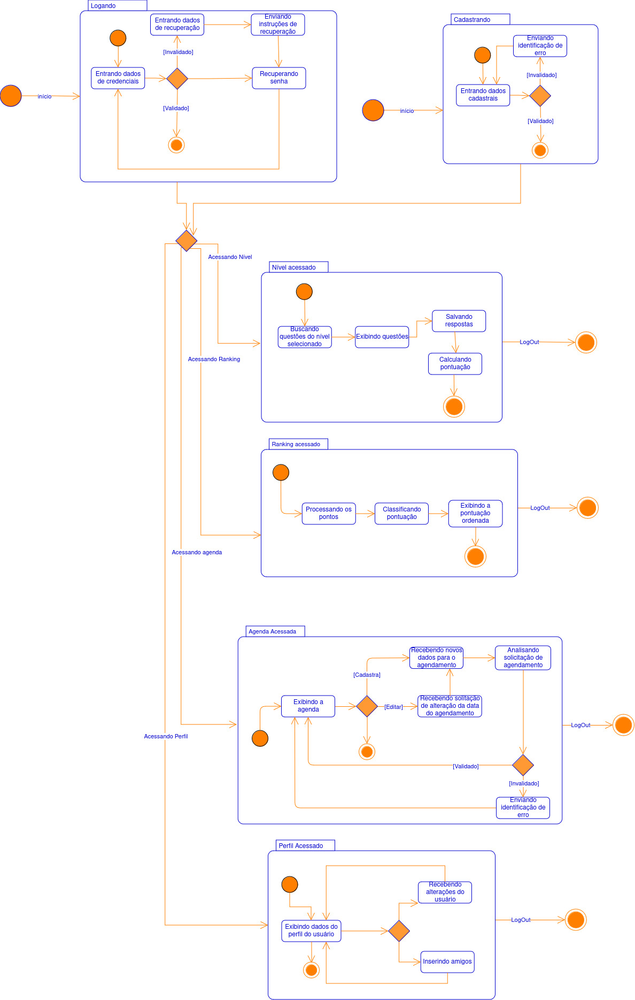
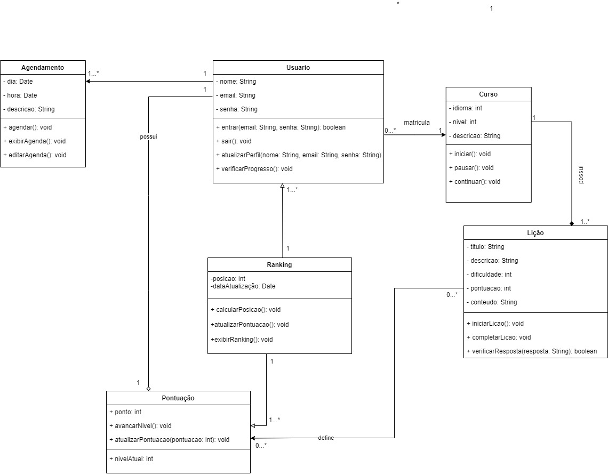
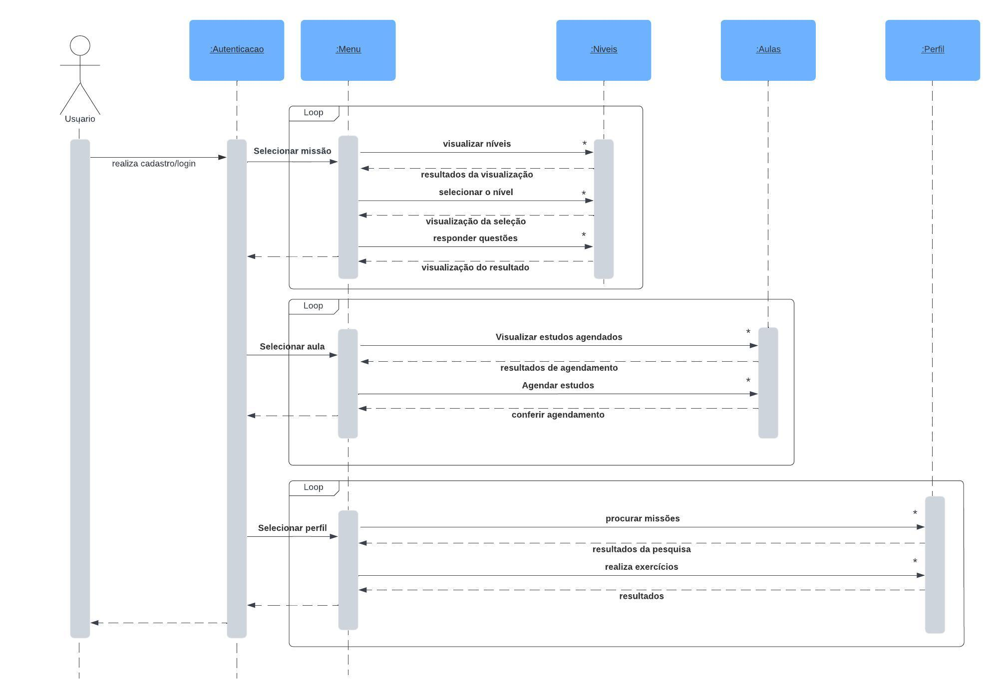
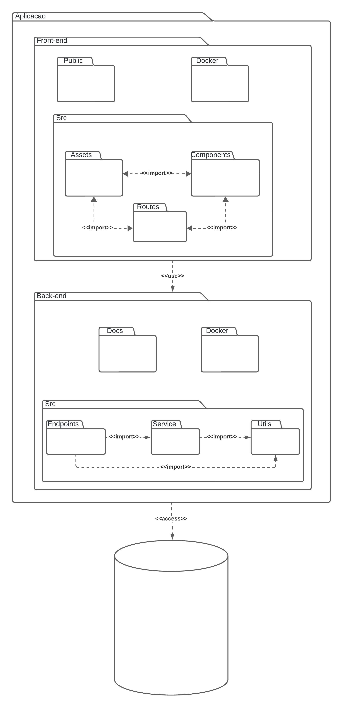

## **4.1.1. DAS - Visão Lógica**

## Participantes

| Nome                                                        |
| ----------------------------------------------------------- |
| [Laura Pinos](https://github.com/laurapinos)                |
| [Maria Eduarda Marques](https://github.com/EduardaSMarques) |
| [Júlia Souza](https://github.com/JuliaSSouza)               |
| [Carolina Barbosa](https://github.com/CarolinaBarb)         |
| [Marina Márcia](https://github.com/The-Boss-Nina)           |

## **Introdução**

&emsp;&emsp; A visão lógica em arquitetura de software descreve a organização interna de um sistema em termos de módulos, classes e componentes, e as relações entre eles. Essa visão abstrata, centrada nos requisitos funcionais, facilita a compreensão do sistema, a identificação de dependências e a tomada de decisões de design.

 

## **Objetivo**

&emsp;&emsp; A construção da visão lógica em arquitetura de software inicia-se com a análise dos requisitos funcionais. O sistema é então decomposto em módulos independentes e modelado através de classes e objetos. Diagramas de classes visualizam essas estruturas e seus relacionamentos. Pacotes organizam o código, enquanto interfaces definem pontos de comunicação entre os módulos. A documentação detalhada e a revisão contínua garantem a qualidade e o alinhamento com os objetivos do projeto.

## **Metodologia**

&emsp;&emsp; Para a elaboração do documento, foi realizada uma reunião inicial com o objetivo de compreender detalhadamente as exigências do módulo e de dividir as responsabilidades entre os membros da equipe. Durante esta reunião, discutiu-se a estrutura do documento e as tarefas atribuídas a cada membro. A elaboração do documento começou paralelamente ao avanço da implementação do código. O desenvolvimento do código e do documento foram realizados de forma integrada para garantir que o conteúdo estivesse alinhado com a implementação prática.

&emsp;&emsp; Além disso, antes de iniciar o trabalho de elaboração do documento, os membros do grupo utilizaram a aula de dúvidas para esclarecer quaisquer questionamentos e verificar se haviam compreendido corretamente os requisitos do módulo. 

## **Diagrama de Estados**

&emsp;&emsp; A **Figura 1** apresenta o diagrama de estados, que é uma ferramenta essencial na modelagem dos aspectos dinâmicos de sistemas. Elas são utilizadas para especificar as sequências de estados que um objeto atravessa durante sua vida em resposta a eventos, bem como as respostas desses objetos a esses eventos. Um estado representa uma condição ou situação durante a vida de um objeto na qual ele satisfaz determinadas condições, realiza atividades ou espera por eventos. Eventos são ocorrências significativas que podem desencadear transições de estado, enquanto transições são relações entre estados que indicam mudanças específicas quando eventos ocorrem e condições são satisfeitas. Diagrama de estados, que representam graficamente esses conceitos, são fundamentais para entender e documentar o comportamento de objetos dentro de um sistema.

&emsp;&emsp; O diagrama apresenta algumas divergências em relação ao código implementado, pois o código foi adaptado para melhor atender às necessidades específicas do projeto. Devido a restrições de tempo, não foi possível refatorar o diagrama para garantir total conformidade com o código.

<h6 align="center">Figura 1: Diagrama de Estados.</h6>

    <h6 align="center">Fonte: 
        <a href="https://unbarqdsw2024-1.github.io/2024.1_G6_My_LanguageLearning/#/Modelagem/dinamico/UML_DiagramaEstados">Autoria própria</a>,2024.
    </h6>

## **Diagrama de Classes**

&emsp;&emsp; O [diagrama de classes](https://unbarqdsw2024-1.github.io/2024.1_G6_My_LanguageLearning/#/Modelagem/estatico/UML_DiagramaClasses) apresentado na **Figura 2**, foi desenvolvido na fase de modelagem do projeto, ele é um diagrama estático que modela a estrutura do sistema do My Language Learning , organizando-se em quatro blocos principais: gestão de usuários, gerenciamento de cursos, lições e gestão de ranking. Inicialmente, havia a intenção de incluir um módulo de agendamento para permitir que o usuário organizasse suas atividades de aprendizado, no entanto, essa funcionalidade foi retirada devido à falta de tempo para implementá-la. E as funcionalidades de cursos e lições, tiveram modificações ao longo da implementação do código. Mesmo assim, a arquitetura modular favorece a escalabilidade, reutilização de componentes e a fácil manutenção, pelo fato que o sistema de pontuação e ranking pode ser facilmente estendido ou adaptado. Além disso, a separação clara entre as camadas de usuários, cursos e ranking facilita a manutenção.

<h6 align="center">Figura 2: Diagrama de Classes.</h6>

    <h6 align="center">Fonte: 
        <a href="https://unbarqdsw2024-1.github.io/2024.1_G6_My_LanguageLearning/#/Modelagem/estatico/UML_DiagramaClasses">Autoria própria</a>,2024.
    </h6>

## **Diagrama de Sequência**
&emsp;&emsp; O [diagrama de sequência](https://github.com/UnBArqDsw2024-1/2024.1_G6_My_LanguageLearning/blob/visao-logica/docs/Modelagem/dinamico/UML_DiagramaSequencia.md) da **Figura 3** desenvolvido pela equipe, conta com a análise do caso de uso realizada e o fluxo necessário para com que o usuário possa navegar entre a aplicação. A figura abaixo mostra que o processo de autenticação e acesso ao menu principal do aplicativo My Language Learning.

&emsp;&emsp; O diagrama apresenta algumas divergências em relação ao código implementado, pois o código foi adaptado para melhor atender às necessidades específicas do projeto. Devido a restrições de tempo, não foi possível refatorar o diagrama para garantir total conformidade com o código.

<h6 align="center">Figura 3: Diagrama de Sequência.</h6>

<h6 align="center"></h6>

    <h6 align="center">Fonte: 
        <a href="https://github.com/UnBArqDsw2024-1/2024.1_G6_My_LanguageLearning/blob/visao-logica/docs/Modelagem/dinamico/UML_DiagramaSequencia.md">Autoria própria</a>,2024.
    </h6>

## **Diagrama de pacotes**
&emsp;&emsp; O [diagrama de pacotes](https://github.com/UnBArqDsw2024-1/2024.1_G6_My_LanguageLearning/blob/visao-logica/docs/Modelagem/estatico/UML_DiagramaPacotes.md) da **Figura 4** trás os arquivos do sistema da aplicação, com uma visão geral clara e de fácil compreensão sobre a organização do sistema. Esse tipo de diagrama é útil para manter a consistência do projeto, permitindo atualizações e adaptações de forma eficiente.

&emsp;&emsp; O diagrama apresenta algumas divergências em relação ao código implementado, pois o código foi adaptado para melhor atender às necessidades específicas do projeto. Devido a restrições de tempo, não foi possível refatorar o diagrama para garantir total conformidade com o código.

<h6 align="center">Figura 4: Diagrama de Pacotes.</h6>

    <h6 align="center">Fonte: 
        <a href="https://github.com/UnBArqDsw2024-1/2024.1_G6_My_LanguageLearning/blob/visao-logica/docs/Modelagem/estatico/UML_DiagramaPacotes.md">Autoria própria</a>,2024.
    </h6>

## **Conclusão**
&emsp;&emsp;  A visão lógica detalhada neste documento fornece uma estrutura clara e bem definida para o desenvolvimento do sistema My Language Learning. Através da utilização de diagramas de estados, classes, sequência e pacotes, foi possível capturar tanto os aspectos dinâmicos quanto estáticos da solução proposta, garantindo que a arquitetura do sistema esteja alinhada com os requisitos funcionais identificados. O processo de desenvolvimento, marcado por uma integração contínua entre código e documentação, foi essencial para assegurar a coerência entre o design arquitetural e a implementação prática.

## **Bibliografia**

> UNIVERSIDADE DE BRASÍLIA. Aprender 3: Plataforma de Educação a Distância. Disponível em:
https://aprender3.unb.br/pluginfile.php/2790287/mod_label/intro/Arquitetura%20e%20Desenho%20de%20Software%20-%20Aula%20Arquitetura%20e%20DAS%20-%20Parte%20II%20-%20Profa.%20Milene.pdf. Acesso em: 05 ago. 2024.

## **Histórico de Versão**

&emsp;&emsp;A <strong>Tabela 01</strong> representa o histórico de versão do documento.

<h6 align="center">Tabela 01: Histórico de Versão</h6>

| Versão | Data       | Descrição            | Autor(es)                                           | Revisor(es) |
| ------ | ---------- | -------------------- | --------------------------------------------------- | ----------- |
| `1.0`  | 05/08/2024 | Criação do documento, adição da introdução, objetivo e bibliografia. | [Marina Márcia](https://github.com/The-Boss-Nina)    | [João Lucas](https://github.com/Jlmsousa) |
| `1.1`  | 15/08/2024 | Adição diagrama de estados. | [Julia Souza](https://github.com/JuliaSSouza)  |[Carolina Barbosa Brito](https://github.com) |
| `1.2`  | 15/08/2024 | Adição diagrama de classes e metodologia. |[Maria Eduarda Marques](https://github.com/EduardaSMarques)   | [Maria Eduarda Barbosa](https://github.com/Madu01) |
| `1.3`  | 15/08/2024 | Adição diagrama de pacotes e sequencia. | [Laura Pinos](https://github.com/laurapinos)  |[Carolina Barbosa Brito](https://github.com) |
| `1.4`  | 15/08/2024 | Ajuste imagem pacotes.| [Julia Souza](https://github.com/JuliaSSouza)  |[Carolina Barbosa Brito](https://github.com) |
| `1.5`  | 15/08/2024 | Adicionando Conclusão.| [Carolina Barbosa Brito](https://github.com) |[Laura Pinos](https://github.com/laurapinos) |
| `1.6`  | 16/08/2024 | Ajuste visão lógica.|  [João Lucas](https://github.com/Jlmsousa) |[Maria Eduarda Barbosa](https://github.com/Madu01) |
| `1.7`  | 16/08/2024 | Correção do ajuste visão lógica.| [Maria Eduarda Barbosa](https://github.com/Madu01) | [João Lucas](https://github.com/Jlmsousa) |
