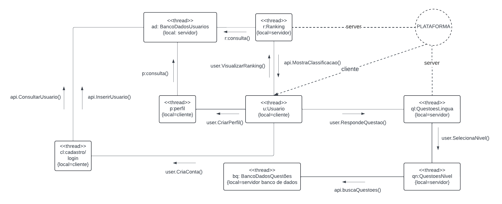

# **4.1.2. DAS - Visão de Processos**

## Participantes

| Nome                                                        |
| ----------------------------------------------------------- |
| [Marina Márcia](https://github.com/The-Boss-Nina)           |
| [Laura Pinos](https://github.com/laurapinos)                |
| [Maria Eduarda Marques](https://github.com/EduardaSMarques) |
| [Felipe Direito](https://github.com/FelipeDireito)          |
| [Felipe Hansen](https://github.com/FHansen98)               |

## **Introdução**

&emsp;&emsp; A visão de processo em arquitetura de software descreve a organização do sistema sob a perspectiva de seus processos, ou seja, como as atividades são executadas ao longo do tempo. Ela aborda aspectos como a decomposição do sistema em processos, a definição de fluxos de trabalho, a coordenação de atividades concorrentes e a sincronização entre componentes. Essa visão é essencial para analisar o comportamento do sistema em tempo de execução e garantir que ele atenda aos requisitos não funcionais, como desempenho e confiabilidade.

 

## **Objetivo**

&emsp;&emsp; Seu objetivo é representar a organização do sistema sob a perspectiva de seus processos. Ela detalha o fluxo de dados, a coordenação de atividades concorrentes, a sincronização entre componentes e a comunicação entre eles. Essa visão é essencial para analisar o comportamento do sistema em tempo de execução e garantir que ele atenda aos requisitos não funcionais, como desempenho e confiabilidade.

## **Metodologia**

&emsp;&emsp; As reuniões iniciais com a equipe responsável foram realizadas com o objetivo de obter informações pertinentes sobre os principais processos do sistema para a elaboração da visão de processo. Com base nessas informações, as atividades foram divididas em tarefas entre a equipe com o objetivo de participação de todos integrantes.
  
Logo, foi gerado o modelo de diagramas de fluxo de dados,executado por todos participantes, para mostrar a organização do sistema e as interações entre seus componentes.Este diagrama foi criado e submetidos a revisões com a equipe, durante as quais foram discutidas e implementadas possíveis otimizações e ajustes necessários para garantir a eficiência e a robustez do sistema.

## **Diagrama de processos**

  
&emsp;&emsp; A **Figura 1**, apresenta o diagrama de processos, este diagrama representa as interações entre diferentes componentes de um sistema de software, modelando a forma como os dados e as funcionalidades são gerenciados entre os elementos cliente e servidor. Ele é baseado no [diagrama de sequência](https://unbarqdsw2024-1.github.io/2024.1_G6_My_LanguageLearning/#/Modelagem/dinamico/UML_DiagramaSequencia) feito pelo grupo ao longo da disciplina. O diagrama mostra a comunicação entre elementos do sistema, divididos entre cliente *(local=cliente)* e servidor *(local=servidor)*, cada componente é representado como um thread, indicando que essas operações podem ocorrer de forma independente e simultânea. Ele destaca as funcionalidades principais, como cadastro/login, visualização de ranking, gerenciamento de perfil, e a interação com um banco de questões para responder a perguntas e selecionar o nível de dificuldade.

#### Cadastro e Login:

- *cl:cadastro/login*: Este componente está localizado no cliente e é responsável pelo gerenciamento das funcionalidades de cadastro e login do usuário.
- *user.CriaConta()*: Quando um novo usuário deseja criar uma conta, ele envia uma solicitação do cliente para o servidor. Essa solicitação é recebida pelo banco de dados de usuários *(ad:BancoDadosUsuarios)*, que está no servidor. O banco de dados processa a criação da nova conta, armazenando as informações do usuário e, em seguida, retorna uma confirmação para o cliente *(api.InserirUsuario())*.
- *api.ConsultarUsuario()*: Quando um usuário tenta fazer login, o cliente envia uma consulta ao banco de dados de usuários no servidor para verificar as credenciais do usuário. Se as credenciais estiverem corretas, o acesso é permitido, e o usuário pode prosseguir para outras funcionalidades do sistema.

#### Perfil de Usuário: 

- *user.CriarPerfil()*: Depois que o usuário está autenticado, ele pode criar seu perfil. Esta ação é iniciada no cliente, onde o perfil do usuário é gerado e gerenciado localmente *(p:perfil)*.
- *user.VisualizarRanking()*: O usuário também pode visualizar sua classificação no sistema. Esta operação envolve uma consulta ao sistema de rankings no servidor *(r:Ranking)* para obter as informações atualizadas sobre a classificação do usuário.

#### Sistema de Rankings:

- *r:Ranking*: Este componente está localizado no servidor e é responsável por gerenciar e armazenar as classificações dos usuários. Quando o cliente solicita a visualização do ranking *(user.VisualizarRanking())*, uma chamada é feita ao servidor através da *api.MostraClassificacao()*. O servidor então consulta o sistema de rankings, processa as informações necessárias e envia os dados de volta ao cliente.

#### Gestão de Questões:

- *user.SelecionaNivel()*: O usuário escolhe o nível de dificuldade das questões que deseja responder, o servidor então identifica e retorna as questões apropriadas para o nível escolhido.
- api.buscaQuestoes(): Uma vez selecionado o nível, o servidor realiza uma busca nas questões armazenadas no banco de dados *(bq: BancoDadosQuestoes)*, retornando as perguntas para o cliente.
- *user.RespondeQuestao()*: O usuário responde às questões, e essas respostas podem ser enviadas de volta ao servidor para serem armazenadas, analisadas, ou para atualizar o progresso e desempenho do usuário.

<h6 align="center">Figura 1: Diagrama de processos.</h6>

    <h6 align="center">Fonte:  
        <a href="https://github.com/The-Boss-Nina">SOUZA</a>, 
        <a href="https://github.com/EduardaSMarques">MARQUES</a>,
        <a href="https://github.com/laurapinos">PINOS</a>,
        <a href="https://github.com/FelipeDireito">DIREITO</a>,
        <a href="https://github.com/FHansen98">HANSEN</a>, 2024.
    </h6>

## **Conclusão**

&emsp;&emsp; Concluímos que o diagrama de visão de processo foi importante para entender como os diferentes componentes do sistema interagem e coordenam suas atividades durante a execução das tarefas na aplicação web. Ele proporciona uma visão detalhada do fluxo de dados, da comunicação entre cliente e servidor, e da execução simultânea das suas funcionalidades, como cadastro, login, gestão de perfil, visualização de ranking e seleção de questões. Por meio desse diagrama é possível avaliar e garantir que o sistema atenda aos requisitos de desempenho, confiabilidade e eficiência.

## **Bibliografia**

> UNIVERSIDADE DE BRASÍLIA. Aprender 3: Plataforma de Educação a Distância. Disponível em:
https://aprender3.unb.br/pluginfile.php/2790287/mod_label/intro/Arquitetura%20e%20Desenho%20de%20Software%20-%20Aula%20Arquitetura%20e%20DAS%20-%20Parte%20II%20-%20Profa.%20Milene.pdf. Acesso em: 05 ago. 2024.

## **Histórico de Versão**

&emsp;&emsp;A tabela 01 representa o histórico de versão do documento.

<h6 align="center">Tabela 01: Histórico de Versão</h6>

| Versão | Data       | Descrição            | Autor(es)                                           | Revisor(es) |
| ------ | ---------- | -------------------- | --------------------------------------------------- | ----------- |
| `1.0`  | 05/08/2024 | Criação do documento, adição da introdução, objetivo e bibliografia | [Marina Márcia](https://github.com/The-Boss-Nina)    | [João Lucas](https://github.com/Jlmsousa)
| `1.1`  | 14/08/2024 | Adição da imagem do diagrama e do desenvolvimento| [Maria Eduarda Marques](https://github.com/EduardaSMarques)  |[Luis Henrique](https://github.com/LuisHenrrique)|
| `1.2`  | 15/08/2024 | Adição da conclusão| [Felipe Hansen](https://github.com/FHansen98)  |[Felipe Direito](https://github.com/FelipeDireito)|
| `1.3`  | 05/08/2024 | Adiçao de metodologia | [Laura Pinos](https://github.com/laurapinos)    |[Maria Eduarda Marques](https://github.com/EduardaSMarques) 

