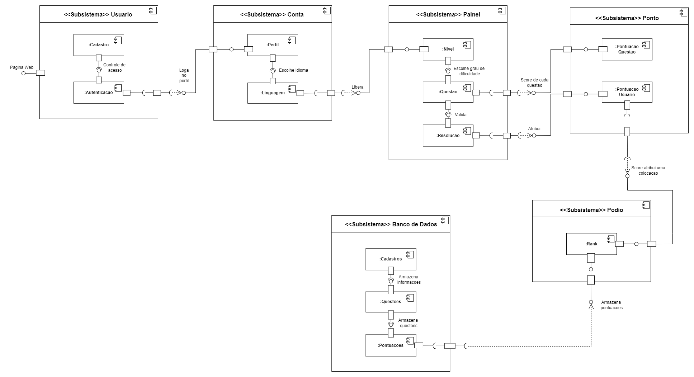

# **4.1.3. DAS - Visão de Implementação**

## Participantes

| Nome                                                        |
| ----------------------------------------------------------- |
| [Luis Henrique](https://github.com/luishenrrique)           |
| [Marina Márcia](https://github.com/The-Boss-Nina)           |
| [Maria Eduarda Barbosa](https://github.com/Madu01)          |
| [João Lucas](https://github.com/Jlmsousa)                   |
| [Felipe Direito](https://github.com/FelipeDireito)          |

## **Introdução**

&emsp;&emsp; A visão de implementação em arquitetura de software detalha a organização do código-fonte e os componentes físicos que compõem o sistema. Ela se concentra em como o design lógico e os processos são concretizados em termos de módulos de código, bibliotecas, arquivos e diretórios. Esta visão é essencial para garantir que a estrutura do código seja clara, bem organizada e fácil de manter, facilitando o desenvolvimento, a integração e a implantação do sistema.

 

## **Objetivo**

&emsp;&emsp; O objetivo da visão de implementação é definir claramente a estrutura física do sistema de software, detalhando como os componentes lógicos são mapeados para módulos de código, bibliotecas e outros artefatos. Ela busca assegurar que o código-fonte seja organizado de maneira eficiente, facilitando a colaboração entre desenvolvedores, a gestão de versões e a manutenção do sistema. Além disso, a visão de implementação ajuda a identificar dependências entre componentes e a planejar a integração e a implantação de maneira eficaz.

## **Metodologia**

&emsp;&emsp;Foram utilizados conteúdos, reuniões e rascunhos além das aulas desta disciplina do projeto, para os integrantes do grupo entenderem e desenvolverem a Visão de Implementação do documento DAS. Foi observado pelos responsáveis que era muito utilizado o diagrama de componentes nessa parte do DAS.
    
    
&emsp;&emsp;Após identificar que o diagrama de componentes era muito usado e o mais adequado para essa parte do DAS, foi percebido que não havia sido criado esse diagrama antes, por isso ele foi feito nesta etapa do projeto. 
Os responsáveis por este artefato foram atrás de relembrar como se fazia esse diagrama, essa parte foi a mais complicada, pois esse diagrama tem muitas regrinhas. Um esboço inicial desenvolvido durante uma reunião foi criado e logo após mostrado para a professora Milene (professora da disciplina do projeto) e assim obteve feedbacks da parte dela e se estava no caminho certo. As dicas foram cruciais para o resultado final do diagrama que ficou muito mais detalhado do que no primeiro rascunho, o que consequentemente nos resultou em um diagrama muito mais agregante para o projeto.

&emsp;&emsp;O diagrama de componentes foi desenvolvido no draw.io, seguindo os padrões estabelecidos, variando apenas a estética. Ele pode ser observado na **Figura 1** disponível logo abaixo.

## **Diagrama de Componentes**

&emsp;&emsp; O diagrama da **figura 1** é uma representação de um sistema dividido em vários subsistemas, cada um com uma função dentro da aplicação Web. Primeiro temos o subsistema de Usuário, onde os componentes como Cadastro e Autenticação gerenciam o login e o cadastro de usuários. Após o controle de acesso, o usuário pode acessar seu perfil , onde ele pode escolher o idioma de preferência através do componente Linguagem.

&emsp;&emsp; Logo depois o subsistema Painel é responsável por gerenciar as atividades do usuário relacionadas ao sistema. O usuário escolhe um nível de dificuldade (subsistema Nivel) e interage com questões (subsistema Questao), que são validadas e resolvidas (Resolucao). Os resultados são passados ao subsistema Ponto, onde as pontuações de cada questão que usuário acertou são calculadas. Essas pontuações são, então, associadas a uma colocação no sistema.

&emsp;&emsp; Por fim, as pontuações são armazenadas e é feito um ranking que mantém a colocação dos usuários atualizadas e mantidas. Todas as informações de cadastro, questões e pontuações são armazenadas e gerenciadas pelo subsistema Banco de Dados, que serve como a base de dados central para todo o sistema, garantindo que todas as operações possam ser realizadas de forma integrada e consistente.

<h6 align="center">Figura 1: Diagrama de Componentes.</h6>

    <h6 align="center">Fonte: 
        <a href="https://github.com/luishenrrique">COSTA</a>, 
        <a href="https://github.com/The-Boss-Nina">SOUZA</a>, 
        <a href="https://github.com/Madu01">BARBOSA</a>, 
        <a href="https://github.com/Jlmsousa">SOUSA</a>, 
        <a href="https://github.com/FelipeDireito">DIREITO</a>,2024.
    </h6>

## **Conclusão**

&emsp;&emsp;O diagrama de componentes é importante para a visão de implementação de um sistema de software, pois ele permite visualizar a estrutura física e a interação entre os subsistemas de um projeto de software.Ele organiza e detalha como os diferentes módulos, como autenticação de usuário, gestão de perfil, e pontuação, interagem e são integrados para o funcionamento do sistema. Este diagrama e sua documentação servem como um guia importante para a equipe, auxiliando na manutenção do código, na gestão de versões e na integração eficiente dos componentes, garantindo a implementação bem feita do sistema.

## **Bibliografia**

> UNIVERSIDADE DE BRASÍLIA. Aprender 3: Plataforma de Educação a Distância. Disponível em:
https://aprender3.unb.br/pluginfile.php/2790287/mod_label/intro/Arquitetura%20e%20Desenho%20de%20Software%20-%20Aula%20Arquitetura%20e%20DAS%20-%20Parte%20II%20-%20Profa.%20Milene.pdf .Acesso em: 05 ago. 2024.

## **Histórico de Versão**

&emsp;&emsp;A tabela 01 representa o histórico de versão do documento.

<h6 align="center">Tabela 01: Histórico de Versão</h6>

| Versão | Data       | Descrição            | Autor(es)                                           | Revisor(es) |
| ------ | ---------- | -------------------- | --------------------------------------------------- | ----------- |
| `1.0`  | 05/08/2024 | Criação do documento, adição da introdução, objetivo e bibliografia | [Marina Márcia](https://github.com/The-Boss-Nina)    | [João Lucas](https://github.com/Jlmsousa) |
| `1.1`  | 12/08/2024 | Reparos no diagrama de componentes e adição do mesmo na documentação | [Marina Márcia](https://github.com/The-Boss-Nina)  | [Felipe Direito](https://github.com/FelipeDireito)  |
| `1.2`  | 12/08/2024 | Adição de conteúdo no tópico metodologia |  [Maria Eduarda Barbosa](https://github.com/Madu01)  | [Felipe Direito](https://github.com/FelipeDireito)  |
| `1.3`  | 13/08/2024 | Adição da conclusão | [João Lucas](https://github.com/Jlmsousa)    | [Marina Márcia](https://github.com/The-Boss-Nina) |
| `1.4`  | 13/08/2024 | Adição em tópico de Diagrama Componentes |  [Luis Henrique](https://github.com/luishenrrique)  | [Marina Márcia](https://github.com/The-Boss-Nina)  |
