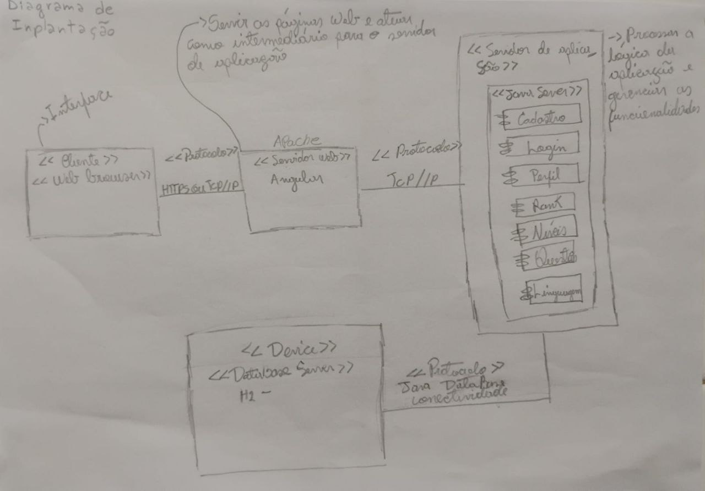

# **4.1.4. DAS - Visão de Implantação**

## Participantes

| Nome                                                        |
| ----------------------------------------------------------- |
| [Luis Henrique](https://github.com/luishenrrique)           |
| [Marina Márcia](https://github.com/The-Boss-Nina)           |
| [Maria Eduarda Marques](https://github.com/EduardaSMarques) |
| [João Lucas](https://github.com/Jlmsousa)                   |
| [Felipe Hansen](https://github.com/FHansen98)               |

## **Introdução**

&emsp;&emsp; A visão de implantação em arquitetura de software descreve como os componentes do sistema são distribuídos em termos de hardware e infraestrutura de rede. Ela detalha a configuração dos ambientes de execução, incluindo servidores, dispositivos de rede, e quaisquer outros recursos necessários para suportar a operação do software. Essa visão é crucial para garantir que o sistema funcione corretamente em seu ambiente real, atendendo aos requisitos de desempenho, escalabilidade, segurança e disponibilidade.

 

## **Objetivo**

&emsp;&emsp; O objetivo da visão de implantação é garantir que todos os componentes do software sejam distribuídos e configurados adequadamente nos ambientes de execução. Isso inclui a definição clara de como os módulos de software serão mapeados para servidores e outros dispositivos, bem como a identificação de dependências e requisitos de infraestrutura. A visão de implantação visa assegurar que o sistema possa ser instalado, configurado e operado de forma eficiente, atendendo aos requisitos de desempenho, segurança, escalabilidade e disponibilidade, além de facilitar a manutenção e a evolução contínua do sistema.

## **Metodologia**

    
&emsp;&emsp; Durante o desenvolvimento do diagrama de implantação arquitetural, a equipe baseou-se em materiais fornecidos pela professora e em repositórios antigos da disciplina, encontrados na bibliografia deste documento. Com o objetivo de alinhar as ideias e definir as responsabilidades, foi realizada uma reunião inicial, na plataforma *Teams*, essa etapa discutiram-se os conceitos principais e as diretrizes que cada membro deveria seguir ao criar sua versão do diagrama. 

&emsp;&emsp; Após o alinhamento, cada membro da equipe, desenvolveu individualmente sua versão do diagrama. Essa abordagem permitiu que diferentes perspectivas fossem exploradas, enriquecendo o processo de desenvolvimento com diversas ideias. Cada versão do diagrama refletia a interpretação e o entendimento do membro sobre o sistema, contribuindo para uma visão mais abrangente e detalhada. E após todos os diagramas prontos, o grupo se reuniu com a professora para validar e tirar dúvidas dos diagramas, recebendo um feedback e sugestões de aprimoramento. E logo após essa validação, o grupo responsável pelo diagrama, consolidou as versões em um único diagrama, incorporando as melhores práticas e as orientações recebidas, resultando em um produto final alinhado com as expectativas e diretrizes do projeto.

<h6 align="center">Figura 1: Diagrama de Implantação.</h6>

    <h6 align="center">Fonte:  
        <a href="https://github.com/FHansen98">HANSEN</a>,2024.
    </h6>

<h6 align="center">Figura 2: Diagrama de Implantação.</h6>

    <h6 align="center">Fonte:  
        <a href="https://github.com/Jlmsousa">SOUSA</a>,2024.
    </h6>

<h6 align="center">Figura 3: Diagrama de Implantação.</h6>

    <h6 align="center">Fonte:  
        <a href="https://github.com/EduardaSMarques">MARQUES</a>,2024.
    </h6>

<h6 align="center">Figura 4: Diagrama de Implantação.</h6>

    <h6 align="center">Fonte:  
        <a href="https://github.com/The-Boss-Nina">SOUZA</a>,2024.
    </h6>

## **Diagrama de Implantação**

&emsp;&emsp; A **Figura 5** representa o diagrama visão de implantação de uma aplicação web voltada para o aprendizado de idiomas. E para a construção do diagrama, foi necessário definir alguns de seus componentes: Dispositivo, que representa a estrutura onde os componentes de software são implantados; Ambiente, que se refere ao contexto onde o sistema opera, como ambientes de desenvolvimento, teste, homologação ou produção, sendo que cada ambiente pode ter configurações e recursos específicos; Artefato, que representa um componente do software mais detalhado, como, por exemplo, um arquivo executável ou qualquer outro tipo de pacote que contenha componentes de software prontos para serem executados; e Caminho, que representa a comunicação ou fluxo de dados, conexão ou interação entre dispositivos, como, por exemplo, redes, conexões de banco de dados ou APIs. Para uma maior compreensão, a seguir, temos o detalhamento do diagrama para a aplicação web do My language learning.

#### Servidor Cliente:

No lado do cliente, o diagrama começa com a interface do usuário, que é a aplicação web acessada diretamente pelos usuários finais. Essa interface representa o ponto de entrada do sistema, onde os usuários podem realizar ações como cadastro, login, e navegação por funcionalidades relacionadas ao aprendizado de idiomas. A comunicação entre o cliente e o servidor web é realizada por meio do protocolo HTTP(S). A inclusão do 'S' no HTTPS sugere que a comunicação é segura, utilizando criptografia para proteger os dados que trafegam entre o navegador do usuário e o servidor web

#### Servidor Web:

O servidor web, posicionado no centro do diagrama, hospeda a camada de frontend da aplicação, desenvolvida utilizando o framework Angular. Este framework é conhecido por sua capacidade de construir interfaces de usuário dinâmicas e responsivas, permitindo que a aplicação ofereça uma experiência rica e interativa. A comunicação entre o servidor web e o servidor de aplicação é feita através do protocolo TCP/IP, que garante a entrega correta e ordenada dos pacotes de dados, assegurando a integridade das informações trocadas

#### Servidor de aplicação:

Este ambiente hospeda a camada de backend da aplicação, desenvolvida em Java e organizada com o framework Spring. O servidor é responsável por diversos componentes que desempenham funções específicas na aplicação, como Cadastro, Login, Perfil, Linguagem, Nível, Questão e Ranking. Esses componentes gerenciam o registro de novos usuários, a autenticação, o gerenciamento de perfis, a seleção de linguagens, o acompanhamento do progresso do usuário, a geração de questões e a consulta de rankings. A comunicação entre o servidor de aplicação e o servidor de banco de dados é realizada por meio de uma conexão Java Database, permitindo a execução de consultas SQL e a persistência ou recuperação dos dados conforme necessário para o funcionamento das funcionalidades da aplicação.

#### Servidor de banco de dados:

Esse servidor hospeda o banco de dados H2 no qual realiza a conexão com o backend através da dependência gerenciada pelo Maven. Este banco armazena dados da aplicação, como informações do usuário, progresso de aprendizado, ranking e as questões e alternativas de respostas para cada pergunta.

<h6 align="center">Figura 5: Diagrama de Implantação.</h6>

    <h6 align="center">Fonte: 
        <a href="https://github.com/luishenrrique">COSTA</a>, 
        <a href="https://github.com/The-Boss-Nina">SOUZA</a>, 
        <a href="https://github.com/EduardaSMarques">MARQUES</a>, 
        <a href="https://github.com/Jlmsousa">SOUSA</a>, 
        <a href="https://github.com/FHansen98">HANSEN</a>,2024.
    </h6>

##  Conclusão

&emsp;&emsp; Por meio do diagrama de visão de implantação foi possível obter uma visão melhor detalhada da arquitetura da aplicação, deixando de forma clara como os diferentes componentes interagem entre si, desde a interface do usuário até o armazenamento dos dados. Essa visão facilitou o entendimento da estrutura e das responsabilidades de cada servidor, garantindo a integração de todas as partes do sistema.

## **Bibliografia**

> 2023.2_G5_ProjetoAmericanas. GitHub. Disponível em: https://unbarqdsw2023-2.github.io/2023.2_G5_ProjetoAmericanas/#/ArquiteturaReutilizacao/4.1.1.DAS. Acesso em: 13 ago. 2024.

> 2023.2_G8_ProjetoMagazineLuiza. GitHub. Disponível em: https://unbarqdsw2023-2.github.io/2023.2_G8_ProjetoMagazineLuiza/#/./ArquiteturaReutilizacao/4.1.PadroesArquiteturais. Acesso em: 13 ago. 2024.

> UNIVERSIDADE DE BRASÍLIA. Aprender 3: Plataforma de Educação a Distância. Disponível em:
https://aprender3.unb.br/pluginfile.php/2790287/mod_label/intro/Arquitetura%20e%20Desenho%20de%20Software%20-%20Aula%20Arquitetura%20e%20DAS%20-%20Parte%20II%20-%20Profa.%20Milene.pdf. Acesso em: 05 ago. 2024.

## **Histórico de Versão**

&emsp;&emsp;A <strong>Tabela 01</strong> representa o histórico de versão do documento.

<h6 align="center">Tabela 01: Histórico de Versão</h6>

| Versão | Data       | Descrição            | Autor(es)                                           | Revisor(es) |
| ------ | ---------- | -------------------- | --------------------------------------------------- | ----------- |
| `1.0`  | 05/08/2024 | Criação do documento, adição da introdução, objetivo e bibliografia. | [Marina Márcia](https://github.com/The-Boss-Nina)    | [João Lucas](https://github.com/Jlmsousa)   |
| `1.0`  | 12/08/2024 | Reparos no diagrama de implantação e adição do mesmo na documentação. | [Marina Márcia](https://github.com/The-Boss-Nina)  | [Maria Eduarda Marques](https://github.com/EduardaSMarques)   |
| `1.1`  | 12/08/2024 | Adição em conjunto do desenvolvimento e conclusão. | [Felipe Hansen](https://github.com/FHansen98), [Luis Henrique](https://github.com/LuisHenrrique), [Maria Eduarda Marques](https://github.com/EduardaSMarques)   | [Felipe Direito](https://github.com/FelipeDireito) |
| `1.2`  | 13/08/2024 | Adição da metodologia. | [Maria Eduarda Marques](https://github.com/EduardaSMarques)   |[Marina Márcia](https://github.com/The-Boss-Nina)|
| `1.3`  | 16/08/2024 | Adição dos diagramas de implantação feitos pelos membros. |[Marina Márcia](https://github.com/The-Boss-Nina)|  [João Lucas](https://github.com/Jlmsousa)   |