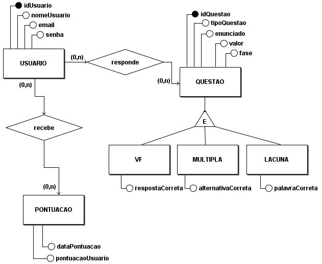

# **4.1.5. DAS - Visão de Dados**

## Participantes

| Nome                                                        |
| ----------------------------------------------------------- |
| [Laura Pinos](https://github.com/laurapinos)                |
| [Maria Eduarda Barbosa](https://github.com/Madu01)          |
| [João Lucas](https://github.com/Jlmsousa)                   |
| [Júlia Souza](https://github.com/JuliaSSouza)               |
| [Carolina Barbosa](https://github.com/CarolinaBarb)         |

## **Introdução**

&emsp;&emsp; A visão de dados em arquitetura de software envolve a organização, armazenamento, acesso e manipulação dos dados. Esse mapeamento é importante para que o gerenciamento dos dados seja feito de forma segura e eficiente. E é uma visão utilizada se a persistência for um aspecto significativo no sistema.

 

## **Objetivo**

&emsp;&emsp; Seu objetivo é garantir um gerenciamento de dados eficiente que permita que os dados sejam persistidos. E no contexto do My_LanguageLearning mostrar a visão do modelo de dados, através de artefatos como o Modelo Entidade Relacionamento(MER), Diagrama Entidade Relacionamento(DER) E O diagrama logico de dados(DLD), representando os dados das questões e do usuário.

## **Metodologia**

&emsp;&emsp; A metodologia adotada foi baseada em uma única reunião on-line. Inicialmente, um dos membros do grupo elaborou, de forma independente, um rascunho do Modelo Entidade-Relacionamento (MER) alinhado com os objetivos do nosso projeto. Posteriormente, durante a reunião realizada por meio da plataforma Microsoft Teams, os demais membros do grupo revisaram, sugeriram melhorias e validaram o MER proposto. Concluída a fase de elaboração do MER, o grupo uniu esforços e, de forma colaborativa, utilizou a ferramenta brModelo para desenvolver tanto o Diagrama Entidade-Relacionamento (DER) quanto o Diagrama Lógico de Dados (DLD), garantindo a coesão e a qualidade do trabalho final.

    <h6 align="center">Fonte:  
        <a href="https://github.com/laurapinos">PINOS</a>, 
        <a href="https://github.com/Madu01">BARBOSA</a>, 
        <a href="https://github.com/Jlmsousa">SOUSA</a>, 
        <a href="https://github.com/CarolinaBarb">BRITO</a>,
        <a href="https://github.com/JuliaSSouza">SANT'ANA</a>,2024.
    </h6>

    <h6 align="center">Fonte: 
        <a href="https://github.com/laurapinos">PINOS</a>, 
        <a href="https://github.com/Madu01">BARBOSA</a>, 
        <a href="https://github.com/Jlmsousa">SOUSA</a>, 
        <a href="https://github.com/CarolinaBarb">BRITO</a>,
        <a href="https://github.com/JuliaSSouza">SANT'ANA</a>,2024.
    </h6>

## **Bibliografia**

> UNIVERSIDADE DE BRASÍLIA. Aprender 3: Plataforma de Educação a Distância. Disponível em:
https://aprender3.unb.br/pluginfile.php/2790287/mod_label/intro/Arquitetura%20e%20Desenho%20de%20Software%20-%20Aula%20Arquitetura%20e%20DAS%20-%20Parte%20II%20-%20Profa.%20Milene.pdf .Acesso em: 05 ago. 2024.

## **Histórico de Versão**

&emsp;&emsp;A tabela 01 representa o histórico de versão do documento.

<h6 align="center">Tabela 01: Histórico de Versão</h6>

| Versão | Data       | Descrição            | Autor(es)                                           | Revisor(es) |
| ------ | ---------- | -------------------- | --------------------------------------------------- | ----------- |
| `1.0`  | 05/08/2024 | Criação do documento, adição da introdução, objetivo e bibliografia |[João Lucas](https://github.com/Jlmsousa) | [Marina Márcia](https://github.com/The-Boss-Nina)    |
| `1.1`  | 12/08/2024 | Adição das imagens e metodologia |[João Lucas](https://github.com/Jlmsousa) | [Marina Márcia](https://github.com/The-Boss-Nina)    |