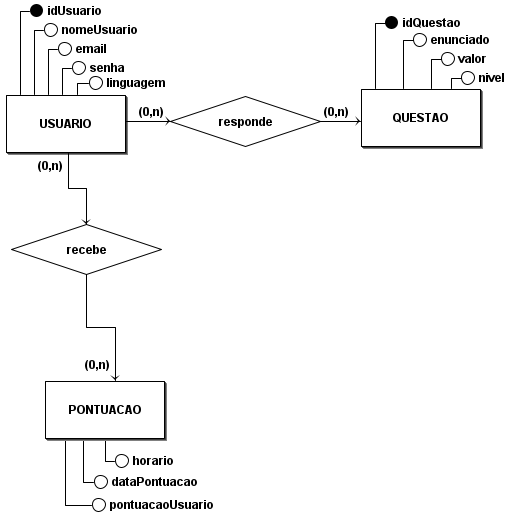
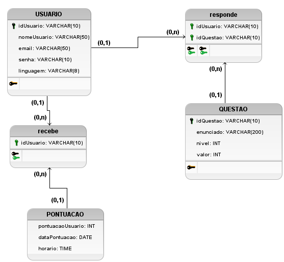

# **4.1.5. DAS - Visão de Dados**

## Participantes

| Nome                                                        |
| ----------------------------------------------------------- |
| [Laura Pinos](https://github.com/laurapinos)                |
| [Maria Eduarda Barbosa](https://github.com/Madu01)          |
| [João Lucas](https://github.com/Jlmsousa)                   |
| [Júlia Souza](https://github.com/JuliaSSouza)               |
| [Carolina Barbosa](https://github.com/CarolinaBarb)         |

## **Introdução**

&emsp;&emsp;A visão de dados em arquitetura de software envolve a organização, armazenamento, acesso e manipulação dos dados. Esse mapeamento é importante para que o gerenciamento dos dados seja feito de forma segura e eficiente. E é uma visão utilizada se a persistência for um aspecto significativo no sistema.

 

## **Objetivo**

&emsp;&emsp;Seu objetivo é garantir um gerenciamento de dados eficiente que permita que os dados sejam persistidos. E no contexto do My_LanguageLearning mostrar a visão do modelo de dados, através de artefatos como o Modelo Entidade Relacionamento(MER), Diagrama Entidade Relacionamento(DER) E O diagrama logico de dados(DLD), representando os dados das questões e do usuário.

## **Metodologia**

&emsp;&emsp;A metodologia adotada foi baseada em uma única reunião on-line. Inicialmente, um dos membros do grupo elaborou, de forma independente, um rascunho do Modelo Entidade-Relacionamento (MER) alinhado com os objetivos do nosso projeto. Posteriormente, durante a reunião realizada por meio da plataforma Microsoft Teams, os demais membros do grupo revisaram, sugeriram melhorias e validaram o MER proposto. Concluída a fase de elaboração do MER, o grupo uniu esforços e, de forma colaborativa, utilizou a ferramenta brModelo para desenvolver tanto o Diagrama Entidade-Relacionamento (DER) quanto o Diagrama Lógico de Dados (DLD), garantindo a coesão e a qualidade do trabalho final.

## **Modelo Entidade-Relacionamento - (MER)**

&emsp;&emsp;Essa é a base inicial da modelagem de dados, por ele se vê quais são as entidades, seus atributos e chaves, além dos relacionamentos e cardinalidades. Por ser a base, os responsáveis utilizaram ele para dar início nos próximos diagramas da modelagem de dados.

  
#### 1º Passo - Identificando as Entidades:

- USUARIO
- QUESTAO 
- PONTUACAO

#### 2º Passo - Descrevendo as Entidades:

Obs.: os marcados em negrito são as chaves primárias. 

- USUARIO (_**idUsuario**_, nomeUsuario, email, senha, linguagem) 
- QUESTAO (_**idQuestao**_, enunciado, valor, nivel) 
- PONTUACAO (pontuacaoUsuario, dataPontuacao, horario)

#### 3º Passo - Descrevendo Relacionamentos:

<b>USUARIO</b> - reponde - <b>QUESTAO</b> 
 
Um usuário pode responder nenhuma ou várias questões. Uma questão é respondida por nenhum ou vários usuários. <b>Cardinalidade: n:m</b>

<b>USUARIO</b> - recebe - <b>PONTUAÇÃO</b> 
 
Um usuário pode realizar nenhuma ou várias pontuações. Uma pontuação é realizada por nenhum ou vários usuários. <b>Cardinalidade: n:m</b>

## **Diagrama Entidade Relacionamento - (DER)**

&emsp;&emsp;Neste diagrama representado na Figura 1, é espelhado o que foi realizado no MER, mas no modelo desse tipo de diagrama, seguindo os padrões dele. Os retangulos com o nome são as entidades que representam tabelas, e as bolinhas com o nome em seguida são os atributos que são o nome das colunas da tabela.

&emsp;&emsp;A explicação sobre o diagrama é a seguinte: o usuário tem uma relação de responder a uma ou nenhuma questão, com informações como nome, e-mail, senha, linguagem(a que ele escolheu durante o cadastro) e seu ID. As questões possuem atributos como ID, valor (que indica o valor de pontos da questão), enunciado e nível (o nível é a fase em que a questão está). Além disso, o usuário tem uma relação com a pontuação que recebe, contendo informações como a pontuação obtida e a data e hora em que foi registrada. Esta tabela armazena as pontuações que os usuários recebem, e essas pontuações serão somadas para a funcionalidade de ranking. Não foi utilizado um campo específico para armazenar a soma, pois isso violaria os princípios de coesão e consistência de dados.

<h6 align="center">Figura 1: Diagrama DER</h6>

    <h6 align="center">Fonte:   
        <a href="https://github.com/laurapinos">PINOS</a>, 
        <a href="https://github.com/Madu01">BARBOSA</a>, 
        <a href="https://github.com/Jlmsousa">SOUSA</a>, 
        <a href="https://github.com/CarolinaBarb">BRITO</a>,
        <a href="https://github.com/JuliaSSouza">SANT'ANA</a>, 2024.
    </h6>

## **Diagrama Lógico de Dados (DLD)**

&emsp;&emsp;A diferença desse diagrama é que ele agrega informações que não tinha no DER nem no MER. Nesse caso é exposto o tamanho e o tipo do dado dos atributos das entidades, além das tabelas que são geradas por causa da cardinalidade n:m. 

&emsp;&emsp;Esse diagrama demonstrado na Figura 2, foi desenvolvido porque é importante saber o tamanho e o tipo do dado para poder implementar no código, também está mais próximo do nível lógico.      

<h6 align="center">Figura 2: Diagrama DLD</h6>

    <h6 align="center">Fonte:  
        <a href="https://github.com/laurapinos">PINOS</a>, 
        <a href="https://github.com/Madu01">BARBOSA</a>, 
        <a href="https://github.com/Jlmsousa">SOUSA</a>, 
        <a href="https://github.com/CarolinaBarb">BRITO</a>,
        <a href="https://github.com/JuliaSSouza">SANT'ANA</a>,2024.
    </h6>

## **Conclusão**

&emsp;&emsp; A visão de dados desenvolvida auxilia na definição da estrutura e organização das informações que serão manipuladas pelo sistema. Através dos modelos MER, DER e DLD, foi possível criar uma representação clara e detalhada das entidades, relacionamentos e tipos de dados envolvidos, garantindo uma base sólida para o gerenciamento eficiente das informações. 

&emsp;&emsp; O processo colaborativo de elaboração desses diagramas, desde a criação inicial do MER até a finalização do DLD, permitiu que o grupo atingisse um entendimento comum e refinado dos requisitos de dados do sistema, assegurando a coerência e a adequação do modelo à realidade do projeto. 

## **Bibliografia**

> UNIVERSIDADE DE BRASÍLIA. Aprender 3: Plataforma de Educação a Distância. Disponível em:
https://aprender3.unb.br/pluginfile.php/2790287/mod_label/intro/Arquitetura%20e%20Desenho%20de%20Software%20-%20Aula%20Arquitetura%20e%20DAS%20-%20Parte%20II%20-%20Profa.%20Milene.pdf .Acesso em: 05 ago. 2024.

## **Histórico de Versão**

&emsp;&emsp;A tabela 03 representa o histórico de versão do documento.

<h6 align="center">Tabela 03: Histórico de Versão</h6>

| Versão | Data       | Descrição            | Autor(es)                                           | Revisor(es) |
| ------ | ---------- | -------------------- | --------------------------------------------------- | ----------- |
| `1.0`  | 05/08/2024 | Criação do documento, adição da introdução, objetivo e bibliografia |[João Lucas](https://github.com/Jlmsousa) | [Marina Márcia](https://github.com/The-Boss-Nina)    |
| `1.1`  | 12/08/2024 | Adição das imagens e metodologia |[João Lucas](https://github.com/Jlmsousa) | [Marina Márcia](https://github.com/The-Boss-Nina)    |
| `1.2`  | 12/08/2024 | Adição dos conteúdos dos tópicos MER, DER e DLD  | [Maria Eduarda Barbosa](https://github.com/Madu01) | [Marina Márcia](https://github.com/The-Boss-Nina)    |
| `1.3`  | 12/08/2024 | Adição da conclusão  | [Julia Souza](https://github.com/JuliaSSouza)| [Carolina Barbosa](https://github.com/CarolinaBarb)   |
| `1.4`  | 14/08/2024 | Atualização no conteúdo de MER, DER e DLD  | [Maria Eduarda Barbosa](https://github.com/Madu01) e [João Lucas](https://github.com/Jlmsousa)| [Carolina Barbosa](https://github.com/CarolinaBarb) e [Marina Márcia](https://github.com/The-Boss-Nina) |
