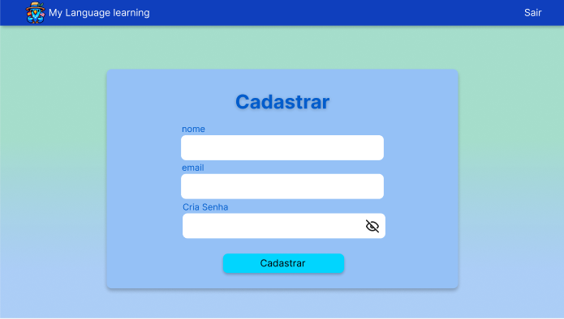
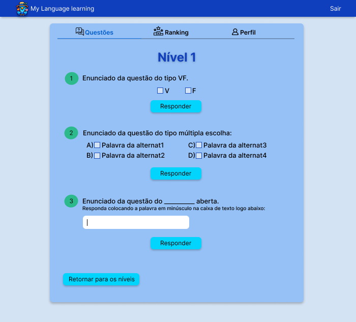

# **4.3.1. MVP - Produto Mínimo Viável**

## Participantes

| Nome                                                        |
| ----------------------------------------------------------- |
| [Luis Henrique](https://github.com/luishenrrique)           |
| [Marina Márcia](https://github.com/The-Boss-Nina)           |
| [Maria Eduarda Barbosa](https://github.com/Madu01)          |
| [João Lucas](https://github.com/Jlmsousa)                   |
| [Maria Eduarda Marques](https://github.com/EduardaSMarques) |
| [Felipe Direito](https://github.com/FelipeDireito)          |

## **Introdução**

&emsp;&emsp;O Minimum Viable Product (MVP) é a versão inicial de um produto de forma que tenha poucos elementos, apenas o que é o mais necessário presente, a ideia é que seja o mínimo para poder testar e não investir muito no desenvolvimento. 

## **Objetivo**

&emsp;&emsp;O objetivo deste documento é ressaltar que o projeto foi reduzido para um MVP para garantir a entrega com o curto prazo. Também demonstrar a versão final do protótipo de alta fidelidade, contendo apenas a ideia de como vai ser o MVP a ser implementado para que a entrega em prazo curto seja realizada com sucesso.

## **Metodologia**

&emsp;&emsp;A equipe percebeu que era necessário desenvolver e refazer o protótipo que antes era de média fidelidade, para agora ser de alta, com o intuito de compactar as ideias iniciais para deixar apenas as principais funcionalidades.
Foi reunido ideias de como seria a logo, as cores, as telas em uma reunião. O protótipo foi criado logo após, com a ideia de manter as funcionalidades que são essenciais para o projeto.
O protótipo foi desenvolvido na plataforma figma, sendo uma forma de deixar mais visível o que vai ter no MVP. Ele está no formato interativo para que o fluxo fique bem definido.

Link para acessar o protótipo da forma interativo: https://www.figma.com/proto/DKVd7l0ODRA7lo3IimjKrS/prototipo?node-id=377-50&t=9aTGyR488tE9zCjV-1&scaling=min-zoom&content-scaling=fixed&page-id=0%3A1&starting-point-node-id=4%3A8

## **Protótipo do MVP**

    
&emsp;&emsp;As imagens 1 até a 8 são as telas da prototipação do MVP. Tem uma identidade visual que além da logo, apresentando nosso mascote *Bluno*, tem a apresentação das telas do nosso protótipo. A sequência começa com a imagem 1, dependendo de qual botão o usuário apertar vai indicar uma tela diferente, se clicar no botão de entrar será a imagem 2, mas se for o cadastrar é a imagem 3. Após a imagem 2 ou 3, é a imagem 4 depois a 5. Na imagem 5, caso o usuário selecione alguma questão do nível aparecerá a imagem 6. Depois tem as imagens 7 e 8.

<h6 align="center">Imagem 1: Tela 1.</h6>

    <h6 align="center">Fonte:  
        <a href="https://github.com/luishenrrique">COSTA</a>, 
        <a href="https://github.com/The-Boss-Nina">SOUZA</a>, 
        <a href="https://github.com/Madu01">BARBOSA</a>,
        <a href="https://github.com/Jlmsousa">SOUSA</a>,
        <a href="https://github.com/EduardaSMarques">MARQUES</a>,
        <a href="https://github.com/FelipeDireito">DIREITO</a>,2024.
    </h6>

<h6 align="center">Imagem 2: Tela 2.</h6>

    <h6 align="center">Fonte:  
        <a href="https://github.com/luishenrrique">COSTA</a>, 
        <a href="https://github.com/The-Boss-Nina">SOUZA</a>, 
        <a href="https://github.com/Madu01">BARBOSA</a>,
        <a href="https://github.com/Jlmsousa">SOUSA</a>,
        <a href="https://github.com/EduardaSMarques">MARQUES</a>,
        <a href="https://github.com/FelipeDireito">DIREITO</a>,2024.
    </h6>

<h6 align="center">Imagem 3: Tela 3.</h6>

    <h6 align="center">Fonte:  
        <a href="https://github.com/luishenrrique">COSTA</a>, 
        <a href="https://github.com/The-Boss-Nina">SOUZA</a>, 
        <a href="https://github.com/Madu01">BARBOSA</a>,
        <a href="https://github.com/Jlmsousa">SOUSA</a>,
        <a href="https://github.com/EduardaSMarques">MARQUES</a>,
        <a href="https://github.com/FelipeDireito">DIREITO</a>,2024.
    </h6>

<h6 align="center">Imagem 4: Tela 4.</h6>

    <h6 align="center">Fonte:  
        <a href="https://github.com/luishenrrique">COSTA</a>, 
        <a href="https://github.com/The-Boss-Nina">SOUZA</a>, 
        <a href="https://github.com/Madu01">BARBOSA</a>,
        <a href="https://github.com/Jlmsousa">SOUSA</a>,
        <a href="https://github.com/EduardaSMarques">MARQUES</a>,
        <a href="https://github.com/FelipeDireito">DIREITO</a>,2024.
    </h6>

<h6 align="center">Imagem 5: Tela 5.</h6>

    <h6 align="center">Fonte:  
        <a href="https://github.com/luishenrrique">COSTA</a>, 
        <a href="https://github.com/The-Boss-Nina">SOUZA</a>, 
        <a href="https://github.com/Madu01">BARBOSA</a>,
        <a href="https://github.com/Jlmsousa">SOUSA</a>,
        <a href="https://github.com/EduardaSMarques">MARQUES</a>,
        <a href="https://github.com/FelipeDireito">DIREITO</a>,2024.
    </h6>

<h6 align="center">Imagem 6: Tela 6.</h6>

    <h6 align="center">Fonte:  
        <a href="https://github.com/luishenrrique">COSTA</a>, 
        <a href="https://github.com/The-Boss-Nina">SOUZA</a>, 
        <a href="https://github.com/Madu01">BARBOSA</a>,
        <a href="https://github.com/Jlmsousa">SOUSA</a>,
        <a href="https://github.com/EduardaSMarques">MARQUES</a>,
        <a href="https://github.com/FelipeDireito">DIREITO</a>,2024.
    </h6>

<h6 align="center">Imagem 7: Tela 7.</h6>

    <h6 align="center">Fonte:  
        <a href="https://github.com/luishenrrique">COSTA</a>, 
        <a href="https://github.com/The-Boss-Nina">SOUZA</a>, 
        <a href="https://github.com/Madu01">BARBOSA</a>,
        <a href="https://github.com/Jlmsousa">SOUSA</a>,
        <a href="https://github.com/EduardaSMarques">MARQUES</a>,
        <a href="https://github.com/FelipeDireito">DIREITO</a>,2024.
    </h6>

<h6 align="center">Imagem 8: Tela 8.</h6>

    <h6 align="center">Fonte:  
        <a href="https://github.com/luishenrrique">COSTA</a>, 
        <a href="https://github.com/The-Boss-Nina">SOUZA</a>, 
        <a href="https://github.com/Madu01">BARBOSA</a>,
        <a href="https://github.com/Jlmsousa">SOUSA</a>,
        <a href="https://github.com/EduardaSMarques">MARQUES</a>,
        <a href="https://github.com/FelipeDireito">DIREITO</a>,2024.
    </h6>

## **MPV Implementado**

    <i>A primeira interação é o Cadastro:</i> o usuário inicia o processo clicando no botão "Cadastrar" na tela inicial, onde deve fornecer informações básicas como nome de usuário, e-mail e senha. Após preencher os dados, ele deve confirmar o cadastro clicando no botão correspondente, para que as informações sejam registradas no banco de dados.
    &emsp;&emsp;

<h6 align="center">Gif 1: Cadastro.</h6>

    <h6 align="center">Fonte:  
        <a href="https://github.com/luishenrrique">COSTA</a>, 
        <a href="https://github.com/The-Boss-Nina">SOUZA</a>, 
        <a href="https://github.com/Madu01">BARBOSA</a>,
        <a href="https://github.com/Jlmsousa">SOUSA</a>,
        <a href="https://github.com/EduardaSMarques">MARQUES</a>,
        <a href="https://github.com/FelipeDireito">DIREITO</a>,2024.
    </h6>

    <i>A segunda interação é o Login:</i> o usuário inicia clicando no botão <strong>Entrar</strong> na tela inicial, onde deve fornecer as informações previamente cadastradas, como e-mail e senha.
    &emsp;&emsp;

<h6 align="center">Gif 2: Login.</h6>

    <h6 align="center">Fonte:  
        <a href="https://github.com/luishenrrique">COSTA</a>, 
        <a href="https://github.com/The-Boss-Nina">SOUZA</a>, 
        <a href="https://github.com/Madu01">BARBOSA</a>,
        <a href="https://github.com/Jlmsousa">SOUSA</a>,
        <a href="https://github.com/EduardaSMarques">MARQUES</a>,
        <a href="https://github.com/FelipeDireito">DIREITO</a>,2024.
    </h6>

*
    <i>A terceira interação envolve a escolha de Idioma, Nível e Questão:</i> o usuário começa selecionando a opção de aprender inglês clicando no botão <strong>Inglês</strong>. Em seguida, escolhe o Nível 1, número 1, sendo direcionado para uma tela com perguntas nos formatos de verdadeiro ou falso, múltipla escolha e preencher lacunas. Conforme o usuário responde, o sistema valida as respostas e informa se ele acertou ou errou, além de exibir a pontuação obtida.
    &emsp;&emsp;

<h6 align="center">Gif 3: Escolha do idioma, nível e questão.</h6>

    <h6 align="center">Fonte:  
        <a href="https://github.com/luishenrrique">COSTA</a>, 
        <a href="https://github.com/The-Boss-Nina">SOUZA</a>, 
        <a href="https://github.com/Madu01">BARBOSA</a>,
        <a href="https://github.com/Jlmsousa">SOUSA</a>,
        <a href="https://github.com/EduardaSMarques">MARQUES</a>,
        <a href="https://github.com/FelipeDireito">DIREITO</a>,2024.
    </h6>

## **Conclusão**

&emsp;&emsp;O protótipo para o MVP que está em desenvolvido no sistema é crucial para entender quais funcionalidades realmente serão realizadas, quais cores, logo, formas, a serem implementados, de modo que estejam concluídos até o dia do prazo da entrega final deste projeto. 

## **Bibliografia**

> SEBRAE. O que é um MVP ou Produto Mínimo Viável. Disponível em: https://sebrae.com.br/sites/PortalSebrae/galeriavideo/o-que-e-um-mvp-ou-produto-minimo-viavel,b386106593cb5710VgnVCM1000004c00210aRCRD. Acesso em: 13 ago. 2024.

## **Histórico de Versão**

&emsp;&emsp;A <strong>Tabela 01</strong> representa o histórico de versão do documento.

<h6 align="center">Tabela 01: Histórico de Versão</h6>

| Versão | Data       | Descrição            | Autor(es)                                           | Revisor(es) |
| ------ | ---------- | -------------------- | --------------------------------------------------- | ----------- |
| `1.0`  | 13/08/2024 | Criação do documento, adição de conteúdos na introdução, objetivo, metodologia, Protótipo do MVP e conclusão | [Maria Eduarda Barbosa](https://github.com/Madu01)  | [Maria eduarda Marques](https://github.com) |
| `1.1`  | 14/08/2024 | Adição do link interativo e fonte nas imagens| [Marina Márcia](https://github.com/The-Boss-Nina) | [João Lucas Miranda de Sousa](https://github.com/Jlmsousa) |
| `1.2`  | 14/08/2024 | Atualização do Protótipo do MVP| [João Lucas Miranda de Sousa](https://github.com/Jlmsousa) | [Marina Márcia](https://github.com/The-Boss-Nina) |
| `1.3`  | 16/08/2024 | Atualização das fontes referentes as imagens| [Marina Márcia](https://github.com/The-Boss-Nina) | [Luis Henrique](https://github.com/luishenrrique) |
| `1.4`  | 16/08/2024 | Atualização do MVP implementado e descrição dos mesmos| [Marina Márcia](https://github.com/The-Boss-Nina) e [Maria Eduarda Marques](https://github.com/EduardaSMarques) | [Felipe Direito](https://github.com/FelipeDireito) |