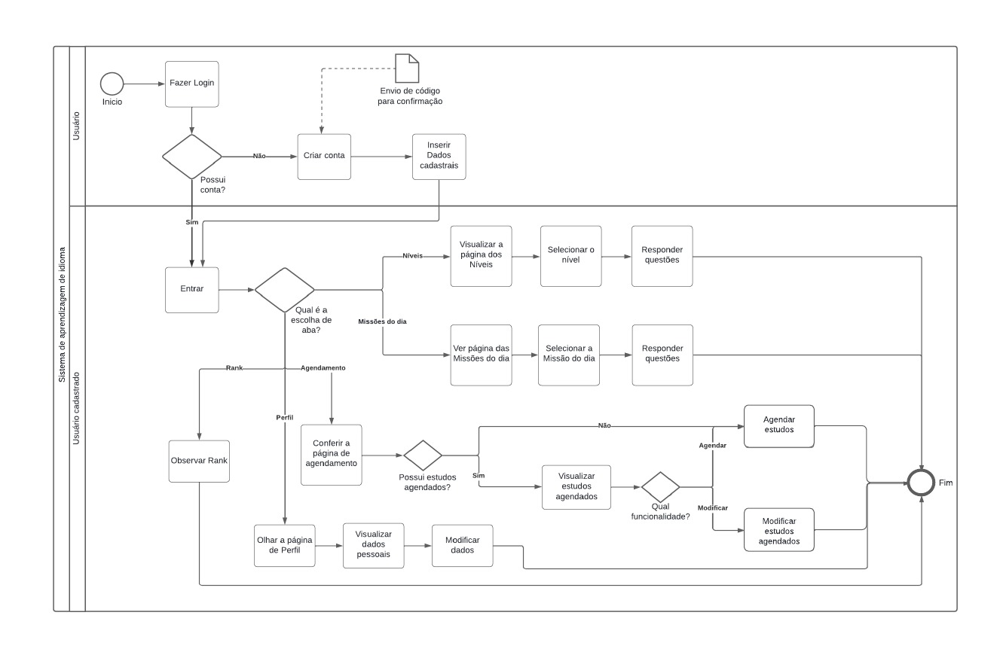

# 1.2. Módulo Processos/Metodologias/Abordagens

## BPMN (Business Process Model and Notation)
O BPMN é uma notação gráfica padronizada utilizada para modelar processos de negócio de forma visual e compreensível. Oferece símbolos e convenções que representam diferentes elementos de um processo, como tarefas, eventos, gateways (decisões), fluxos de sequência, entre outros. Esses elementos são usados para descrever como as atividades de um processo se relacionam entre si, como os dados fluem e como as decisões são tomadas.

A notação BPMN é amplamente utilizada em diversos setores da indústria para documentar, analisar, melhorar e implementar processos de negócio. Ela é uma ferramenta valiosa para analistas de negócios, desenvolvedores de software, gerentes de projeto e outros profissionais envolvidos na gestão e otimização de processos empresariais.

## Elementos do Diagrama

| Elemento       | Descrição                                                                                                                                                       |
|------------------------|-----------------------------------------------------------------------------------------------------------------------------------------------------------------|
| Tarefa                 | Representa uma atividade ou etapa realizada como parte do processo. Pode ser uma ação manual ou automatizada.                                                  |
| Evento                 | Indica algo que acontece durante o curso do processo, como um início, fim, ou algum ponto de interesse. Pode ser de início, intermediário ou final.         |
| Gateway                | Utilizado para controlar a divergência ou convergência do fluxo do processo. Pode representar decisões, divisões ou junções no fluxo de atividades.         |
| Fluxo de Sequência     | Indica a direção do fluxo de atividades no processo. Geralmente, uma seta que conecta os elementos do diagrama, mostrando a ordem das atividades.              |
| Pool                   | Representa uma entidade externa que executa parte ou todo o processo. Pode representar um departamento, organização ou sistema externo.                        |
| Lane                   | Subdivisão dentro de um pool, que organiza e separa atividades relacionadas dentro do mesmo. Pode representar funções, papéis ou departamentos dentro de uma organização. |

Fonte: Autor,2024.

## Diagramas

  

Imagem 1: BPMN do sistema. Fonte: Autor, 2024

 

 

Fonte: 

  

Imagem 2: Metodologia do sistema. Fonte: Autor, 2024

 

 

Fonte: 

## Bibliografia

> SGANDERLA, Kelly. <b>Um guia para iniciar estudos em BPMN (I)<b>: atividades e sequência. Atividades e sequência. 2012. Disponível em: https://blog.iprocess.com.br/2012/11/um-guia-para-iniciar-estudos-em-bpmn-i-atividades-e-sequencia/. Acesso em:  8 abr. 2024.
> 
> LUCIDCHART. What is Business Process Modeling Notation. Disponível em: https://www.lucidchart.com/pages/bpmn. Acesso em:  8 abr. 2024.

## Referências Bibliográficas

>  1. SOMMERVILLE, I. Software engineering. 10. ed. [s.l.] Boston, Mass. Amsterdam Cape Town Pearson Education Limited, 2016.  
>  2. CRUZ, F. Scrum e PMBOK unidos no Gerenciamento de Projetos. [s.l.] Brasport, [s.d.].  
>  3. VINÍCIUS MANHÃES TELES. Extreme Programming. [s.l.] Novatec Editora, 2017.  
>  4. CONVENTIONAL Commits. Conventional Commits. Disponível em: <https://www.conventionalcommits.org/pt-br/v1.0.0/#especificação/>. Acesso em:  8 abr. 2024.  
>  5. BPMN (Business Process Model and Notation). Universidade de Brasília (UNB). Disponível em: <https://www.dpo.unb.br/images/phocadownload/dpr/biblioteca/BPMN.pdf>. Acesso em: 8 abr. 2024.

 
## Histórico de Versões

| Versão | Data       | Descrição            | Autor(es)                                           | Revisor(es) |
| ------ | ---------- | -------------------- | --------------------------------------------------- | ----------- |
| `1.0`  | 08/04/2024 | Criação do documento | [Laura Pinos](https://github.com/laurapinos) |     [Felipe Hansen](https://github.com/FHansen98)        |
| `1.1`  | 08/04/2024 | Adesão do BPMN do sistema | [Felipe Hansen](https://github.com/FHansen98) |             |
