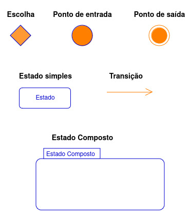
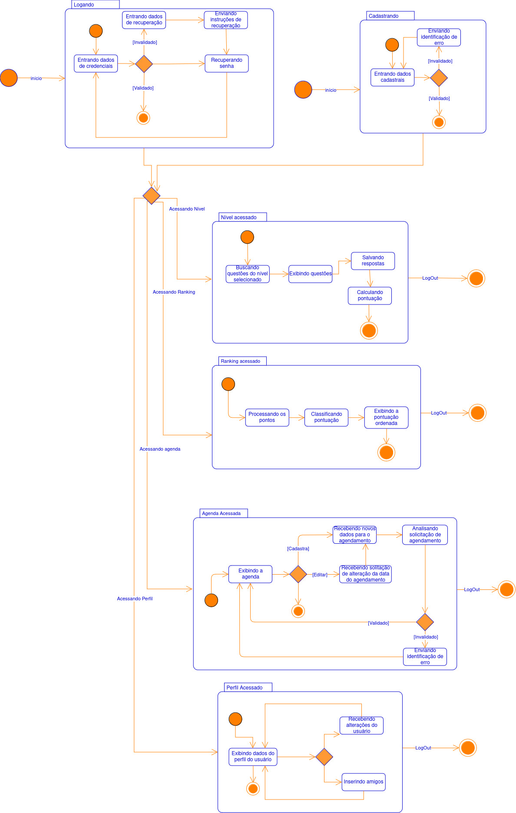
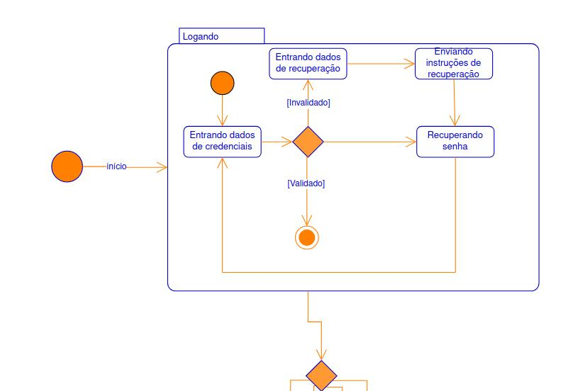
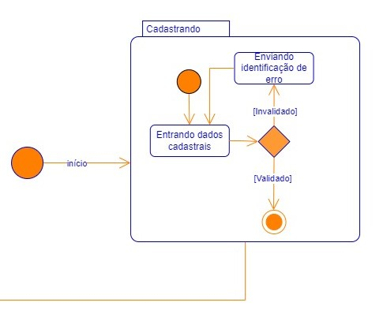
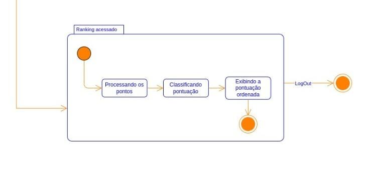

# ***Diagrama de Estados***

## Participantes

| Nome                    |
|-------------------------|
| [Carolina Barbosa](https://github.com/CarolinaBarb)           |
| [Maria Eduarda Barbosa](https://github.com/Madu01)            |
| [João Lucas](https://github.com/Jlmsousa)                     |
| [Júlia Souza](https://github.com/JuliaSSouza)                 |
| [Laura Pinos](https://github.com/laurapinos)                  |   
| [Maria Eduarda Marques](https://github.com/EduardaSMarques)   |

## **Introdução**

&emsp;&emsp;Diagrama de estados é uma ferramenta essencial na modelagem dos aspectos dinâmicos de sistemas. Elas são utilizadas para especificar as sequências de estados que um objeto atravessa durante sua vida em resposta a eventos, bem como as respostas desses objetos a esses eventos. Um estado representa uma condição ou situação durante a vida de um objeto na qual ele satisfaz determinadas condições, realiza atividades ou espera por eventos. Eventos são ocorrências significativas que podem desencadear transições de estado, enquanto transições são relações entre estados que indicam mudanças específicas quando eventos ocorrem e condições são satisfeitas. Diagrama de estados, que representam graficamente esses conceitos, são fundamentais para entender e documentar o comportamento de objetos dentro de um sistema <a href="">[5]</a> .

## **Objetivo**

&emsp;&emsp;O objetivo deste documento é complementar a descrição das classes, documentando os estados possíveis que os objetos de uma certa classe podem assumir e os eventos do sistema que geram tais mudanças. Este documento busca especificar a dinâmica do sistema através de diagrama de estados, reunindo o comportamento completo de uma classe em todos os casos de uso relevantes. Assim, o diagrama de estados oferece uma visão global do comportamento dos objetos de uma classe, permitindo prever todos os comportamentos possíveis de um objeto de acordo com os eventos que ele possa sofrer. Além disso, o documento visa esclarecer quando e como utilizar diagramas de estado, destacando suas notações e a importância de analisar a mudança de estados para capturar o ciclo de vida dos objetos, subsistemas e sistemas.

## **Metodologia**

&emsp;&emsp;A metodologia adotada para o desenvolvimento do diagrama envolveu a realização de duas reuniões, a primeira para fazer a versão inicial de diagramas e em seguida mostrar para a professora milene da disciplina em que este projeto pertence, para ter certeza se estavam no caminho certo e a segunda reunião seria para concretizar as possíveis correções e decidir sobre como seria distribuido os responsáveis na criação deste documento. 

&emsp;&emsp;Na primeira reunião os responsáveis apresentaram suas ideias e com base em conteúdos e exemplos relacionados ao diagrama de estados, colaboraram na criação de um esboço inicial. Os Conteúdos utilizados foram a do UML DIAGRAMS <a href="">[1]</a> o vídeo aula da professora Milene <a href="">[2]</a> e o site <a href="">[4]</a> Lucid Chart além dos ensinamentos da aula presencial. Foi fundamental a leitura desses conteúdos, porém os exemplos observados durante essa fase ajudou ainda mais para que tivessem ideias de como fariam, a equipe avaliou diferentes exemplos para determinar as melhores práticas a serem aplicadas no desenvolvimento do diagrama, identificando elementos e estados que seriam mais adequados para o projeto, mas ainda surgiu dúvidas se estava correto o que já haviam realizado, houve muitas dificuldades em como desenvolve-lo. 

&emsp;&emsp;Antes da segunda reunião, os responsáveis mostraram o diagrama para a professora com o intuito de retirar dúvidas e aplicar melhorias, foi percebido pela professora que os nossos diagramas tendiam mais para um diagrama de atividades em vez de estados. Na segunda reunião, o foco foi a finalização do diagrama e a organização das responsabilidades para a elaboração do artefato do diagrama de estados, no caso este documento. Nesse encontro, os membros da equipe trabalharam em conjunto para melhorar a criação inicial, com correções a respeito do que foi percebido que havia de errado e pelas dicas da professora. 

&emsp;&emsp;Vale ressaltar que o diagrama foi criado no software diagrams.net, o qual possui seu próprio tipo de modelo mas segue as regras da linguagem-padrão UML, o modelo dele pode ser observado na <b>Figura 1</b>. Além disso, os diagramas deste documento representam os estados, mas com base nas dicas da professora milene, a equipe decidiu utilizar o BPMN como um representante que auxilia o leitor a obter mais detalhes do fluxo do usuário no nosso sistema. Esse documento pode ser encontrado em [BPMN_Do_Projeto](https://unbarqdsw2024-1.github.io/2024.1_G6_My_LanguageLearning/#/Base/1.2.ProcessosMetodologiasAbordagens). 

## **Diagramas de Estado**

&emsp;&emsp;Para um melhor acompanhamento na leitura dos diagramas de estado foi disponibilizado uma legenda que pode ser observada na <b>Figura 1</b> e explicada na <b>Tabela 1</b>.

### **Legenda**

<h6 align="center">Figura 1: legenda do diagrama de estados.</h6>

<h6 align="center">Fonte: <a href="https://github.com/fulanodetal">BARBOSA, maria eduarda</a>.

<h6 align="center">Tabela 1: Descrição da legenda.</h6>

| Nome | Descrição | 
| ---- | --------- |
| Escolha | Mostra a ramificação de estados como opções com base nos eventos anteriores, é uma decisão dinâmica de quais opções podem serem utilizadas. |
| Ponto de entrada | Indica qual é o primeiro estado ou estado composto a ser iniciado . |
| Ponto de saída | Indica o término de um estado ou estado composto ou da máquina de estados. |
| Estado simples | Representa o estado atual e não possui subestados dentro dele. |
| Transição | É uma seta que mostra o fluxo dos estados, indicando as mudanças de estados. |
| Estado composto | É um estado que tem subestados dentro dele. |

<h6 align="center">Fonte: <a href="https://github.com/Madu01">BARBOSA, Maria eduarda</a>. 2024.</h6>

### **Diagrama**

#### **Diagrama geral**

<h6 align="center">Figura 2: estado geral.</h6>

<h6 align="center">Fonte: Autoria própria. 2024.</h6>

 

&emsp;&emsp;A <b>Figura 2</b> demonstra de forma geral o resultado final do diagrama de estados. Os estados compostos posteriores é uma vizualização mais focada.

#### **Estado composto Logando**

<h6 align="center">Figura 3: estado composto logando.</h6>

<h6 align="center">Fonte: Autoria própria. 2024.</h6>

 

&emsp;&emsp;Na <b>Figura 3</b> que representa o estado composto logando, inicia com o subestado <b>"entrando dados de credenciais"</b> esse estado seria o preenchimento do usuário nos campos de login, a mudança de estado ocorre logo em seguida, com a presença de uma Escolha representado pelo simbolo observado na <b>Figura 1</b> e explicado na <b>Tabela 1</b>, nele ha duas escolhas a que o resultado deu validado, esse sendo a primeira saída dos subestados, e o resultado de invalidado, que representa quando os dados do usuário não são compatíveis aos que estão cadastrado no banco de dados, neste o caminho é diferente do validado, indo para o subestado <b>"entrando dados de recuperação"</b>, representando o estado em que o usuário insere dados para a recuperação de senha, em seguida vem o <b>"enviando instruções de recuperação"</b>, o qual o sistema enviará por email do usuário a redefinição de senha, no estado posterior <b>"recuperando senha"</b> é o estado em que o usuário estará seguindo as instruções do sistema pelo email e assim que concluir irá retorna para o primeiro estado <b>"entrando dados de credenciais"</b> para acessar o sistema. 

&emsp;&emsp;E por fim, a outra saída é quando o estado composto de logando muda e vai para outros que aparecem quando o usuário esta logado no sistema, o símbolo de Escolha é utilizado para representar essa ideia de escolha para os outros estados compostos. 

  
#### **Estado composto Cadastrando**

<h6 align="center">Figura 4: estado composto cadastrando.</h6>

<h6 align="center">Fonte: Autoria própria. 2024.</h6>

 

&emsp;&emsp;A <b>Figura 4</b>, representa o estado composto cadastrando, iniciando-se pelo estado simples, <b>Entrando dados cadastrais </b>, onde irá ocorrer a entrada de dados do usuário para o cadastramento dele no sistema. Logo após o cadastramento,irá ocorrer uma mudança de evento, que estará sendo representado pelo símbolo de escolha, onde levará a dois caminhos, o primeiro sendo o de <b>Invalidado</b>, que ocorrerá quando o usuário entrar com algum dado incorreto, fazendo que ocorra o estado simples <b>Enviando identificação de erro
</b>, que criará um pop-up para o usuário fazer as correções e logo após retornar novamente para a tela de cadastro. Por fim, quando o usuário adicionar os dados corretamentes, o segundo caminho será o de <b>Validado</b> que acontece quando o usuário finaliza o cadastro e faz com que ocorra um novo evento para ir para o próximo estado composto.

#### **Estado composto Ranking acessado**

<h6 align="center">Figura 5: estado Ranking acessado.</h6>

<h6 align="center">Fonte: <a href="https://github.com/Jlmsousa">SOUSA, João Lucas</a>. 2024.</h6>

 

&emsp;&emsp;Na <b>Figura 5</b>, se representa o estado composto ranking acessado começa no estado simples <b>Processando os pontos<b>, onde ocorre a coleta e o cálculo dos pontos dos usuários que participam do ranking. Em seguida, avança para o estado simples <b>Classificando pontuação<b>, onde as pontuações são organizadas em ordem, classificando os usuários de acordo com seus pontos. Depois disso, segue para o estado <b>Exibindo pontuação ordenada<b>, onde o ranking com todas as pontuações ordenadas são exibidos. O processo termina no ponto de saída, ou continua para o próximo estado composto, conforme necessário.

#### **Estado composto Agendamento**

<h6 align="center">Figura 4: estado composto agendando.</h6>

<h6 align="center">Fonte: <a href="https://github.com/CarolinaBarb">BRITO, Carolina Barbosa</a>. 2024.</h6>

 

&emsp;&emsp;Na <b>figura 4</b> que representa o estado composto do acesso a agenda, inicia com o sub-estado <b>"Exibindo a agenda"</b> esse estado seria o primeiro contato do usuario com a sessão de agendamento onde ele visualizaria os agendamentos que ele já possui caso já tivesse realizado algum, a mudança de estado ocorre logo em seguida, com a presença de uma Escolha representado pelo simbolo observado na <b>Figura 1</b> e explicado na <b>Tabela 1</b>, nele ha três escolhas, a que o resultado já direciona para uma saída caso o usuário só deseje visualizar seus agendamentos, o resultado que cadastra, esse sendo uma escolha do sub-estado <b>"Recebendo novos dados para o agendamento"</b> que o usuario insere os dados para agendar um dia e horario para realizar lições, e o resultado de edita, esse sendo uma escolha do sub-estado <b>"Recebendo solitação de alteração da data do agendamento"</b> que representa a permissão dos usuários alterarem o dia e horario de um agendamento já realizado, seguindo por este caminho o fluxo volta para o sub-estado <b>"Recebendo novos dados para o agendamento"</b>, seguindo em frente para o subestado <b>"Analisando solicitação de agendamento"</b>, onde o sistema processa os dados inseridos pelo usuário estado, após esse subestado nos deparamos com mais uma situação de escolha, onde a primeira é invalidado que direciona para o subestado<b>"Enviando identificação de erro"</b> que representa que o sistema retorna-rá para o usuário uma mensagem de erro, a outra escolha é validada levando novamente ao subestado inicial <b>"Exibindo a agenda"</b> que mostra que o processo deu certo e assim encerrando o ciclo. 

## **Conclusão**

&emsp;&emsp;O Diagrama de Estados elaborado nos ofereceu uma representação visual clara dos estados de um objeto e as transições entre esses estados, facilitando a compreensão do comportamento do sistema ao longo do tempo. Esse diagrama também permite uma visão detalhada das respostas do sistema a diversos eventos, auxiliando na identificação de possíveis melhorias e na previsão de comportamentos.

## **Links**

<a href="link de referência">nome a ser referenciado</a>

## **Bibliografia**

> <a href="https://Link_da_fonte">[1]</a> UML DIAGRAMS. State Machine Diagrams. 2023. Disponível em: <https://www.uml-diagrams.org/state-machine-diagrams.html>. Acesso em: 4 jul. 2024.

> <a href="https://Link_da_fonte">[2]</a> SERRANO, milene. 06d - VideoAula - DSW-Modelagem - Estados. [Vídeo]. 2020. Stream. Disponível em: <https://unbbr-my.sharepoint.com/personal/mileneserrano_unb_br/_layouts/15/stream.aspx?id=%2Fpersonal%2Fmileneserrano%5Funb%5Fbr%2FDocuments%2FArqDSW%20%2D%20V%C3%ADdeosOriginais%2F06d%20%2D%20VideoAula%20%2D%20DSW%2DModelagem%20%2D%20Estados%2Emp4&ga=1&referrer=StreamWebApp%2EWeb&referrerScenario=AddressBarCopied%2Eview%2E44d12a9d%2Db41e%2D4015%2Da3ef%2D490962423f81>. Acesso em: 4 jul. 2024.

> <a href="https://Link_da_fonte">[3]</a> Diagrama de estados. [imagem]. 2024. Aprender 3. Disponível em: <https://aprender3.unb.br/pluginfile.php/2790248/mod_label/intro/State%20Diagram%20Example.png>. Acesso em: 4 jul. 2024.

> <a href="https://Link_da_fonte">[4]</a> LUCIDCHART. O que é diagrama de máquina de estados UML. Disponível em: <https://www.lucidchart.com/pages/pt/o-que-e-diagrama-de-maquina-de-estados-uml>. Acesso em: 4 jul. 2024.

> <a href="https://Link_da_fonte">[5]</a> BOOCH, G. et al. The Unified Modeling Language User Guide Medeiros, E. Desenvolvendo Software com UML 2.0: Definitivo, Makron Books, 2006.

## **Histórico de Versão**

&emsp;&emsp;A tabela n representa o histórico de versão do documento.

  
<h6 align="center">Tabela 2: Histórico de Versão.</h6>

| Versão | Data      | Descrição                                                                                       | Autor(es)                                              | Revisor(es)                                     |
|--------|-----------|-------------------------------------------------------------------------------------------------|--------------------------------------------------------|------------------------------------------------|
| 1.0    | 06/07/2024| Criação do arquivo e do conteúdo na metodologia                                                 | [Maria Eduarda Barbosa](https://github.com/Madu01)     | [Marina Márcia](https://github.com/The-Boss-Nina) |
| 1.1    | 06/07/2024| Atualização da metodologia e adição do conteúdo da legenda, do diagrama geral, e do estado composto de logando | [Maria Eduarda Barbosa](https://github.com/Madu01)     | [Marina Márcia](https://github.com/The-Boss-Nina) |
| 1.2    | 08/07/2024| Adição da conclusão                                                                             | [Julia Souza](https://github.com/JuliaSSouza)          | [Felipe Aguiar Hansen](https://github.com/fhansen98) |
| 1.3    | 08/07/2024| Adição do estado composto Agendamento                                                           | Carolina Barbosa Brito                                 | Luis Henrique Luz Costa                         |
| 1.4    | 08/07/2024| Adição do tópico Estado composto Ranking acessado, da imagem e da referência                    | [João Lucas](https://github.com/Jlmsousa)              |                                                 |
| 1.5   | 08/07/2024| Correção tabela        |  [Julia Souza](https://github.com/JuliaSSouza)              |         [Felipe Aguiar Hansen](https://github.com/fhansen98)    
| 1.6 | 20/04/2024| Adição da introdução e dos objetivos | Maria eduarda Marques    |   Felipe Direito    |
| 1.7 | 20/04/2024| Adição do tópico Estado composto Cadastrando, da imagem e da referência  | Maria eduarda Marques    |   Felipe Direito    |

<h6 align="center">Fonte: <a href="https://github.com/Madu01">BARBOSA, Maria Eduarda</a>. 2024.</h6>

