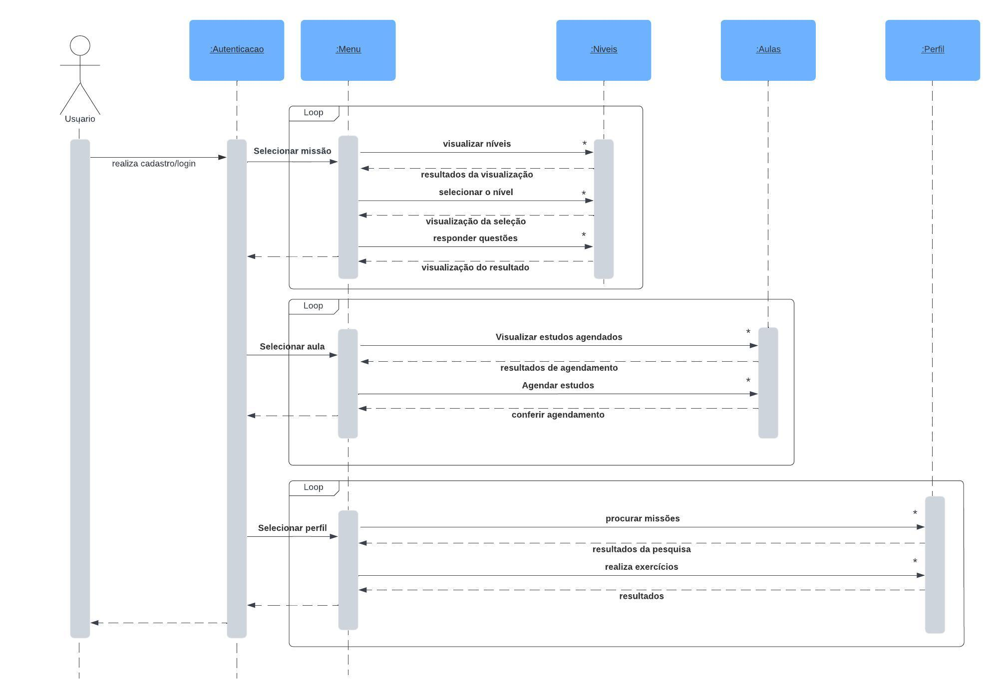

# ***Diagrama de sequência***

## Participantes

| Nome                    |
|-------------------------|
| [Gabriela Lemos](https://github.com/heylisten64)           |
| [Pedro Augusto](https://github.com/PedroSiq)               |
| [Luis Henrique](https://github.com/luishenrrique)          |
| [Felipe Hansen](https://github.com/fhansen98)              |
| [Felipe Direito](https://github.com/FelipeDireito)         |
| [Marina Márcia](https://github.com/The-Boss-Nina)          |
| [Matheus Moreira](https://github.com/MatheusPerillo)       |

## **Introdução**

&emsp;&emsp;Os Diagrama de Sequência são frequentemente usados para modelar o comportamento dinâmico de um sistema, especialmente durante a fase de modelagem e análise. Existem várias formas de representar um diagrama sequencial, mas geralmente ele inclui componentes como objetos, classes, módulos ou funções, bem como as mensagens ou eventos que são trocados entre esses componentes durante a execução do sistema.

## **Objetivo**

&emsp;&emsp;O objetivo do Diagrama Sequencial é facilitar a análise e a compreensão das possíveis interações entre várias partes do software. Para isso, é necessário mapear diversos fluxos que os usuários podem seguir dentro da aplicação, permitindo um entendimento mais aprofundado da mesma. Este processo auxilia na elaboração, construção e refinamento da arquitetura do software.

## **Metodologia**

&emsp;&emsp;A metodologia adotada para o desenvolvimento do diagrama envolveu.....

## **Diagrama de Sequência**
<h6 align="center">Fonte: <a href="https://github.com/The-Boss-Nina">SOUZA</a>. 2024.</h6>

## **Tópico 1: Autenticação e Menu**

&emsp;&emsp;O diagrama de sequência mostra que o processo de autenticação e acesso ao menu principal do aplicativo My Language Learning se dá da seguinte forma:

1. Usuário: O usuário inicia o aplicativo e realiza o login, informando seu email e senha.
2. Sistema: O sistema verifica as credenciais do usuário no banco de dados.
3. Se as credenciais forem válidas:
- Sistema: O sistema autentica o usuário e apresenta o menu principal.
- Usuário: O usuário pode escolher entre visualizar os níveis disponíveis, selecionar um nível para visualizar as aulas, selecionar uma aula 4.para responder às questões ou visualizar seus estudos agendados.
4. Se as credenciais forem inválidas:
- Sistema: O sistema apresenta uma mensagem de erro informando que o email ou a senha estão incorretos.
- Usuário: O usuário pode tentar novamente o login ou clicar em "Esqueci minha senha" para recuperar sua senha.

## **Tópico 2: Níveis e Aulas**

&emsp;&emsp;O diagrama de sequência mostra que o processo de seleção de níveis, aulas e realização de exercícios no aplicativo My Language Learning se dá da seguinte forma:

1. Usuário: O usuário seleciona um nível na lista de níveis disponíveis.
2. Sistema: O sistema apresenta a lista de aulas do nível selecionado.
3. Usuário: O usuário seleciona uma aula na lista de aulas disponíveis.
4. Sistema: O sistema apresenta as questões da aula selecionada.
5. Usuário: O usuário responde às questões da aula.
6. Sistema: O sistema verifica as respostas do usuário e apresenta o resultado das questões.
7. Usuário: O usuário pode visualizar seus estudos agendados ou voltar para a lista de níveis.

## **Tópico 3: Perfil**

&emsp;&emsp;O diagrama de sequência mostra que o processo de acesso ao perfil, realização de missões e exercícios no aplicativo My Language Learning se dá da seguinte forma:

1. Usuário: O usuário acessa seu perfil.
2. Sistema: O sistema apresenta a lista de missões disponíveis.
3. Usuário: O usuário seleciona uma missão na lista de missões disponíveis.
4. Sistema: O sistema apresenta os exercícios da missão selecionada.
5. Usuário: O usuário realiza os exercícios da missão.
6. Sistema: O sistema verifica os resultados dos exercícios e apresenta o feedback ao usuário.
7. Usuário: O usuário pode visualizar seus resultados dos exercícios ou voltar para o menu principal.

## **Conclusão**

&emsp;&emsp;Os Diagramas de Sequência tratam-se de artefatos fundamentais na modelagem do comportamento dinâmico do sistema, visto como uma base instrumental na fase de modelagem e análise de software. A partir dele é possível observar informações detalhadas a respeito das interações dos componentes presentes no sistema ao longo do tempo. 

&emsp;&emsp;Neste contexto, utilizamos a técnica para mapear fluxos de seleção de níveis e aulas, autenticação e interação com o perfil do usuário. Assim, com o artefato elaborado temos uma base robusta para o exame e desenvolvimento contínuo do sistema. Ou seja, o diagrama não só apresenta elementos que auxiliam no entendimento das interações como também oferece uma referência para futuras expansões e aperfeiçoamentos no sistema, o que contribui significativamente para a eficácia do desenvolvimento do software. Com base nesta técnica todas as interações possíveis são devidamente mapeadas e compreendidas pelo time de desenvolvimento.

<!--
## **Links**

<a href="link de referência">nome a ser referenciado</a>

-->

## **Bibliografia**
> <a href="https://Link_da_fonte">[1]</a> Bóson Treinamentos. Curso de UML - O que é um Diagrama de Sequência. Disponível em: https://www.youtube.com/watch?v=UVkj3ed0ZuM. Acesso em: 08 jul. 2024.

> <a href="https://Link_da_fonte">[2]</a> Diagramas de Seqüência. Disponível em: https://www.ibm.com/docs/pt-br/rsm/7.5.0?topic=uml-sequence-diagrams. Acesso em: 08 jul. 2024.

## **Histórico de Versão**

&emsp;&emsp;A tabela 1 representa o histórico de versão do documento.

<h6 align="center">Tabela 1: Histórico de Versão.</h6>

| Versão | Data      | Descrição                                   | Autor(es) | Revisor(es) |
| ------ | --------- | ------------------------------------------- | --------- | ---------- |
| `1.1`  | 26/04/2024| Adição do diagrama de sequência e tópicos explicativos sobre o diagrama      | [Marina Márcia](https://github.com/The-Boss-Nina)     |    [Maria Eduarda Barbosa](https://github.com/Madu01)   |
| `1.2`  | 26/04/2024| Ajuste no tamanho da imagem do diagrama e adição da Introdução e Objetivos      | [Felipe Direito](https://github.com/FelipeDireito)     |     [Gabriela Lemos](https://github.com/heylisten64)  |
| `1.3`  | 08/07/2024| Ajuste na imagem do diagrama e adição da conclusão, bibliografia e tabela de participação      | [Gabriela Lemos](https://github.com/heylisten64)     |    [Felipe Direito](https://github.com/FelipeDireito)   |
| `1.4`  | 08/07/2024| Correção da imagem do diagrama de sequência      | [Marina Márcia](https://github.com/The-Boss-Nina)     |   [Maria Eduarda Barbosa](https://github.com/Madu01)    |

<h6 align="center">Fonte: <a href="https://github.com/Madu01">BARBOSA, Maria eduarda</a>. 2024.</h6>
