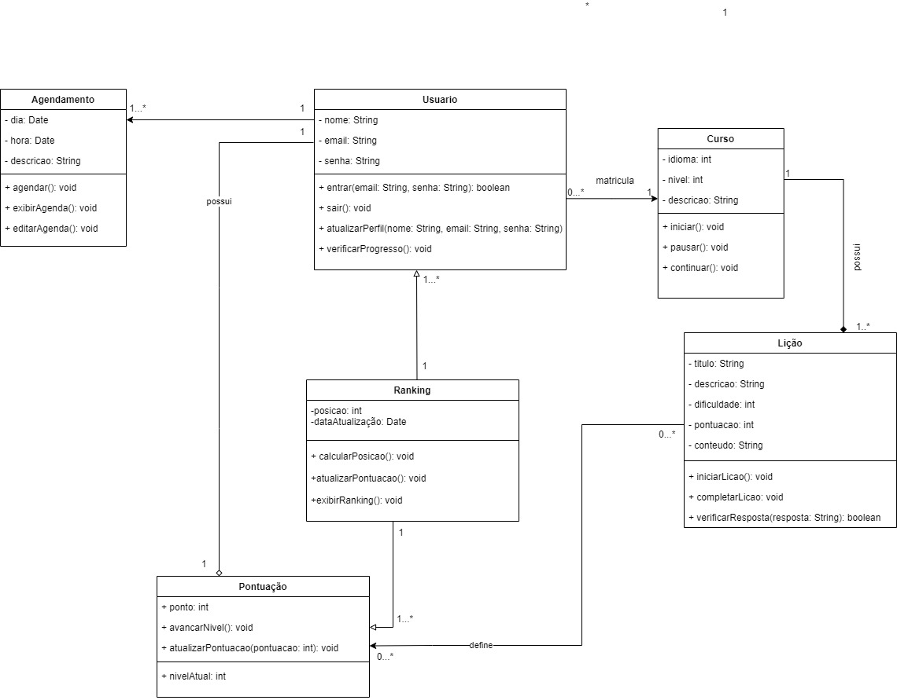

# ***Diagrama de classes***

## Participantes

| Nome                    |
|-------------------------|
| [Carolina Barbosa] (https://github.com/CarolinaBarb)           |
| [Gabriela Lemos](https://github.com/heylisten64)               |
| [João Lucas] (https://github.com/Jlmsousa)                     |
| [Júlia Souza] (https://github.com/JuliaSSouza)                 |
| [Laura Pinos] (https://github.com/laurapinos)                  |   
| [Maria Eduarda Marques] (https://github.com/EduardaSMarques)   |

## **Introdução**

&emsp;&emsp;Texto ....(introduz ao que se trata o artefato)

## **Objetivo**

&emsp;&emsp;Texto .... (coloque os objetivos)

## **Metodologia**

&emsp;&emsp;Para iniciar o desenvolvimento do diagrama, foi utilizado a metodologia de identificar primeiro os responsáveis por sua criação e estabelecer os dias e horários das reuniões, visando contornar os problemas de disponibilidade de todos os participantes. 

&emsp;&emsp;Na primeira reunião, foi realizado um esboço inicial do diagrama, durante o qual os participantes presentes dedicaram-se a estudar o tema em questão, buscando referências em outros repositórios e sites para embasar sua elaboração. Surgiram diversas dúvidas e obstáculos no processo de desenvolvimento, o que sugere que o diagrama presente neste artefato ainda pode passar por modificações em futuras versões. A segunda reunião foi dedicada à conclusão do diagrama e também o artefato sobre ele.

## **Diagrama**

<h6 align="center">Figura 2: Diagrama de classes.</h6>

<h6 align="center">Fonte: <a href="https://github.com/EduardaSMarqus">Autoria própria </a>. 2024.</h6>

 

&emsp;&emsp;A <b>Figura 2</b>, mostra quais serão as classes desenvolvidas neste projeto. No contexto deste projeto, temos as seguintes classes principais: Agendamento, Usuário, Curso, Ranking, Lição e Pontuação. Cada uma dessas classes possui atributos e métodos específicos que definem seu comportamento e funcionalidade dentro do sistema.

&emsp;&emsp; A classe <b>Usuário</b> é central nesse sistema, ela está relacionada a várias outras classes, indicando as diferentes interações que um usuário pode ter dentro do sistema.

&emsp;&emsp;A classe <b>Agendamento</b> está diretamente relacionada à classe Usuário,a relação indica que um usuário pode criar múltiplos agendamentos e cada agendamento está associado a um único usuário.

&emsp;&emsp; A classe <b>Curso</b>, está relacionada com Usuário e a classe <b>Lição</b>, a cardianalidade com o usuário sendo, nenhum ou muitos usuários só podem está matriculados em um curso e um curso pode pertencer a muitos usuários, e a relação entre Curso e Lição, mostra que um curso pode ter várias lições, mas cada lição pertence a um único curso.

&emsp;&emsp;Já na classe <b>Ranking</b>, mostra que um usuário pode ter uma posição em um ranking e o rank pode ter muitos usuário, e o rank pode ter muitas pontuações, entretanto essas pontuações só podem pertencer a um ranking.

&emsp;&emsp;E por último temos a classe <b>Pontuação</b>, que além do que já foi dito acima, ela também pode pertencer ao usuário, indicando que um usuário pode possuir muitos pontos, mas uma pontuação só pode pertencer a um usuário.

## **Conclusão**

&emsp;&emsp;Texto .... (explique a conclusão que se teve a respeito do desenvolvimento do artefato)

## **Legenda**

<h6 align="center">Figura/Tabela n: Nome da figura/tabela.</h6>

  
(Coloque a Figura/Tabela aqui, lembrando que tem que haver um espaço acima e embaixo da Figura/Tabela para não quebrar a tabela no .md)

<h6 align="center">Fonte: <a href="https://github.com/fulanodetal">SOBRENOME, Nome</a>; <a href="https://github.com/fulanodetal">SOBRENOME, Nome</a>. 2024.</h6>

## **Links**

<a href="link de referência">nome a ser referenciado</a>

## **Bibliografia**
> <a href="https://Link_da_fonte">[1]</a> Fonte 1

> <a href="https://Link_da_fonte">[2]</a> Fonte 2

## **Histórico de Versão**

&emsp;&emsp;A tabela n representa o histórico de versão do documento.

<h6 align="center">Figura/Tabela n: Histórico de Versão.</h6>

| Versão | Data      | Descrição                                   | Autor(es) | Revisor(es) |
| ------ | --------- | ------------------------------------------- | --------- | ---------- |
| `1.0`  | 21/04/2024| Criação do arquivo  | Felipe Hansen    |    Maria Eduarda Barbosa   |
| `1.1`  | 08/07/2024| Adicionando o diagrama de classes e as explicação das relações de cada classe | Maria eduarda Marques    |   Maria Eduarda Barbosa  |

<h6 align="center">Fonte: <a href="https://github.com/Mad01">Autoria Própria</a>. 2024.</h6>
