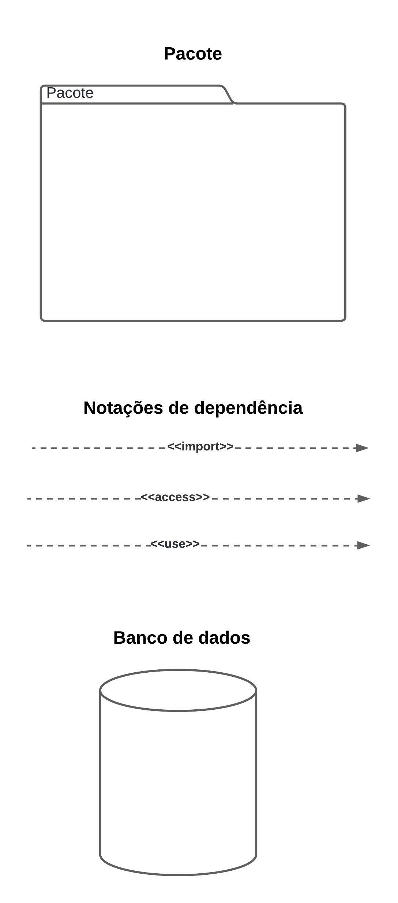
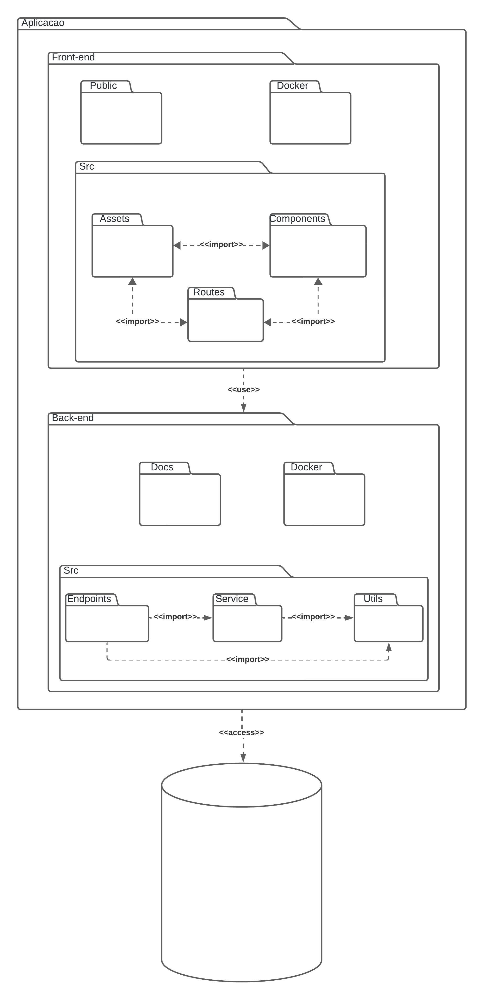

# ***Diagrama de pacotes***

## Participantes

| Nome                    |
|-------------------------|
| [Maria Eduarda Barbosa](https://github.com/Madu01)         |
| [Luis Henrique](https://github.com/luishenrrique)          |
| [Felipe Hansen](https://github.com/fhansen98)              |
| [Felipe Direito](https://github.com/FelipeDireito)         |
| [Marina Márcia](https://github.com/The-Boss-Nina)          |
| [Matheus Moreira](https://github.com/MatheusPerillo)       |
| [Pedro Augusto](https://github.com/PedroSiq)               |

## **Introdução**

&emsp;&emsp;Neste documento, é abordado o conteúdo de diagrama de pacotes, como ele foi realizado e também a explicação do diagrama criado. O diagrama de pacotes mostra a estrutura organizacional da arquitetura de qualquer classificador UML, no caso desse projeto, do software. Os elementos nesse tipo de diagrama seguindo o padrão UML, são relacionados, sendo pacotes, classes e documentos, possuindo hierarquia entre eles. Um pacote é uma pasta que possui arquivos do sistema ou de um projeto UML, ele também pode conter outro pacote além de classes e documentos. Para mais explicação sobre os elementos utilizados, observa a <b>imagem 1</b> e <b>tabela 1</b> além da explicação do tópico <b>Diagrama</b>. 

## **Objetivo**

&emsp;&emsp;O objetivo da utilização do diagrama de pacotes no projeto, é para obter uma visão geral e fácil de entender sobre a organização do sistema com sua estrutura hierárquica dos elementos no padrão UML. Além disso, o diagrama de pacotes favorece a visibilidade em sistemas de grande escala, com a vantagem dos elementos visuais em UML serem facilmente interpretados e atualizados de acordo com a situação atual do sistema.

## **Metodologia**

&emsp;&emsp;A metodologia foi embasada em reuniões, as primeiras que foram duas, eram para estudar sobre o conteúdo, pesquisando em site oficial <a href="">[1]</a> e em outros repositórios do site github e pelo vídeo aula da professora Milene <a href="">[2]</a> da disciplina em que este projeto participa, além de fazer um esboço inicial do diagrama com junção de ideias dos envolvidos. Nessa etapa era mais imatura, pois havia muitas dúvidas de como fazer, principalmente pelas ideias diferentes de cada responsável por esse diagrama, pois cada um tinha uma visão diferente e alguns modificaram sem avisar e consentir com o restante.

&emsp;&emsp;Nas outras duas reuniões, sendo a segunda etapa, já estavam mais maduros e com ideias consolidadas, as dúvidas foram sanadas durante as aulas da professora Milene e isso contribuiu ainda mais para a conclusão do diagrama de pacotes. O diagrama foi realizado com um olhar mais geral para englobar as tecnologias que ainda não foram bem definidas para o desenvolvimento do software, por ser mais geral pode passar por alterações futuras para se adequar melhor à situação do sistema. 

&emsp;&emsp;É importante mencionar que o diagrama deste documento foi criado no site do Lucidchart.com, seguindo as regras estabelecidas pela UML.  

## **Diagrama**

&emsp;&emsp;Está presente na <b>imagem 1</b> e <b>tabela 1</b>, o conteúdo e explicação dos elementos utilizados no desenvolvimento do diagrama de pacotes do software do projeto. Vai servir como guia para o leitor entender melhor.  

### **Legenda**

<h6 align="center">Imagem 1: legenda do diagrama de pacotes.</h6>

<h6 align="center">Fonte: <a href="https://github.com/fulanodetal">BARBOSA, maria eduarda</a>.

<h6 align="center">Tabela 1: Descrição da legenda.</h6>

| Nome | Descrição | 
| ---- | --------- |
| Pacote | Representa uma pasta que pode conter os elementos UML. |
| Notações de dependência: << import >> | Dependência representado pela "seta" demonstra a relação entre os elementos, que nesse caso especifica um import, ou seja, usada quando ha uma importação de dados de um elemento para o outro. |
| Notações de dependência: << access >> | Essa dependência indica uma relção mais íntima entre os elementos, pois um precisa utilizar os dados ou funções do outro. |
| Notações de dependência: << use >> | Indica que um elemento utiliza dados ou funções do outro elemento. |
| Banco de dados | Representação da base ou banco de dados do sistema. |

<h6 align="center">Fonte: <a href="https://github.com/Madu01">BARBOSA, Maria eduarda</a>. 2024.</h6>

<h6 align="center">Imagem 2: diagrama de pacotes.</h6>

<h6 align="center">Fonte: <a href="https://github.com/fulanodetal">BARBOSA, maria eduarda</a>.</h6>

&emsp;&emsp;Na <b>Imagem 2</b>, dentro do pacote <b>Aplicacao</b> tem outros dois pacotes importantes para o sistema do projeto, o <b>Front-end</b> e <b>Back-end</b>. No <b>Front-end</b>, é a pasta onde ficarão as classes, arquivos e imagens referentes à parte visual do sistema. No <b>Back-end</b> é a parte de transições de dados e os arquivos de linguagens de programação com os métodos, funções e classes a respeito da parte lógica do que está no front-end. O pacote <b>Aplicacao</b> tem uma ligação ao banco de dados, fazendo com que todos que estejam dentro dele possam também ter acesso.

&emsp;&emsp;Dentro do pacote <b>Front-end</b>, existem os seguintes pacotes: o <b>Public</b>, o <b>Docker</b> e o <b>Src</b>. No <b>Public</b> serão armazenados arquivos visuais como imagens e ícones que estão abertos para o público, sendo para algo mais específico. No <b>Docker</b>, estarão os arquivos de configurações necessários de docker para preservar a ambientação do sistema. No <b>Src</b> estão armazenados outros três pacotes: o <b>Assets</b> que terá as imagens mais gerais e utilizadas no sistema, o <b>Routes</b>, que manterá as rotas de páginas do sistema, e o <b>Components</b> com os arquivos de lógica com métodos, funções e classes.

&emsp;&emsp;Dentro do pacote <b>Back-end</b>, existem três pastas: o <b>Docker</b>, que será como o do front-end, porém mais específico para o back-end, terá também o <b>Doc</b> que guardará os documentos e o <b>Src</b> que inclui os pacotes <b>EndPoints</b> que transmitem e recebem informações, o <b>Service</b> e o <b>Utils</b> que mantém os arquivos de lógica com métodos, funções e classes.

## **Conclusão**

&emsp;&emsp;Portanto, o nosso sistema seguirá a estrutura apresentada na <b>Imagem 2</b>, para facilitar na manuntenção e interpretação do nosso sistema. Assim os desenvolvedores do sistema irão se manter alinhados nessa questão da estrutura organizacional do projeto.

## **Bibliografia**
> <a href="https://Link_da_fonte">[1]</a> LUCIDCHART. Diagrama de pacotes UML. Disponível em: https://www.lucidchart.com/pages/pt/diagrama-de-pacotes-uml. Acesso em: 4 jul. 2024.

> <a href="https://Link_da_fonte">[2]</a> SERRANO, M. VideoAula - DSW Modelagem - Pacotes. Disponível em: https://unbbr-my.sharepoint.com/personal/mileneserrano_unb_br/_layouts/15/stream.aspx?id=%2Fpersonal%2Fmileneserrano%5Funb%5Fbr%2FDocuments%2FArqDSW%20%2D%20V%C3%ADdeosOriginais%2F05g%20%2D%20VideoAula%20%2D%20DSW%2DModelagem%20%2D%20Pacotes%2Emp4&ga=1&referrer=StreamWebApp%2EWeb&referrerScenario=AddressBarCopied%2Eview%2Eaf1e9ddf%2D13c9%2D4a4e%2D9b13%2Dfc60bc491de7. Acesso em: 4 jul. 2024.

## **Histórico de Versão**

&emsp;&emsp;A tabela 2 representa o histórico de versão do documento.

<h6 align="center">Tabela 2: Histórico de Versão.</h6>

| Versão | Data      | Descrição                                   | Autor(es) | Revisor(es) |
| ------ | --------- | ------------------------------------------- | --------- | ---------- |
| `1.0`  | 20/04/2024| Criação do arquivo e adição de conteúdo na metodologia  | Maria Eduarda Barbosa     |   Maria Eduarda Marques    |
| `1.1`  | 20/04/2024| Adição de conteúdo nos tópicos introdução, objetivos, diagrama, legenda e conclusão.  | Maria Eduarda Barbosa     |   Maria Eduarda Marques    |
| `1.2`  | 08/07/2024| Adição da tabela de participantes e correção gramatical.  | Maria Márcia     |

<h6 align="center">Fonte: <a href="https://github.com/Madu01">BARBOSA, Maria eduarda</a>. 2024.</h6>
