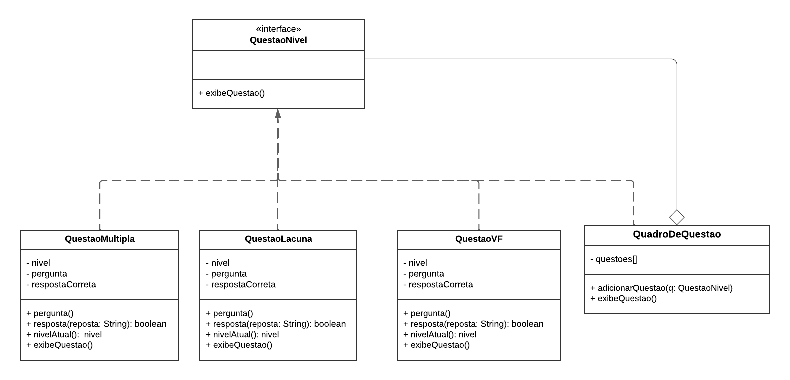

# **3.1. Módulo Padrões de Projeto GRASPs**

## **Introdução**

&emsp;&emsp;No desenvolvimento de software, a atribuição eficaz de responsabilidades é crucial para criar sistemas bem projetados e fáceis de manter. Os padrões GRASP (General Responsibility Assignment Software Patterns), formulados por Craig Larman, fornecem um conjunto de diretrizes para a alocação de responsabilidades entre objetos em um sistema de software. Esses padrões visam resolver problemas comuns no design de sistemas, promovendo uma estrutura organizada e uma comunicação clara entre os componentes do sistema.

 
&emsp;&emsp;Os padrões GRASP abordam questões importantes como a definição de quem deve assumir determinadas responsabilidades e como os objetos devem interagir. Ao aplicar esses padrões, os desenvolvedores podem alcançar uma maior coesão e menor acoplamento, resultando em um código mais modular, flexível e fácil de manter. O projeto visa explorar e aplicar esses padrões para demonstrar sua eficácia na melhoria da qualidade do design e no desenvolvimento de sistemas de software mais robustos e adaptáveis.

## **Objetivo**

&emsp;&emsp;O objetivo deste projeto é melhorar a qualidade do design de software por meio da aplicação dos padrões GRASP. Esses padrões fornecem abordagens estruturadas para a atribuição de responsabilidades, ajudando a resolver problemas de design e promover boas práticas no desenvolvimento de software.

&emsp;&emsp;A aplicação dos padrões GRASP visa aprimorar a coesão e reduzir o acoplamento entre os objetos, resultando em um sistema mais modular e fácil de manter. O projeto busca implementar um sistema de software utilizando esses padrões, avaliar seu impacto na qualidade do design e documentar as melhores práticas para futuros desenvolvimentos. Assim, o projeto pretende contribuir para a criação de sistemas mais robustos e flexíveis, que sejam capazes de se adaptar a mudanças e evoluções ao longo do tempo.

## **GRASPs utilizados**

&emsp;&emsp;Utilizamos os GRASPs de Invenção Pura ou Fabricação Própria, de Polimorfismo e de Controladora ou Controller, que são encontrados nos GoFs, para ser mais específico, nos tópicos logo abaixo representam de onde estar cada GRASPs, nos respectivos GoFs. Na tabela 1, se encontra linkagens para os GoFs que utilizaram os GRASPs, de forma a facilitar o acesso e entendimento do leitor. 

<h6 align="center">Tabela 1: Linkagens para os GoFs.</h6>

| GRASPs | GoFs  |
| ------ | ----- |
| Invenção Pura ou Fabricação Própria | [Criacional - Abstract Factory](https://unbarqdsw2024-1.github.io/2024.1_G6_My_LanguageLearning/#/PadroesDeProjeto/criacionalAbstractFactory) |
| Polimorfismo | [Estrutural - Composite](https://unbarqdsw2024-1.github.io/2024.1_G6_My_LanguageLearning/#/PadroesDeProjeto/estruturalComposite) |
| Controladora ou Controller | [Comportamental - Memento](https://unbarqdsw2024-1.github.io/2024.1_G6_My_LanguageLearning/#/PadroesDeProjeto/comportamentalMemento) |

<h6 align="center">Fonte: Autoria própria. 2024.</h6>

### **GRASP de Invenção Pura ou Fabricação Própria**

<h6 align="center">Figura 1: Diagrama UML Abstract Factory demonstrando Invenção Pura.</h6>

<h6 align="center">Fonte: Autoria própria. 2024.</h6>

&emsp;&emsp; No UML de Abstrac Factory presente na figura 1, LinguagemFactory e RankingFactory são exemplos de invenção pura. Eles são responsáveis pela criação de objetos específicos de acordo com o idioma selecionado. Essas fábricas encapsulam a lógica de criação, permitindo que a classe Cliente não se preocupe com os detalhes de como as questões ou rankings são criados. 

### **GRASP de Polimorfismo**

<h6 align="center">Figura 2: Diagrama UML Composite demonstrando polimorfismo.</h6>

<h6 align="center">Fonte: Autoria própria. 2024.</h6>

&emsp;&emsp;Na figuara 2, o polimorfismo foi utilizado no padrão GoF estrutural 'Composite', onde as classes QuestaoNivel, QuestaoMultipla, QuestaoLacuna, QuestaoVF e QuadroDeQuestao possuem relação de herança e têm o método exibeQuestao sendo herdado e sobrescrito nessas classes.

### **GRASP de Controladora ou Controller**

<h6 align="center">Figura 3: Diagrama UML Memento demonstrando GRAsP controladora.</h6>

<h6 align="center">Fonte: Autoria própria. 2024.</h6>

&emsp;&emsp;Na figura 3, o UML representado é do GOF comportamental memento, o UML em questão utiliza o GRAsP controladora ou controller. A classe Cuidadora é responsável por gerenciar as operações de salvamento e restauração do estado de Originadora. Ela não apenas coordena estas operações, mas também mantém um histórico dos estados anteriores. Isso é consistente com o papel do Controller, que coordena as operações e delega responsabilidades.

## **Histórico de Versão**

&emsp;&emsp;A tabela 01 representa o histórico de versão do documento.

<h6 align="center">Tabela 01: Histórico de Versão</h6>

| Versão | Data       | Descrição            | Autor(es)                                           | Revisor(es) |
| ------ | ---------- | -------------------- | --------------------------------------------------- | ----------- |
| `1.0`  | 24/07/2024 | Criação do documento, adição da Introdução e objetivo | [Marina Márcia](https://github.com/The-Boss-Nina) | [João Lucas](https://github.com/Jlmsousa)    |
| `1.1`  | 24/07/2024 | Adicionando a intro do tópico GRASPs utilizados, a tabela de linkagens, e estrutura dos novos tópicos dos grasps | [Maria Eduarda Barbosa](https://github.com/Madu01) | [Marina Márcia](https://github.com/The-Boss-Nina)    |
| `1.2`  | 25/07/2024| Adicionando as imagens dos GOFs e explicando a relação dos GRAsP com os GOFs | [Maria Eduarda Marques](https://github.com/EduardaSMarques)   | [Marina Márcia](https://github.com/The-Boss-Nina)   |

