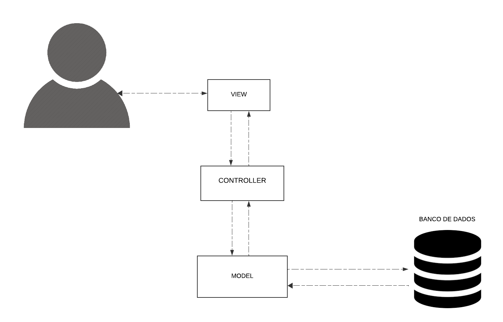

# **3.4. Módulo Padrões de Projeto Extras: (Padrões de projeto emergentes)**

## **Introdução**

&emsp;&emsp;Padrões de projeto emergentes são soluções arquitetônicas modernas que surgem para resolver problemas específicos no desenvolvimento de software contemporâneo. Diferente dos padrões clássicos, como os Padrões GoF, os emergentes atendem às novas demandas de escalabilidade, manutenibilidade e performance em ambientes ágeis e DevOps.

&emsp;&emsp;Esses padrões incluem abordagens para microserviços, arquiteturas serverless e aplicações em nuvem, refletindo as últimas tendências tecnológicas. Utilizar padrões emergentes permite que equipes se adaptem rapidamente a mudanças tecnológicas e de mercado, garantindo qualidade, flexibilidade e eficiência no desenvolvimento de software.

## **Objetivo**

&emsp;&emsp; O objetivo de utilizar padrões emergentes, como o MVC (Model-View-Controller), aplicado no projeto My_LanguageLearning, é promover a separação de responsabilidades entre os componentes do software, facilitando a manutenção e evolução do sistema. O MVC permite uma organização modular onde o Model gerencia os dados e regras de negócios, a View é responsável pela interface com o usuário e o Controller lida com a lógica de aplicação e a comunicação entre o Model e a View. Esta abordagem não apenas melhora a legibilidade e testabilidade do código, mas também facilita a implementação de novas funcionalidades e a adaptação a mudanças futuras, garantindo um desenvolvimento mais ágil e eficiente.

## **Metodologia**

&emsp;&emsp; A metodologia adotada para a elaboração deste padrão de projeto extra, foi a realização de reuniões em conjunto entre os membros do projeto. A primeira reunião teve como objetivo principal definir o modelo emergente mais adequado para o projeto. Os participantes discutiram as diferentes opções e como cada uma poderia atender às necessidades específicas do projeto. Durante a reunião, após a tomada de decisão, foram apresentados e discutidos os seguintes materiais dos sites encontados na bibliografia deste documento <a href="">[1]</a>  <a href="">[2]</a>, os participantes analisaram o conteúdo desses materiais para entender como o padrão MVC poderia ser aplicado e quais seriam os benefícios e limitações. 

&emsp;&emsp;A segunda reunião foi dedicada à elaboração e finalização do diagrama UML. A ferramenta Lucidchart<a href="">[3]</a> foi utilizada para a elaboração do diagrama, garantindo que o modelo fosse visualmente claro e conforme as normas da UML. Os membros, com base nas discussões anteriores e nas referências utilizadas, desenvolveram o diagrama conforme as necessidades do projeto. Durante esta fase, foram abordados e solucionados os obstáculos identificados na primeira reunião, culminando na conclusão do artefato.

## **UML MVC (Model-View-Controller)**

&emsp;&emsp; Abaixo, na figura 1, foi desenvolvido pelos participantes o UML MVC.

<h6 align="center">Figura 1: UML MVC.</h6>
<!-- 
 -->

    <h6 align="center">Fonte: 
        <a href="https://github.com/luishenrrique">COSTA</a>, 
        <a href="https://github.com/The-Boss-Nina">SOUZA</a>, 
        <a href="https://github.com/Madu01">BARBOSA</a>, 
        <a href="https://github.com/EduardaSMarques">MARQUES</a>, 
        <a href="https://github.com/Jlmsousa">SOUSA</a>, 
        <a href="https://github.com/CarolinaBarb">BRITO</a>,
        <a href="https://github.com/JuliaSSouza">SANT'ANA</a>,
        2024.
    </h6>

## **Desenvolvimento**

 **Model**
 O componente Model gerencia os dados e as regras de negócios do sistema, conectando-se ao banco de dados para armazenar e recuperar informações. No projeto, o Model será responsável por armazenar informações sobre os usuários, suas atividades de aprendizado e progresso.

 **View**
O componente View é responsável pela interface com o usuário, exibindo dados do Model ao usuário e enviando as interações do usuário ao Controller. No projeto, a View pode ser uma página web que mostra os exercícios de linguagem ao usuário e captura suas respostas.

**Controller**
O componente Controller lida com a lógica de aplicação e a comunicação entre o Model e a View. Ele processa as entradas do usuário, atualiza o Model e seleciona a View apropriada para resposta. No projeto, o Controller será processa as respostas dos exercícios dos usuários, atualiza o progresso no Model e exibe a próxima atividade na View.

#### Os benefícios da arquitetura MVC

&emsp;&emsp; A aplicação do padrão MVC traz diversos benefícios significativos. Primeiramente, a separação de responsabilidades permite que cada componente tenha uma função bem definida, facilitando a manutenção e evolução do sistema. A modularidade da arquitetura possibilita que diferentes partes do sistema sejam desenvolvidas e testadas de forma independente, promovendo um desenvolvimento mais eficiente. Além disso, a separação clara de componentes facilita a escrita de testes unitários e de integração, melhorando a qualidade do software. A reutilização de código é outro benefício importante, pois componentes podem ser reaproveitados em diferentes partes do sistema ou em outros projetos, aumentando a eficiência do desenvolvimento. Por fim, a flexibilidade da arquitetura facilita a implementação de novas funcionalidades e a adaptação a mudanças futuras, o que é essencial em ambientes ágeis e dinâmicos. 

## **Conclusão**

&emsp;&emsp;Portanto, a utilização do padrão MVC para o projeto vai agilizar e tornar mais eficazes as manutenções nos códigos do projeto, além de contribuir para um melhor alinhamento entre os integrantes com o diagrama, facilitando que qualquer leitor possa também se alinhar ao padrão que foi escolhido para o projeto, pois neste artefato há uma explicação base do padrão escolhido e como esse padrão afeta nosso sistema com a explicação dos benefícios dele.

## **Bibliografia**

> <a href="https://Link_da_fonte">[1]</a> Zucher, Vitor. O que é padrão MVC? Entenda arquitetura de softwares!. Disponível em: https://blog.lewagon.com/pt-br/skills/o-que-e-padrao-mvc/. Acesso em: 25 jul. 2024

> <a href="https://Link_da_fonte">[2]</a> Usandopy. O que é MVC? Entenda arquitetura de padrão MVC. Disponível em: https://www.usandopy.com/pt/artigo/o-que-e-mvc-entenda-arquitetura-de-padrao-mvc/. Acesso em: 25 jul. 2024

> <a href="https://Link_da_fonte">[3]</a>LucidChart. Diagrama de padrões extra. 2024. Disponível em: https://lucid.app/lucidchart/63c3e604-41c6-40b5-95de-379c3ddfb40f/edit?viewport_loc=-449%2C-45%2C2061%2C934%2CE-7VIQ9fAtvG&invitationId=inv_18f4c38a-6c25-4e4c-873f-c5236bd6b751. Acesso em: 25 jul. 2024

## **Histórico de Versão**

&emsp;&emsp;A tabela 01 representa o histórico de versão do documento.

<h6 align="center">Tabela 01: Histórico de Versão</h6>

| Versão | Data       | Descrição            | Autor(es)                                           | Revisor(es) |
| ------ | ---------- | -------------------- | --------------------------------------------------- | ----------- |
| `1.0`  | 25/07/2024 | Criação do documento e adição da introdução | [Marina Márcia](https://github.com/The-Boss-Nina) | [João Lucas](https://github.com/Jlmsousa) |
| `1.1`  | 25/07/2024 | Adicionando objetivo | [João Lucas](https://github.com/Jlmsousa) | [Maria Eduarda Barbosa](https://github.com/Madu01)|
| `1.2`  | 25/07/2024 | Adicão da bibliografia | [Marina Márcia](https://github.com/The-Boss-Nina) | [João Lucas](https://github.com/Jlmsousa) |
| `1.3`  | 25/07/2024 | Adicão da imagem e fonte | [Marina Márcia](https://github.com/The-Boss-Nina) | [Luis Henrique Luz Costa ](https://github.com/luishenrrique) |
| `1.4` | 20/04/2024 | Adicionando metodologia  | [Maria Eduarda Marques](https://github.com)  |  [Carolina Barbosa Brito](https://github.com)  |
|`1.5`|25/07/2024| Adicionando desenvolvimento |[Carolina Barbosa Brito](https://github.com) | [Julia Souza](https://github.com/JuliaSSouza)  |
|`1.6`|25/07/2024| Adicionando conclusão | [Maria Eduarda Barbosa](https://github.com/Madu01) |  [Maria Eduarda Marques](https://github.com/EduardaSMarques)      |
