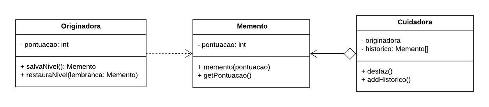
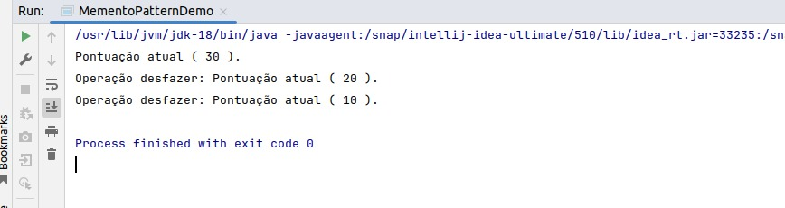

# Memento

## Participantes

| Nome                                                        |
| ----------------------------------------------------------- |
| [Luis Henrique](https://github.com/luishenrrique)           |
| [Marina Márcia](https://github.com/The-Boss-Nina)           |
| [Laura Pinos](https://github.com/laurapinos)                |
| [Maria Eduarda Barbosa](https://github.com/Madu01)          |
| [Maria Eduarda Marques](https://github.com/EduardaSMarques) |
| [João Lucas](https://github.com/Jlmsousa)                   |
| [Júlia Souza](https://github.com/JuliaSSouza)               |
| [Carolina Barbosa](https://github.com/CarolinaBarb)         |
| [Felipe Direito](https://github.com/FelipeDireito)          |
| [Felipe Hansen](https://github.com/FHansen98)               |

## **Introdução**

<p align="justify">
&emsp;&emsp; Dentro dos padrões de projeto GoF (Gang of Four), descritos por Erich Gamma, Richard Helm, Ralph Johnson e John Vlissides no livro “Design Patterns: Elements of Reusable Object-Oriented Software”, em 1994, há a categoria de padrões criacionais, nos quais os seus padrões de design buscam criar objetos de maneira eficiente, mediante ao contexto onde está inserido.

&emsp;&emsp; O padrão de projeto comportamental Memento permite que seja possível salvar e restaurar um estado anterior de um objeto sem precisar revelar seus detalhes de implementação.

</p>

## **Objetivo**

<p align="justify">
&emsp;&emsp; O memento permite que um objeto possa capturar seu estado interno em um objeto 'memento' podendo ser armazenado em um histórico ou em uma lista. 
</p>

## **Metodologia**

<p align="justify">
&emsp;&emsp; A metodologia adotada para a elaboração deste padrão GOF, foi o método por reuniões. No total foram 3 reuniões realizadas em conjunto com a equipe, para eloborar tanto o diagrama, como o código do memento. Os materias de estudos utilizados foram materias disponibilizados pela professora Milene no aprender da disciplina <a href="">[1]</a> e pelo site do Refactoring Guru <a href="">[3]</a>.

&emsp;&emsp;Durante a primeira reunião, a equipe discutiu os diferentes padrões comportamentais do GoF. Foram analisadas as vantagens de cada padrão em relação às necessidades específicas do projeto. Após a discussão, foi decidido que o padrão comportamental Memento seria o mais adequado para o projeto, devido à sua capacidade de capturar e restaurar estados de objetos, o que atende aos requisitos do sistema em desenvolvimento. Com o padrão escolhido, os membros da equipe começaram a esboçar o diagrama UML. Utilizando o Lucidchart <a href="">[2]</a> , foram definidos os elementos principais do diagrama, incluindo classes, atributos e métodos relevantes para a implementação do padrão Memento. Dúvidas e obstáculos surgidos durante essa fase foram anotados para serem resolvidos nas próximas reuniões.

&emsp;&emsp;Na segunda reunião, o esboço inicial do diagrama UML foi revisado e refinado. Os participantes discutiram detalhadamente cada elemento do diagrama, realizando ajustes necessários para garantir a precisão e a conformidade com o padrão Memento.Com base nas revisões e discussões, o diagrama UML foi finalizado. Foram adicionados detalhes sobre as interações entre os objetos e a forma como o estado seria armazenado e restaurado. O resultado foi um diagrama UML completo e detalhado, pronto para guiar a implementação do código.

&emsp;&emsp;Na terceira reunião, a equipe iniciou a implementação do código do padrão Memento em Java. Durante a implementação do código, foram identificadas algumas inconsistências e melhorias possíveis no diagrama UML. A equipe revisou o diagrama, realizando correções e atualizações para refletir com precisão a estrutura e o comportamento do código.

</p>

## **UML Memento**

<p align="justify">
&emsp;&emsp;Abaixo, na figura 1, foi desenvolvido pelos participantes o UML do Memento.

&emsp;&emsp;O UML do GoF comportamental de Memento foi inspirado utilizando como base dois UMLs, um do site Guru <a href="https://Link_da_fonte">[1]</a> e outro de um exemplo mostrado pela professora dessa disciplina. Ambos podem ser visualizados pelos links referentes na bibliografia.

&emsp;&emsp;Explicando o UML, ele possui três classes: a `Originadora`, o `Memento` e a `Cuidadora`. A `Originadora` tem um atributo privado e dois métodos públicos: um que salva o memento, criando-o com a pontuação atual, e outro que restaura a pontuação anterior. Na classe `Memento`, ele tem dois métodos: um que retorna a pontuação e outro que armazena essa pontuação. Na `Cuidadora`, que possui dois atributos (um do tipo array), há o método `desfazer` que reverte a pontuação atual para a anterior, e o método que adiciona no array os estados de pontuação do nível.

&emsp;&emsp;A ideia principal do UML é que a `Originadora` salva e restaura as pontuações, o `Memento` armazena os estados anteriores ao atual e a `Cuidadora` mantém esse histórico de mementos, podendo desfazer para as pontuações anteriores.

</p>

<h6 align="center">Figura 1: UML Memento.</h6>
<!-- <div align="center"> -->



<div>
    <h6 align="center">Fonte: 
        <a href="https://github.com/luishenrrique">COSTA</a>, 
        <a href="https://github.com/The-Boss-Nina">SOUZA</a>, 
        <a href="https://github.com/laurapinos">PINOS</a>, 
        <a href="https://github.com/Madu01">BARBOSA</a>, 
        <a href="https://github.com/EduardaSMarques">MARQUES</a>, 
        <a href="https://github.com/Jlmsousa">SOUSA</a>, 
        <a href="https://github.com/CarolinaBarb">BRITO</a>,
        <a href="https://github.com/JuliaSSouza">SANT'ANA</a>,
        <a href="https://github.com/FelipeDireito">DIREITO</a>,
        <a href="https://github.com/FHansen98">HANSEN</a>.
        2024.
    </h6>
</div>

</p>

## **Código do UML Memento**

<p align="justify">
&emsp;&emsp;Esse código, desenvolvido na linguagem java, segue o UML da Figura 1, o main presente serve para dar o início para a compilação.
</p>

`Cuidadora:`

```ruby
package memento;

import java.util.ArrayList;
import java.util.List;

public class Cuidadora {
    private Originadora originadora;
    private List<Memento> historico;

    public Cuidadora(Originadora originadora) {
        this.originadora = originadora;
        this.historico = new ArrayList<>();
    }

    public void desfaz() {
        if (!historico.isEmpty()) {
            Memento memento = historico.remove(historico.size() - 1);
            originadora.restauraNivel(memento);
        }
    }

    public void addHistorico() {
        historico.add(originadora.salvaNivel());
    }
}
```

`Memento:`

```ruby
package memento;

public class Memento {
    private final int pontuacao;

    public Memento(int pontuacao) {
        this.pontuacao = pontuacao;
    }

    public int getPontuacao() {
        return pontuacao;
    }
}
```

`Originadora:`

```ruby
package memento;

public class Originadora {
    private int pontuacao;

    public void setPontuacao(int pontuacao) {
        this.pontuacao = pontuacao;
    }

    public int getPontuacao() {
        return pontuacao;
    }

    public Memento salvaNivel() {
        return new Memento(pontuacao);
    }

    public void restauraNivel(Memento lembranca) {
        this.pontuacao = lembranca.getPontuacao();
    }
}
```

`Main:`

```ruby
package memento;

public class Main {
    public static void main(String[] args) {
        Originadora originadora = new Originadora();
        Cuidadora cuidadora = new Cuidadora(originadora);

        originadora.setPontuacao(10);
        cuidadora.addHistorico();

        originadora.setPontuacao(20);
        cuidadora.addHistorico();

        originadora.setPontuacao(30);
        System.out.println("Pontuação atual ( " + originadora.getPontuacao() + " ).");

        cuidadora.desfaz();
        System.out.println("Operação desfazer: Pontuação atual ( " + originadora.getPontuacao() + " ).");

        cuidadora.desfaz();
        System.out.println("Operação desfazer: Pontuação atual ( " + originadora.getPontuacao() + " ).");
    }
}
```

<div>
    <h6 align="center">Fonte: 
        <a href="https://github.com/luishenrrique">COSTA</a>, 
        <a href="https://github.com/The-Boss-Nina">SOUZA</a>, 
        <a href="https://github.com/laurapinos">PINOS</a>, 
        <a href="https://github.com/Madu01">BARBOSA</a>, 
        <a href="https://github.com/EduardaSMarques">MARQUES</a>, 
        <a href="https://github.com/Jlmsousa">SOUSA</a>, 
        <a href="https://github.com/CarolinaBarb">BRITO</a>,
        <a href="https://github.com/JuliaSSouza">SANT'ANA</a>,
        <a href="https://github.com/FelipeDireito">DIREITO</a>,
        <a href="https://github.com/FHansen98">HANSEN</a>.
        2024.
    </h6>
</div>

### Saída

&emsp;&emsp;A saída do código está na Figura 2, que mostra o resultado no terminal e demonstra o código funcionando conforme esperado. Ele exibiu a pontuação atual e, ao realizar a operação de desfazer, foi possível observar que a pontuação realmente retornou aos estados anteriores.

&emsp;&emsp;Esta saída é apenas um teste, uma forma de mostrar que o sistema está funcionando. No resultado final, não será assim, será utilizado para quando o usuário precisar voltar a níveis (fases) em que já havia feito questões, e a pontuação é fundamental nesse contexto. Por isso, foi implementado especificamente para a pontuação. Quando o usuário retorna a um nível (fase) para refazê-lo, a pontuação atual é desfeita e será somada ao número resultante do desfazer para o estado anterior. Porque, ele tentará realizar as questões e receberá uma nova pontuação.

</p>

<h6 align="center">Figura 2: Saída do código do GoF de Memento.</h6>
<div align="center">



</div>
<h6 align="center">Fonte: Autoria própria, 2024</a>.

## **Conclusão**

O padrão de projeto comportamental Memento oferece uma solução eficaz para a restauração do estado de um objeto sem violar seu encapsulamento. Este padrão é útil em situações onde é necessário desfazer operações ou restaurar estados anteriores de um objeto de forma segura e eficiente.

O padrão Memento foi aplicado para permitir que o estado das lições e pontuações dos usuários pudesse ser salvo e restaurado conforme necessário. Isso é útil para funcionalidades como desfazer ações, onde o estado anterior precisa ser recuperado de forma precisa. Em conclusão, o padrão Memento se mostrou uma solução eficaz para a gestão de estados em sistemas complexos.

## **Bibliografia**

> <a href="https://Link_da_fonte">[1]</a> Aprender3. Arquitetura e Desenho de Software. 2024. Disponível em: https://aprender3.unb.br/course/view.php?id=22090&section=4. Acesso em: 25 jul. 2024

> <a href="https://Link_da_fonte">[2]</a> LucidChart. GOF Memento. 2024. Disponível em: https://lucid.app/lucidchart/63c3e604-41c6-40b5-95de-379c3ddfb40f/edit?viewport_loc=55%2C181%2C1480%2C671%2COa7VxU0W7XTX&invitationId=inv_18f4c38a-6c25-4e4c-873f-c5236bd6b751. Acesso em: 25 jul. 2024

> <a href="https://Link_da_fonte">[3]</a> Refactoring Guru. Memento. Disponível em: https://refactoring.guru/design-patterns/memento. Acesso em: 25 jul. 2024

> <a href="https://Link_da_fonte">[4]</a> REFACTORING GURU. Design Patterns: Memento. Disponível em: <https://refactoring.guru/design-patterns/memento>. Acesso em: 17 jul. 2024.

## **Histórico de Versão**

| Versão | Data       | Descrição                                                                                         | Autor(es)                                                                                                                                                                                                                                                                                                                                                                                                                                                                                                              | Revisor(es)                                                                                                                                               |
| ------ | ---------- | ------------------------------------------------------------------------------------------------- | ---------------------------------------------------------------------------------------------------------------------------------------------------------------------------------------------------------------------------------------------------------------------------------------------------------------------------------------------------------------------------------------------------------------------------------------------------------------------------------------------------------------------- | --------------------------------------------------------------------------------------------------------------------------------------------------------- |
| `1.0`  | 22/07/2024 | Criação do documento e da estrutura                                                               | [Maria Eduarda Barbosa](https://github.com/Madu01)                                                                                                                                                                                                                                                                                                                                                                                                                                                                     | [Marina Márcia](https://github.com/The-Boss-Nina)                                                                                                         |
| `1.1`  | 22/07/2024 | Finalização do UML                                                                                | [Luis Henrique](https://github.com/luishenrrique), [Marina Márcia](https://github.com/The-Boss-Nina), [Laura Pinos](https://github.com/laurapinos), [João Lucas](https://github.com/Jlmsousa), [Julia Souza](https://github.com/JuliaSSouza), [Maria Eduarda Barbosa](https://github.com/Madu01), [Maria Eduarda Marques](https://github.com/EduardaSMarques), [Carolina Barbosa](https://github.com/CarolinaBarb), [Felipe Direito](https://github.com/FelipeDireito) e [Felipe Hansen](https://github.com/FHansen98) | [Luis Henrique](https://github.com/luishenrrique), [Marina Márcia](https://github.com/The-Boss-Nina) e [Maria Eduarda Barbosa](https://github.com/Madu01) |
| `1.2`  | 24/07/2024 | Adição do quadro de participantes                                                                 | [Marina Márcia](https://github.com/The-Boss-Nina)                                                                                                                                                                                                                                                                                                                                                                                                                                                                      | [João Lucas](https://github.com/Jlmsousa), [Maria Eduarda Marques](https://github.com)                                                                    |
| `1.3`  | 24/07/2024 | Adição do código do memento                                                                       | [João Lucas](https://github.com/Jlmsousa)                                                                                                                                                                                                                                                                                                                                                                                                                                                                              | [Marina Márcia](https://github.com/The-Boss-Nina)                                                                                                         |
| `1.4`  | 20/04/2024 | Adicionando metodologia                                                                           | [Maria Eduarda Marques](https://github.com)                                                                                                                                                                                                                                                                                                                                                                                                                                                                            | [Maria Eduarda Barbosa](https://github.com/Madu01), [Luis Henrique](https://github.com/luishenrrique)                                                     |
| `1.5`  | 25/07/2024 | Adição conclusão                                                                                  | [Julia Souza](https://github.com/JuliaSSouza)                                                                                                                                                                                                                                                                                                                                                                                                                                                                          | [Carolina Barbosa](https://github.com/CarolinaBarb)                                                                                                       |
| `1.6`  | 25/07/2024 | Adição de conteúdo nos tópicos de desenvolvimento: UML Composite, Código do UML Composite e saída | [Maria Eduarda Barbosa](https://github.com/Madu01)                                                                                                                                                                                                                                                                                                                                                                                                                                                                     | [Maria Eduarda Marques](https://github.com/EduardaSMarques)                                                                                               |
