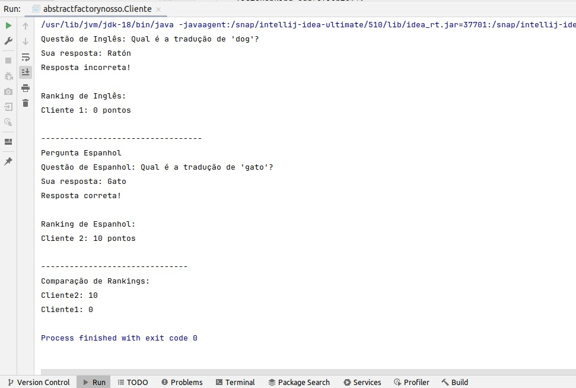

# Abstract Factory

## Participantes

| Nome                                                        |
| ----------------------------------------------------------- |
| [Luis Henrique](https://github.com/luishenrrique)           |
| [Marina Márcia](https://github.com/The-Boss-Nina)           |
| [Laura Pinos](https://github.com/laurapinos)                |
| [Maria Eduarda Barbosa](https://github.com/Madu01)          |
| [Maria Eduarda Marques](https://github.com/EduardaSMarques) |
| [Pedro Augusto](https://github.com/PedroSiq)                |
| [Matheus Perillo](https://github.com/MatheusPerillo)        |
| [João Lucas](https://github.com/Jlmsousa)                   |
| [Júlia Souza](https://github.com/JuliaSSouza)               |
| [Carolina Barbosa](https://github.com/CarolinaBarb)         |
| [Felipe Direito](https://github.com/FelipeDireito)          |
| [Felipe Hansen](https://github.com/FHansen98)               |

## **Introdução**

&emsp;&emsp;texto

## **Objetivo**

&emsp;&emsp;

## **Metodologia**

&emsp;&emsp;

## **UML Abstract Factory**

&emsp;&emsp;

## **Código do UML Abstract Factory**

&emsp;&emsp;

### Saída

&emsp;&emsp;A saída do código está na Figura 2, que mostra o resultado no terminal e demonstra o código funcionando conforme esperado. Ele exibiu uma questão que foi criada em uma classe concreta e, ao fornecer uma respota a questão, é possível observar que há pontuação relacionada se acertar a resposta da questão.

&emsp;&emsp;Esta saída é apenas um teste, uma forma de mostrar que o sistema está funcionando. No resultado final, não será assim, será utilizado para quando o usuário for consumir a fábrica de questões pois estarão sendo construidas, e a pontuação é fundamental nesse contexto. Quando o usuário acerta a questão ele atualiza a pontuação e é feito o rankeamento. O ranking também foi gerado de uma fábrica. Porque, ele tentará realizar as questões e receberá uma nova pontuação e consequentemente será atualizado sua posição no ranking.
 

<h6 align="center">Figura 2: Saída do código do GoF de criação Abstract Factory.</h6>

<h6 align="center">Fonte: Autoria própria, 2024</a>.

## **Bibliografia**

> 

## **Histórico de Versão**

| Versão | Data       | Descrição            | Autor(es)                                           | Revisor(es) |
| ------ | ---------- | -------------------- | --------------------------------------------------- | ----------- |
| `1.0`  | 22/07/2024 | Criação do documento e da estrutura | [Maria Eduarda Barbosa](https://github.com/Madu01) |    [Marina Márcia](https://github.com/The-Boss-Nina)       |
| `1.1`  | 25/07/2024 | Adição dos participantes no documento | [Marina Márcia](https://github.com/The-Boss-Nina) |  [João Lucas](https://github.com/Jlmsousa)     |
| `1.6`  | 25/07/2024 | Adição de saída do código e explicação | [Luis Henrique](https://github.com/luishenrrique) |  [Maria Eduarda Marques](https://github.com/EduardaSMarques)  |