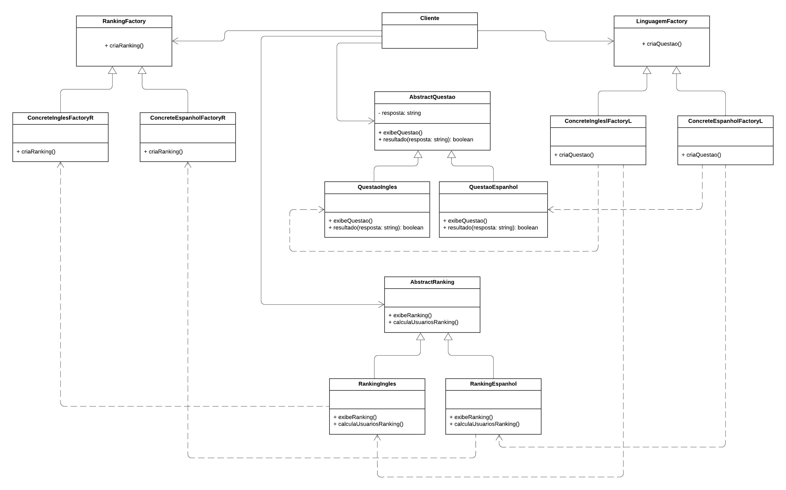

# Abstract Factory

## Participantes

| Nome                                                        |
| ----------------------------------------------------------- |
| [Luis Henrique](https://github.com/luishenrrique)           |
| [Marina Márcia](https://github.com/The-Boss-Nina)           |
| [Laura Pinos](https://github.com/laurapinos)                |
| [Maria Eduarda Barbosa](https://github.com/Madu01)          |
| [Maria Eduarda Marques](https://github.com/EduardaSMarques) |
| [Pedro Augusto](https://github.com/PedroSiq)                |
| [Matheus Perillo](https://github.com/MatheusPerillo)        |
| [João Lucas](https://github.com/Jlmsousa)                   |
| [Júlia Souza](https://github.com/JuliaSSouza)               |
| [Carolina Barbosa](https://github.com/CarolinaBarb)         |
| [Felipe Direito](https://github.com/FelipeDireito)          |
| [Felipe Hansen](https://github.com/FHansen98)               |


## **Introdução**

<p align="justify">
&emsp;&emsp;texto
</p>

## **Objetivo**

<p align="justify">
&emsp;&emsp;
</p>

## **Metodologia**

<p align="justify">
&emsp;&emsp;Foram realizadas reuniões para debater sobre em qual contexto do nosso sistema se encaixaria o GoF de Abstract Factory, além da equipe estudar sobre o conteúdo, seja em sala de aula ou por vídeos e slides. Foram duas reuniões principais, uma no contêiner da FGA e outra online, além de mais três reuniões online para desenvolver o código com base no UML desenvolvido a respeito desse GoF.  

&emsp;&emsp;A equipe também identificou os GRASPs presentes, sendo um deles chamado de Invenção Pura ou Fabricação Própria. Para mais detalhes a respeito disso, acesse: <a href="https://unbarqdsw2024-1.github.io/2024.1_G6_My_LanguageLearning/#/PadroesDeProjeto/3.1.GRAsPs">Explicação dos GRASPs presentes nos GoFs.</a>

&emsp;&emsp;Vale ressaltar que a equipe teve dificuldades em desenvolver o diagrama. Ele foi alterado algumas vezes, pois, ao passar para o código desenvolvido na linguagem Java, foram percebidas falhas de lógica por causa do UML. É importante também mencionar que nem todos os integrantes da equipe participaram da elaboração do UML e/ou do desenvolvimento do código. O diagrama do Abstract Factory foi desenvolvido no site Lucidchart.com, seguindo os padrões da UML.

&emsp;&emsp;O UML desenvolvido foi inspirado no site Guru <a href="https://Link_da_fonte">[2]</a> e outro do slide da página 31 da professora dessa disciplina <a href="https://Link_da_fonte">[1]</a>. Ambos podem serem observados pelo links presentes em bibliografia.
</p>


## **UML Abstract Factory**

<p align="justify">
&emsp;&emsp; Abaixo, na figura 1, foi desenvolvido pelos participantes o UML do Abstract Factory.

<h6 align="center">Figura 1: UML Abstract Factory.</h6>
<!-- <div align="center"> -->



<div>
    <h6 align="center">Fonte: 
        <a href="https://github.com/luishenrrique">COSTA</a>, 
        <a href="https://github.com/The-Boss-Nina">SOUZA</a>, 
        <a href="https://github.com/laurapinos">PINOS</a>, 
        <a href="https://github.com/Madu01">BARBOSA</a>, 
        <a href="https://github.com/EduardaSMarques">MARQUES</a>, 
        <a href="https://github.com/Jlmsousa">SOUSA</a>, 
        <a href="https://github.com/CarolinaBarb">BRITO</a>,
        <a href="https://github.com/JuliaSSouza">SANT'ANA</a>.
        2024.
    </h6>
</div>

</p>

## **Código do UML Abstract Factory**

<p align="justify">
&emsp;&emsp;
</p>

RankingFactory:
```ruby
package abstractfactorynosso;

public interface RankingFactory {
    AbstractRanking criaRanking();
}
```

ConcreteEspanholFactoryR:
```ruby
package abstractfactorynosso;

public class ConcreteEspanholFactoryR implements RankingFactory {
    private int pontuacao;

    public ConcreteEspanholFactoryR() {
        this.pontuacao = 0;
    }

    public AbstractRanking criaRanking() {
        return new RankingEspanhol();
    }
}
```

ConcreteInglesFactoryR:
```ruby
package abstractfactorynosso;

public class ConcreteInglesFactoryR implements RankingFactory {
    private int pontuacao;

    public ConcreteInglesFactoryR() {
        this.pontuacao = 0;
    }

    public AbstractRanking criaRanking() {
        return new RankingIngles();
    }
}
```

AbstractRanking:
```ruby
package abstractfactorynosso;

public abstract class AbstractRanking {
    public abstract int pontos ();
    public abstract void exibeRanking();
    public abstract void calculaUsuarioRanking(int pontuacao);
}
```

RankingIngles:
```ruby
package abstractfactorynosso;

public class RankingIngles extends AbstractRanking {

    private int pontuacaoIngles;

    public RankingIngles() {
        this.pontuacaoIngles = 0;
    }

    @Override
    public int pontos() {
        return this.pontuacaoIngles;
    }

    public void exibeRanking() {
        // Implementação para exibir ranking em inglês
        System.out.println("\nRanking de Inglês:");
        System.out.println("Cliente 1: " + pontuacaoIngles + " pontos");
    }

    public void calculaUsuarioRanking(int pontuacao) {
        // Implementação para calcular ranking do usuário em inglês
        this.pontuacaoIngles += pontuacao;
    }
}
```

RankingEspanhol:
```ruby
package abstractfactorynosso;

public class RankingEspanhol extends AbstractRanking {
    private int pontuacaoEspanhol;

    public RankingEspanhol() {
        this.pontuacaoEspanhol = 0;
    }


    @Override
    public int pontos() {
        return this.pontuacaoEspanhol;
    }

    public void exibeRanking() {
        // Implementação para exibir ranking em espanhol
        System.out.println("\nRanking de Espanhol:");
        System.out.println("Cliente 2: " + pontuacaoEspanhol + " pontos");
    }

    public void calculaUsuarioRanking(int pontuacao) {
        // Implementação para calcular ranking do usuário em espanhol
        this.pontuacaoEspanhol += pontuacao;
    }
}

```

LinguagemFactory:
```ruby
package abstractfactorynosso;

public interface LinguagemFactory {

    AbstractQuestao criaQuestao();
}
```

ConcreteInglesFactoryL:
```ruby
package abstractfactorynosso;

public class ConcreteInglesFactoryL implements LinguagemFactory {
    public AbstractQuestao criaQuestao() {
        return new QuestaoIngles();
    }
}
```

ConcreteEspanholFactoryL:
```ruby
package abstractfactorynosso;

public class ConcreteEspanholFactoryL implements LinguagemFactory {
    public AbstractQuestao criaQuestao() {
        return new QuestaoEspanhol();
    }
}
```

AbstractQuestao:
```ruby
package abstractfactorynosso;

public abstract class AbstractQuestao {
    protected String resposta;

    public abstract void exibeQuestao();
    public abstract boolean resultado(String resposta);
}

```

QuestaoIngles:
```ruby
package abstractfactorynosso;

public class QuestaoIngles extends AbstractQuestao {
    public void exibeQuestao() {
        // Implementação para exibir questão em inglês
        System.out.println("Questão de Inglês: Qual é a tradução de 'dog'?");
    }

    public boolean resultado(String resposta) {
        String respostaCorreta = "Cachorro";
        return respostaCorreta.equalsIgnoreCase(resposta);
    }
}

```

QuestaoEspanhol:
```ruby
package abstractfactorynosso;

public class QuestaoEspanhol extends AbstractQuestao {
    public void exibeQuestao() {
        // Implementação para exibir questão em espanhol
        System.out.println("Questão de Espanhol: Qual é a tradução de 'gato'?");
    }

    public boolean resultado(String resposta) {
        // Implementação para verificar resposta em espanhol
//        return this.resposta.equals(resposta);
        return "Gato".equalsIgnoreCase(resposta);
    }
}

```

Cliente:
```ruby
package abstractfactorynosso;

import java.util.*;

public class Cliente {
    private static LinguagemFactory linguagemFactory;
    private static RankingFactory rankingFactory;
    private int pontuacao;
    private int codigo;

    public Cliente(LinguagemFactory linguagemFactory, RankingFactory rankingFactory, int codigo) {
        this.linguagemFactory = linguagemFactory;
        this.rankingFactory = rankingFactory;
        this.pontuacao = 0;
        this.codigo = codigo;
    }

    public int getPontuacao() {
        return this.pontuacao;
    }

    public void setPontuacao(int pontuacao) {
        this.pontuacao = pontuacao;
    }

    public boolean realizarQuestao(AbstractQuestao questao, AbstractRanking ranking, String resposta) {
        questao.exibeQuestao();

        System.out.println("Sua resposta: " + resposta);

        if (questao.resultado(resposta)) {
            System.out.println("Resposta correta!");
            ranking.calculaUsuarioRanking(10);
            return true;
        }

        System.out.println("Resposta incorreta!");
        return false;
    }

    public void exibirRanking(AbstractRanking ranking) {
        ranking.exibeRanking();
    }

    public static void main(String[] args) {

        // Cliente 1 (Inglês)
        Cliente cliente1 = new Cliente(new ConcreteInglesFactoryL(), new ConcreteInglesFactoryR(), 1);
        AbstractQuestao questao1 = linguagemFactory.criaQuestao();
        AbstractRanking ranking1 = rankingFactory.criaRanking();
        if (cliente1.realizarQuestao(questao1, ranking1, "Ratón")) {
            cliente1.pontuacao += 10;
        }
        cliente1.exibirRanking(ranking1);

        // Cliente 2 (Espanhol)
        System.out.println("\n----------------------------------\nPergunta Espanhol");
        Cliente cliente2 = new Cliente(new ConcreteEspanholFactoryL(), new ConcreteEspanholFactoryR(), 2);
        AbstractQuestao questao2 = linguagemFactory.criaQuestao();
        AbstractRanking ranking2 = rankingFactory.criaRanking();
        if (cliente2.realizarQuestao(questao2,ranking2,"Gato")) {
            cliente2.pontuacao += 10;
        }
        cliente2.exibirRanking(ranking2);

        List<Cliente> listaRanking = new ArrayList<>();
        listaRanking.add(cliente1);
        listaRanking.add(cliente2);
        listaRanking.sort(Collections.reverseOrder(Comparator.comparing(Cliente::getPontuacao)));

        // Comparação de Rankings
        System.out.println("\n-------------------------------\nComparação de Rankings:");
        for (Cliente cliente : listaRanking) {
            System.out.println("Cliente" + cliente.codigo + ": " + cliente.pontuacao);
        }
    }
}
```


## **Bibliografia**

>> <a href="https://Link_da_fonte">[1]</a> SERRANO, Milene. Arquitetura e Desenho de Software, AULA - GOFS CRIACIONAIS. 2024. UnB sigaa. Disponível em: <https://sigaa.unb.br/sigaa/portais/discente/discente.jsf>. Acesso em: 17 jul. 2024.

>> <a href="https://Link_da_fonte">[2]</a> REFACTORING GURU. Design Patterns: Composite. Disponível em: <https://refactoring.guru/design-patterns/abstract-factory>. Acesso em: 17 jul. 2024.

## **Histórico de Versão**

| Versão | Data       | Descrição            | Autor(es)                                           | Revisor(es) |
| ------ | ---------- | -------------------- | --------------------------------------------------- | ----------- |
| `1.0`  | 22/07/2024 | Criação do documento e da estrutura | [Maria Eduarda Barbosa](https://github.com/Madu01) |    [Marina Márcia](https://github.com/The-Boss-Nina)       |
| `1.1`  | 25/07/2024 | Adição dos participantes no documento | [Marina Márcia](https://github.com/The-Boss-Nina) |  [João Lucas](https://github.com/Jlmsousa)     |
| `1.2` | 25/04/2024 | Adicionando uml    | [Maria Eduarda Marques](https://github.com)     |  [Julia Souza](https://github.com/JuliaSSouza), [Luis Henrique](https://github.com/luishenrrique)   |
| `1.3` | 25/04/2024 | Adicionando código ao documento | [Luis Henrique](https://github.com/luishenrrique), [Marina Márcia](https://github.com/The-Boss-Nina), [Maria Eduarda Barbosa](https://github.com/Madu01), [Maria Eduarda Marques](https://github.com/EduardaSMarques),  [João Lucas](https://github.com/Jlmsousa), [Julia Souza](https://github.com/JuliaSSouza) | [Felipe Direito](https://github.com/FelipeDireito), [Felipe Hansen](https://github.com/FHansen98)
| `1.4` | 25/04/2024 | Adicionando uml    | [Maria Eduarda Marques](https://github.com)     |  [Julia Souza](https://github.com/JuliaSSouza)   |
| `1.5`  | 25/07/2024 | Adição de conteúdo em metodologia | [Maria Eduarda Barbosa](https://github.com/Madu01) |  [Maria Eduarda Marques](https://github.com/EduardaSMarques)   |
