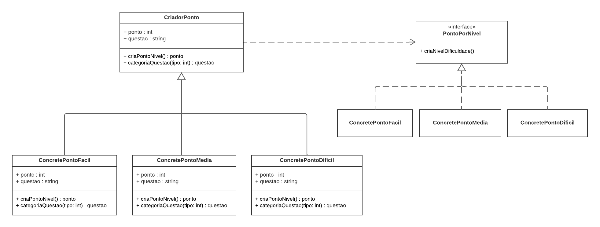
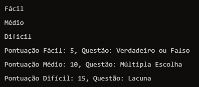

# Prototype

## Participantes

| Nome                                                        |
| ----------------------------------------------------------- |
| [Luis Henrique](https://github.com/luishenrrique)           |
| [Marina Márcia](https://github.com/The-Boss-Nina)           |
| [Laura Pinos](https://github.com/laurapinos)                |
| [Maria Eduarda Barbosa](https://github.com/Madu01)          |
| [Maria Eduarda Marques](https://github.com/EduardaSMarques) |
| [Pedro Augusto](https://github.com/PedroSiq)                |
| [Matheus Perillo](https://github.com/MatheusPerillo)        |
| [João Lucas](https://github.com/Jlmsousa)                   |
| [Júlia Souza](https://github.com/JuliaSSouza)               |
| [Carolina Barbosa](https://github.com/CarolinaBarb)         |
| [Felipe Direito](https://github.com/FelipeDireito)          |
| [Felipe Hansen](https://github.com/FHansen98)               |

## **Introdução**

<p align="justify">
&emsp;&emsp; O padrão de projeto criacional Prototype que permite copiar objetos existentes sem fazer seu código ficar dependente de suas classes. 
</p>

## **Objetivo**

<p align="justify">
&emsp;&emsp; O objetivo do padrão de projeto Prototype é permitir a criação de novos objetos através da clonagem de objetos existentes, em vez de criar novos objetos do zero. Isso pode ser especialmente útil em situações onde a criação de um objeto é complexa ou custosa em termos de tempo e recursos. Ele é particularmente útil em sistemas onde os objetos a serem criados são semelhantes entre si e onde a criação de novos objetos pode ser um gargalo de desempenho.
</p>

## **Metodologia**

<p align="justify">
&emsp;&emsp; A metodologia foi baseada em reuniões online. As primeiras reuniões focaram no estudo detalhado do padrão comportamental Memento. A equipe assistiu à videoaula da professora Milene, responsável pela disciplina do projeto, o que forneceu uma base teórica sólida sobre o padrão. Durante essas reuniões, foram discutidos os conceitos principais e as melhores práticas para a implementação do Memento. Com base nas discussões e estudos, os integrantyes do grupo começaram a esboçar o diagrama UML. Utilizando o Lucidchart, foram definidos os elementos principais do diagrama, para a implementação do Memento. As ideias foram coletadas e combinadas, resultando em um esboço inicial do diagrama.

&emsp;&emsp; Foi realizada uma reunião presencial no dia 19/07, ao final da aula de arquitetura, para consolidar as ideias e revisar o progresso do diagrama UML. No mesmo dia, após a aula de Paradigmas da mesma, a equipe abordou a professora Milene para obter orientações adicionais. As recomendações fornecidas pela professora foram fundamentais para ajustar e aprimorar o diagrama UML, contribuindo significativamente para o avanço do projeto.

</p>

## **UML Prototype**

<p align="justify">
&emsp;&emsp; Abaixo, na figura 1, foi desenvolvido pelos participantes o UML do Prototype que visa a possibilidade de clonagens da classe principal CriadorPonto. 

&emsp;&emsp; A classe base presente na Figura 1 é a CriadorPonto e ela possui seus métodos como: criaPontoNivel() e categoriaQuestao(tipo: int): questao.

&emsp;&emsp;Temos uma interface chamada PontoPorNivel que define o método criaNivelDificuldade.

&emsp;&emsp; As classes concretas são definidas por ConcretePontoFacil, ConcretePontoMedia, ConcretePontoDificil que implementam a interface PontoPorNivel. Essas classes possuem atributos como ponto e questao e métodos como criaPontoNivel() e categoriaQuestao(tipo:int): questao.

&emsp;&emsp;Portanto, este diagrama mostra como o padrão criacional Prototype pode ser utilizado para criar novos tipos de objetos diferentes (ConcretePontoFacil, ConcretePontoMedia, ConcretePontoDificil) por meio da interface em comum (PontoPorNivel()), o que permite clonar objetos de maneira correta.
</p>

<h6 align="center">Figura 1: UML Prototype.</h6>



<div>
    <h6 align="center">Fonte: 
        <a href="https://github.com/luishenrrique">COSTA</a>, 
        <a href="https://github.com/The-Boss-Nina">SOUZA</a>, 
        <a href="https://github.com/laurapinos">PINOS</a>, 
        <a href="https://github.com/Madu01">BARBOSA</a>, 
        <a href="https://github.com/EduardaSMarques">MARQUES</a>, 
        <a href="https://github.com/Jlmsousa">SOUSA</a>, 
        <a href="https://github.com/CarolinaBarb">BRITO</a>,
        <a href="https://github.com/JuliaSSouza">SANT'ANA</a>,
        <a href="https://github.com/FelipeDireito">DIREITO</a>,
        <a href="https://github.com/FHansen98">HANSEN</a>, 2024.
    </h6>
</div>

## **Código do UML Prototype**

`Interface PontoPorNivel`

```ruby
public interface PontoPorNivel {
    PontoPorNivel clone();
    void criaNivelDificuldade();
}
```

`Classe abstrata CriadorPonto`

```ruby
public abstract class CriadorPonto implements PontoPorNivel {
    public int ponto;
    public String questao;

    public CriadorPonto(int ponto, String questao) {
        this.ponto = ponto;
        this.questao = questao;
    }

    public CriadorPonto(CriadorPonto source) {
        this.ponto = source.ponto;
        this.questao = source.questao;
    }

    @Override
    public abstract CriadorPonto clone();

    public abstract int criaPontoNivel();

    public abstract String categoriaQuestao(int tipo);
}
```

`Classe ConcretePontoFacil`

```ruby
public class ConcretePontoFacil extends CriadorPonto {

    public ConcretePontoFacil(int ponto, String questao) {
        super(ponto, questao);
    }

    public ConcretePontoFacil(ConcretePontoFacil source) {
        super(source);
    }

    @Override
    public ConcretePontoFacil clone() {
        return new ConcretePontoFacil(this);
    }

    @Override
    public int criaPontoNivel() {
        this.ponto = 5;
        return this.ponto;
    }

    @Override
    public String categoriaQuestao(int tipo) {
        switch (tipo) {
            case 1:
                return "Verdadeiro ou Falso";
            case 2:
                return "Múltipla Escolha";
            case 3:
                return "Lacuna";
            default:
                return "Não existe esta categoria";
        }
    }

    @Override
    public void criaNivelDificuldade() {
        System.out.println("Fácil");
    }
}
```

`Classe ConcretePontoMedia`

```ruby
public class ConcretePontoMedia extends CriadorPonto {

    public ConcretePontoMedia(int ponto, String questao) {
        super(ponto, questao);
    }

    public ConcretePontoMedia(ConcretePontoMedia source) {
        super(source);
    }

    @Override
    public ConcretePontoMedia clone() {
        return new ConcretePontoMedia(this);
    }

    @Override
    public int criaPontoNivel() {
        this.ponto = 10;
        return this.ponto;
    }

    @Override
    public String categoriaQuestao(int tipo) {
        switch (tipo) {
            case 1:
                return "Verdadeiro ou Falso";
            case 2:
                return "Múltipla Escolha";
            case 3:
                return "Lacuna";
            default:
                return "Não existe esta categoria";
        }
    }

    @Override
    public void criaNivelDificuldade() {
        System.out.println("Médio");
    }
}
```

`Classe ConcretePontoDificil`

```ruby
public class ConcretePontoDificil extends CriadorPonto {

    public ConcretePontoDificil(int ponto, String questao) {
        super(ponto, questao);
    }

    public ConcretePontoDificil(ConcretePontoDificil source) {
        super(source);
    }

    @Override
    public ConcretePontoDificil clone() {
        return new ConcretePontoDificil(this);
    }

    @Override
    public int criaPontoNivel() {
        this.ponto = 15;
        return this.ponto;
    }

    @Override
    public String categoriaQuestao(int tipo) {
        switch (tipo) {
            case 1:
                return "Verdadeiro ou Falso";
            case 2:
                return "Múltipla Escolha";
            case 3:
                return "Lacuna";
            default:
                return "Não existe esta categoria";
        }
    }

    @Override
    public void criaNivelDificuldade() {
        System.out.println("Difícil");
    }
}
```

`Principal (Main)`

```ruby
public class Main {
    public static void main(String[] args) {
        ConcretePontoFacil pontuacaoFacil = new ConcretePontoFacil(0, "");
        ConcretePontoMedia pontuacaoMedia = new ConcretePontoMedia(0, "");
        ConcretePontoDificil pontuacaoDificil = new ConcretePontoDificil(0, "");

        ConcretePontoFacil clonePontuacaoFacil = pontuacaoFacil.clone();
        ConcretePontoMedia clonePontuacaoMedia = pontuacaoMedia.clone();
        ConcretePontoDificil clonePontuacaoDificil = pontuacaoDificil.clone();

        clonePontuacaoFacil.criaNivelDificuldade();
        clonePontuacaoMedia.criaNivelDificuldade();
        clonePontuacaoDificil.criaNivelDificuldade();

        System.out.println("Pontuação Fácil: " + clonePontuacaoFacil.criaPontoNivel() + ", Questão: " + clonePontuacaoFacil.categoriaQuestao(1));
        System.out.println("Pontuação Médio: " + clonePontuacaoMedia.criaPontoNivel() + ", Questão: " + clonePontuacaoMedia.categoriaQuestao(2));
        System.out.println("Pontuação Difícil: " + clonePontuacaoDificil.criaPontoNivel() + ", Questão: " + clonePontuacaoDificil.categoriaQuestao(3));
    }
}
```
<div>
    <h6 align="center">Fonte: 
        <a href="https://github.com/PedroSiq">SIQUEIRA</a>, 
        <a href="https://github.com/MatheusPerillo">PERILLO</a>. 2024.
    </h6>
</div>

### Saída

&emsp;&emsp; O retorno mostrado na Figura 2 contém a pontuação de cada questão, bem como o seu tipo, seja ele Verdadeiro ou Falso, Lacuna e Múltipla Escolha. Esse código demonstra a ideia do padrão do Prototype onde é possível realizar clones da classe abstrata principal CriadorPonto.

<h6 align="center">Figura 2: Saída do código do GoF criacional prototype.</h6>
<div align="center">



<div>
    <h6 align="center">Fonte: 
        <a href="https://github.com/PedroSiq">SIQUEIRA</a>, 
        <a href="https://github.com/MatheusPerillo">PERILLO</a>. 2024.
    </h6>
</div>


## **Conclusão**

&emsp;&emsp;Em conclusão. o uso do padrão de projeto criacional Prototype foi uma boa escolha por oferecer uma solução eficaz para a criação de novos objetos através da clonagem de objetos existentes. Este padrão permite que objetos sejam copiados sem fazer o código depender de suas classes concretas, promovendo assim a reutilização de código e a consistência no tratamento de diferentes tipos de objetos no sistema.

## **Bibliografia**

> Prototype,Refactoring Guru. Acesso em: 22 jul. 2024 https://refactoring.guru/pt-br/design-patterns/prototype

## **Histórico de Versão**

| Versão | Data       | Descrição                                     | Autor(es)                                                                                            | Revisor(es)                                         |
| ------ | ---------- | --------------------------------------------- | ---------------------------------------------------------------------------------------------------- | --------------------------------------------------- |
| `1.0`  | 22/07/2024 | Criação do documento                          | [Laura Pinos](https://github.com/laurapinos)                                                         | [Marina Márcia](https://github.com/The-Boss-Nina)   |
| `1.1`  | 22/07/2024 | Organização da estrutura padrão               | [Maria Eduarda Barbosa](https://github.com/Madu01)                                                   | [Marina Márcia](https://github.com/The-Boss-Nina)   |
| `1.2`  | 24/07/2024 | Adição do quadro de participantes             | [Marina Márcia](https://github.com/The-Boss-Nina)                                                    | [João Lucas](https://github.com/Jlmsousa)           |
| `1.3`  | 25/07/2024 | Adição conclusão                              | [Júlia Souza](https://github.com/JuliaSSouza)                                                        | [Carolina Barbosa](https://github.com/CarolinaBarb) |
| `1.4`  | 25/07/2024 | Adição da metodologia                         | [Marina Márcia](https://github.com/The-Boss-Nina) e [Maria Eduarda Marques](https://github.com)      | [Luis Henrique](https://github.com/luishenrrique)   |
| `1.5`  | 25/07/2024 | Adição do objetivo                            | [Matheus Perillo](https://github.com/MatheusPerillo) e [Pedro Siqueira](https://github.com/PedroSiq) | [Maria Eduarda Barbosa](https://github.com/Madu01)  |
| `1.6`  | 25/07/2024 | Adição do código Prototype                    | [Matheus Perillo](https://github.com/MatheusPerillo) e [Pedro Siqueira](https://github.com/PedroSiq) | [Maria Eduarda Barbosa](https://github.com/Madu01)  |
| `1.7`  | 25/07/2024 | Adição de saída do código e explicação do UML | [Matheus Perillo](https://github.com/MatheusPerillo) e [Pedro Siqueira](https://github.com/PedroSiq) | [Maria Eduarda Barbosa](https://github.com/Madu01)  |
