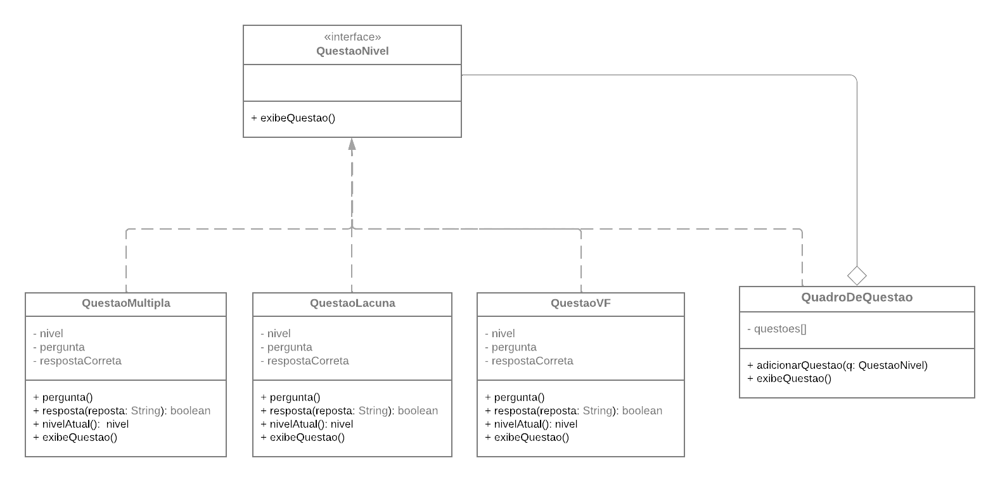
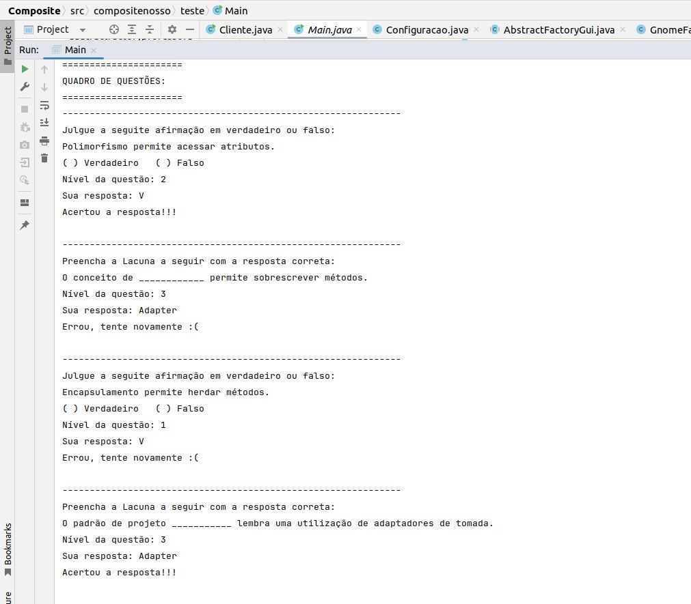

# Composite

## Participantes

| Nome                                                        |
| ----------------------------------------------------------- |
| [Luis Henrique](https://github.com/luishenrrique)           |
| [Marina Márcia](https://github.com/The-Boss-Nina)           |
| [Laura Pinos](https://github.com/laurapinos)                |
| [Maria Eduarda Barbosa](https://github.com/Madu01)          |
| [Maria Eduarda Marques](https://github.com/EduardaSMarques) |
| [Pedro Augusto](https://github.com/PedroSiq)                |
| [Matheus Perillo](https://github.com/MatheusPerillo)        |
| [João Lucas](https://github.com/Jlmsousa)                   |
| [Júlia Souza](https://github.com/JuliaSSouza)               |
| [Carolina Barbosa](https://github.com/CarolinaBarb)         |
| [Felipe Direito](https://github.com/FelipeDireito)          |
| [Felipe Hansen](https://github.com/FHansen98)               |

## **Introdução**

<p align="justify">
&emsp;&emsp;O padrão Composite é um padrão de projeto estrutural e é usado para tratar objetos individuais e composições de objetos de maneira uniforme facilitando a gestão de estruturas hierárquicas.
</p>

## **Objetivo**

<p align="justify">
&emsp;&emsp; O objetivo do padrão de projeto Composite, quando aplicado a uma solução educacional como o My_LanguageLearning, é fornecer uma maneira flexível e unificada de gerenciar a estrutura de questões de diferentes tipos, como múltipla escolha, lacuna e verdadeiro ou falso. Em uma plataforma como esta, uma questão pode ser vista como um componente que pode ter subcomponentes ou itens, como alternativas em uma questão de múltipla escolha, espaços a serem preenchidos em uma questão de lacuna ou opções de verdadeiro ou falso.
</p>

## **Metodologia**

<p align="justify">
&emsp;&emsp;A metodologia foi baseada em reuniões online. As primeiras reuniões focaram no estudo detalhado do diagrama de classes apresentado. A equipe assistiu à videoaula da professora Milene, responsável pela disciplina do projeto, o que forneceu uma base teórica sólida. Durante essas reuniões, foram discutidos os conceitos principais e as melhores práticas para a implementação do diagrama. Com base nas discussões e estudos, os integrantes do grupo começaram a esboçar o diagrama UML. Utilizando o Lucidchart, foram definidos os elementos principais do diagrama, como as classes QuestaoNivel, QuestaoMultipla, QuestaoLacuna, QuestaoVF, e QuadroDeQuestao. As ideias foram coletadas e combinadas, resultando em um esboço inicial do diagrama.

&emsp;&emsp;Foi realizada uma reunião presencial no dia 19/07, ao final da aula de arquitetura, para consolidar as ideias e revisar o progresso do diagrama UML. No mesmo dia, após a aula de Paradigmas, a equipe abordou a professora Milene para obter orientações adicionais. As recomendações fornecidas pela professora foram fundamentais para ajustar e aprimorar o diagrama UML, contribuindo significativamente para o avanço do projeto.
</p>

## **UML Composite**

<p align="justify">
&emsp;&emsp;O UML do CompositefFoi utilizado para o desenvolvimento do código que está na linguagem java, de modo que facilite para possíveis manuntenções ou atualizações. Logo abaixo, na figura 1, foi desenvolvido pelos participantes o UML do Composite.  

&emsp;&emsp;Uma explicação mais detalhada sobre o diagrama da Figura 1, ele possui 5 classes, contendo métodos e atributos. Na classe `QuestaoNivel`, que é um interface, contém um método chamado `exibeQuestao`, o qual será erdado pelos filhos. Ele tem a função de exibir a questão na tela para o usuário e imprimir se o usuário acertou ou não a questão. 

&emsp;&emsp;A outra classe, chamada `QuadroDeQuestao`, contém um atributo privado do tipo array que vai armazenar as questões que estão classificadas pelas outras classes. Essa classe possui os métodos de adicionar a questão ou de exibi-la. 

&emsp;&emsp;Na classe `QuestaoLacuna`, que é uma das filhas da `QuestaoNivel`, possui atributos privados e métodos públicos. O método `resposta` verifica se a resposta do usuário está correta, retornando `false` para errada e `true` para correta. No método `nivelAtual`, retorna o nível (fase) em que o usuário está e, no `exibeQuestao`, mostra na tela a pergunta e se acertou. Esses métodos estão também nas outras classes com a mesma função, apenas diferenciando para cada tipo de questão. No caso, tem a questão de lacuna, a de múltipla escolha e a de verdadeiro ou falso, todas representadas por classes com suas particularidades.

&emsp;&emsp;Esse UMl foi inspirado em dois diagramas, um do site Guru <a href="https://Link_da_fonte">[2]</a> e outro do slide da página 52 da professora dessa disciplina <a href="https://Link_da_fonte">[1]</a>. Ambos podem serem vizualizados pelo links referentes em bibliografia.

&emsp;&emsp;A ideia principal é que o sistema possa utilizar diversos tipos de questões de forma mais eficiente.
</p>


<h6 align="center">Figura 1: UML Composite.</h6>
 <!-- <div align="center">  -->



<div>
    <h6 align="center">Fonte: 
        <a href="https://github.com/luishenrrique">COSTA</a>, 
        <a href="https://github.com/The-Boss-Nina">SOUZA</a>, 
        <a href="https://github.com/laurapinos">PINOS</a>, 
        <a href="https://github.com/Madu01">BARBOSA</a>, 
        <a href="https://github.com/EduardaSMarques">MARQUES</a>, 
        <a href="https://github.com/Jlmsousa">SOUSA</a>, 
        <a href="https://github.com/CarolinaBarb">BRITO</a>,
        <a href="https://github.com/JuliaSSouza">SANT'ANA</a>,
        <a href="https://github.com/FelipeDireito">DIREITO</a>,
        <a href="https://github.com/FHansen98">HANSEN</a>,
        <a href="https://github.com/PedroSiq">SIQUEIRA</a>. 
        2024.
    </h6>
</div>

</p>

## **Código do UML Composite**

<p align="justify">
&emsp;&emsp;O código logo abaixo, foi criado apartir do UMl da Figura 1, seguindo a estrutura seja na nomeclatura das classes e métodos como também no padrão estrutural representado nela. Na estrutura do Composite existe ao componente e as folhas além do prórpio composite. Logo abaixo mostra a organização de acordo com essa estrutura referente, além da main que é onde vai iniciar a compilar o código.

</p>

`Componente:`

```ruby
package compositenosso.componente;

public interface QuestaoNivel {

    public void exibeQuestao ();
}
```

`Folhas:`

```ruby package compositenosso.leaf;

import compositenosso.componente.QuestaoNivel;

public class QuestaoLacuna implements QuestaoNivel {
    private int nivel;
    private String pergunta;
    private String respostaCorreta;

    public QuestaoLacuna () {

    }

    public QuestaoLacuna(String pergunta, String respostaCorreta, int nivel) {
        this.respostaCorreta = respostaCorreta;
        this.pergunta = pergunta;
        this.nivel = nivel;
    }

    public void pergunta() {
        System.out.println("--------------------------------------------------------------");
        System.out.println("Preencha a Lacuna a seguir com a resposta correta:");
        System.out.println(pergunta);
    }

    public boolean resposta(String resposta) {
        return this.respostaCorreta.equals(resposta);
    }

    public int nivelAtual() {
        return this.nivel;
    }

    @Override
    public void exibeQuestao() {
        pergunta();
        System.out.println("Nível da questão: " + nivelAtual());
        System.out.println("Sua resposta: Adapter");
        System.out.println(resposta("Adapter") ? "Acertou a resposta!!!\n" : "Errou, tente novamente :(\n");
    }
}
```

```ruby package compositenosso.leaf;

import compositenosso.componente.QuestaoNivel;

public class QuestaoMultipla implements QuestaoNivel {
    private int nivel;
    private String pergunta;
    private String respostaCorreta;

    public QuestaoMultipla(String pergunta, String respostaCorreta, int nivel) {
        this.respostaCorreta = respostaCorreta;
        this.pergunta = pergunta;
        this.nivel = nivel;
    }


    public void pergunta() {
        System.out.println("--------------------------------------------------------------");
        System.out.println("Escolha uma das opções a seguir:");
        System.out.println(pergunta);
        System.out.println("[ ] Template");
        System.out.println("[ ] Abstract Factory");
        System.out.println("[ ] Composite");
        System.out.println("[ ] Memento");
    }


    public boolean resposta(String resposta) {
        return this.respostaCorreta.equals(resposta);
    }


    public int nivelAtual() {
        return this.nivel;
    }

    @Override
    public void exibeQuestao() {
        pergunta();
        System.out.println("Nível da questão: " + nivelAtual());
        System.out.println("Sua resposta: Composite");
        System.out.println(resposta("Composite") ? "Acertou a resposta!!!\n" : "Errou, tente novamente :(\n");
    }
}

```

```ruby package compositenosso.leaf;

import compositenosso.componente.QuestaoNivel;

public class QuestaoVF implements QuestaoNivel {

    private int nivel;
    private String pergunta;
    private String respostaCorreta;

    public QuestaoVF () {}

    public QuestaoVF(String respostaCorreta, int nivel) {
        this.respostaCorreta = respostaCorreta;
        this.nivel = nivel;
    }

    public QuestaoVF (String pergunta, String respostaCorreta, int nivel) {
        this.pergunta = pergunta;
        this.respostaCorreta = respostaCorreta;
        this.nivel = nivel;
    }


    public void pergunta() {
        System.out.println("--------------------------------------------------------------");
        System.out.println("Julgue a seguite afirmação em verdadeiro ou falso:");
        System.out.println(pergunta);
        System.out.println("( ) Verdadeiro   ( ) Falso");
    }


    public boolean resposta(String resposta) {
        return this.respostaCorreta.equals(resposta);
    }


    public int nivelAtual() {
        return this.nivel;
    }


    @Override
    public void exibeQuestao() {
        pergunta();
        System.out.println("Nível da questão: " + nivelAtual());
        System.out.println("Sua resposta: V");
        System.out.println(resposta("V") ? "Acertou a resposta!!!\n" : "Errou, tente novamente :(\n");
    }
}
```

`Composite:`

```ruby package compositenosso.composite;

import compositenosso.componente.QuestaoNivel;

import java.util.ArrayList;
import java.util.List;

public class QuadroDeQuestao implements QuestaoNivel {
    private List<QuestaoNivel> questoes = new ArrayList<QuestaoNivel>();

    public void adicionarQuestao (QuestaoNivel q) {
        this.questoes.add(q);
    }

    public void removerQuestao (QuestaoNivel q) {
        this.questoes.remove(q);
    }

    @Override
    public void exibeQuestao() {
        System.out.println("======================\nQUADRO DE QUESTÕES:\n======================");
        for (QuestaoNivel q : questoes) {
            q.exibeQuestao();
        }
        System.out.println();
    }
}
```

`Principal (main):`

```ruby package compositenosso.teste;

import compositenosso.componente.QuestaoNivel;
import compositenosso.composite.QuadroDeQuestao;
import compositenosso.leaf.QuestaoLacuna;
import compositenosso.leaf.QuestaoMultipla;
import compositenosso.leaf.QuestaoVF;

public class Main {
    public static void main(String[] args) {
        QuestaoNivel qvf = new QuestaoVF("Polimorfismo permite acessar atributos.", "V", 2);
        QuestaoNivel qvf1 = new QuestaoVF("Encapsulamento permite herdar métodos.", "F", 1);
        QuestaoNivel lac = new QuestaoLacuna("O conceito de ____________ permite sobrescrever métodos.", "Polimorfismo", 3);
        QuestaoNivel lac1 = new QuestaoLacuna("O padrão de projeto ___________ lembra uma utilização de adaptadores de tomada.", "Adapter", 3);
        QuestaoNivel mul = new QuestaoMultipla("Escolha um padrão de projeto GoF Estrutural", "Composite", 3);
        QuestaoNivel mul1 = new QuestaoMultipla("Escolha um padrão de projeto GoF Criacional", "Abstract Factory", 3);


        QuadroDeQuestao lista = new QuadroDeQuestao();
        lista.adicionarQuestao(qvf);
        lista.adicionarQuestao(lac);
        lista.adicionarQuestao(qvf1);
        lista.adicionarQuestao(lac1);
        lista.adicionarQuestao(mul);
        lista.adicionarQuestao(mul1);
        lista.exibeQuestao();


        QuadroDeQuestao lista1 = new QuadroDeQuestao();
        lista1.adicionarQuestao(mul1);
        lista1.adicionarQuestao(lac);
        lista1.adicionarQuestao(qvf);
        lista1.adicionarQuestao(lac1);
        lista1.adicionarQuestao(qvf1);
        lista1.adicionarQuestao(mul);
        lista1.exibeQuestao();

    }
}
```
<div>
    <h6 align="center">Fonte: 
        <a href="https://github.com/luishenrrique">COSTA</a>, 
        <a href="https://github.com/The-Boss-Nina">SOUZA</a>, 
        <a href="https://github.com/laurapinos">PINOS</a>, 
        <a href="https://github.com/Madu01">BARBOSA</a>, 
        <a href="https://github.com/EduardaSMarques">MARQUES</a>, 
        <a href="https://github.com/Jlmsousa">SOUSA</a>, 
        <a href="https://github.com/CarolinaBarb">BRITO</a>,
        <a href="https://github.com/JuliaSSouza">SANT'ANA</a>,
        <a href="https://github.com/FelipeDireito">DIREITO</a>,
        <a href="https://github.com/FHansen98">HANSEN</a>.
        2024.
    </h6>
</div>

### Saída

<p align="justify">
&emsp;&emsp;O resultado do código presente na Figura 2, é uma saída no terminal, contendo as perguntas e repostas do usuário de forma que dê para vizualizar se ele acertou ou errou. Essa saída é apenas um teste para demonstrar e provar ao leitor que o código está funcionando com a estrutura do GoF de Composite, posteriormente vai ser atualizado para ser uma tela com uma estrurua melhor. 
</p>

<h6 align="center">Figura 2: Saída do código do GoF de composite.</h6>
<div align="center">



</div>
<h6 align="center">Fonte: <a href="https://github.com/luishenrrique">COSTA. 2024</a>.


</p>

## **Conclusão**

O padrão de projeto Composite nos permite gerenciar estruturas hierárquicas em sistemas orientados a objetos. Ele agrupa objetos que fazem parte de uma relação parte-todo de maneira que possam ser tratados de forma uniforme. Além disso. esse padrão é útil para diminuir o acoplamento entre os objetos de um sistema, o que facilita a manutenção e evolução do software.

Nós usamos o padrão Composite para gerenciar diferentes tipos de questões (como múltipla escolha, lacuna e verdadeiro ou falso) e suas respectivas partes (como alternativas e respostas corretas). Isso permite que o sistema trate tanto as questões individuais quanto as composições de questões de maneira uniforme, melhorando a coesão e facilitando a extensão do sistema com novos tipos de questões no futuro.

O uso do padrão Composite nos permitiu uma estrutura flexível e escalável, simplificando a gestão dos componentes e promovendo a reutilização de código e consistência no tratamento de diferentes tipos de objetos no sistema.

## **Bibliografia**

>> <a href="https://Link_da_fonte">[1]</a> SERRANO, Milene. Arquitetura e Desenho de Software, AULA - GOFS ESTRUTURAIS. 2024. UnB sigaa. Disponível em: <https://sigaa.unb.br/sigaa/portais/discente/discente.jsf>. Acesso em: 17 jul. 2024.

>> <a href="https://Link_da_fonte">[2]</a> REFACTORING GURU. Design Patterns: Composite. Disponível em: <https://refactoring.guru/design-patterns/composite>. Acesso em: 17 jul. 2024.


## **Histórico de Versão**

<p align="justify">
&emsp;&emsp;A tabela 1 representa o histórico de versão do documento.
</p>

<h6 align="center">Tabela 1: Histórico de Versão.</h6>
<div align="center">

| Versão | Data       | Descrição                                      | Autor(es)                                            | Revisor(es)                                        |
| ------ | ---------- | ---------------------------------------------- | ---------------------------------------------------- | -------------------------------------------------- |
| `1.0`  | 22/07/2024 | Criação do documento e da estrutura            | [Maria Eduarda Barbosa](https://github.com/Madu01)   | [Marina Márcia](https://github.com/The-Boss-Nina)  |
| `1.1`  | 22/07/2024 | Finalização do UML e código     |   [Luis Henrique](https://github.com/luishenrrique), [Marina Márcia](https://github.com/The-Boss-Nina), [Laura Pinos](https://github.com/laurapinos), [Maria Eduarda Barbosa](https://github.com/Madu01), [Maria Eduarda Marques](https://github.com/EduardaSMarques), [Carolina Barbosa](https://github.com/CarolinaBarb), [João Lucas](https://github.com/Jlmsousa), [Julia Souza](https://github.com/JuliaSSouza), [Felipe Direito](https://github.com/FelipeDireito), [Felipe Hansen](https://github.com/FHansen98) e [Pedro Augusto](https://github.com/PedroSiq) (Participou somente da reunião presencial do dia 19/07.) | [Luis Henrique](https://github.com/luishenrrique), [Marina Márcia](https://github.com/The-Boss-Nina) e [Maria Eduarda Barbosa](https://github.com/Madu01) 
| `1.2`  | 22/07/2024 | Adição do código realizado pelo grupo        | [Maria Eduarda Barbosa](https://github.com/Madu01)   | [Marina Márcia](https://github.com/The-Boss-Nina)  |
| `1.3`  | 23/07/2024 | Adição da introdução, dos objetivos e da figura UML | [Matheus Perillo](https://github.com/MatheusPerillo) | [Maria Eduarda Barbosa](https://github.com/Madu01) |
| `1.4`  | 24/07/2024 | Adição do quadro de participantes | [Marina Márcia](https://github.com/The-Boss-Nina) |  [Maria Eduarda Barbosa](https://github.com/Madu01) |
| `1.5`  | 24/07/2024 | Correção da introdução, objetivo e imagem do composite | [João Lucas](https://github.com/Jlmsousa) |  [Marina Márcia](https://github.com/The-Boss-Nina) |
| `1.6`  | 25/07/2024 | Adição conclusão | [Julia Souza](https://github.com/JuliaSSouza) |  [Carolina Barbosa](https://github.com/CarolinaBarb) |
| `1.7`  | 25/07/2024 | Adição da metodologia | [Marina Márcia](https://github.com/The-Boss-Nina) | [Maria Eduarda Marques](https://github.com/EduardaSMarques), [Luis Henrique](https://github.com/luishenrrique)  |
| `1.8`  | 25/07/2024 | Adição da metodologia | [Marina Márcia](https://github.com/The-Boss-Nina) | [Maria Eduarda Marques](https://github.com/EduardaSMarques)    |
| `1.9`  | 25/07/2024 | Adição de conteúdo nos tópicos de desenvolvimento: UML Composite, Código do UML Composite e saída  | [Maria Eduarda Barbosa](https://github.com/Madu01) |  [Maria Eduarda Marques](https://github.com/EduardaSMarques)      |
| `2.0`  | 25/07/2024 | Adição conclusão                                       | [Julia Souza](https://github.com/JuliaSSouza)
| `2.1`  | 25/07/2024 | Adição do objetivo                            | [Matheus Perillo](https://github.com/MatheusPerillo) e [Pedro Siqueira](https://github.com/PedroSiq) | [Maria Eduarda Barbosa](https://github.com/Madu01)  |
| `2.2`  | 25/07/2024 | Adição do código Prototype                    | [Matheus Perillo](https://github.com/MatheusPerillo) e [Pedro Siqueira](https://github.com/PedroSiq) | [Maria Eduarda Barbosa](https://github.com/Madu01)  |
| `2.3`  | 25/07/2024 | Adição de saída do código e explicação do UML | [Matheus Perillo](https://github.com/MatheusPerillo) e [Pedro Siqueira](https://github.com/PedroSiq) | [Maria Eduarda Barbosa](https://github.com/Madu01)  |

