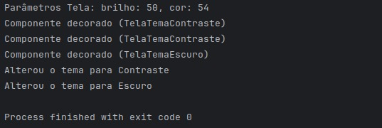

# Decorator

## Participantes

| Nome                                                        |
| ----------------------------------------------------------- |
| [Luis Henrique](https://github.com/luishenrrique)           |
| [Marina Márcia](https://github.com/The-Boss-Nina)           |
| [Laura Pinos](https://github.com/laurapinos)                |
| [Maria Eduarda Barbosa](https://github.com/Madu01)          |
| [Maria Eduarda Marques](https://github.com/EduardaSMarques) |
| [Pedro Augusto](https://github.com/PedroSiq)                |
| [Matheus Perillo](https://github.com/MatheusPerillo)        |
| [João Lucas](https://github.com/Jlmsousa)                   |
| [Júlia Souza](https://github.com/JuliaSSouza)               |
| [Carolina Barbosa](https://github.com/CarolinaBarb)         |
| [Felipe Direito](https://github.com/FelipeDireito)          |
| [Felipe Hansen](https://github.com/FHansen98)               |


## **Introdução**

<p align="justify">
&emsp;&emsp; O Decorator é um padrão de projeto estrutural focado em componentes concretos e componentes decoradores. É facilmente compreendido para um frontend onde temos uma página estática como componente concreto. Para adicionar funcionalidades ou elementos decorativos (como botões, etc.), podemos usar componentes decoradores que podem ser reutilizados.
</p>

## **Objetivo**

<p align="justify">
&emsp;&emsp; O objetivo do Decorator para o nosso projeto é modelar a estrutura visual da aplicação. Com ele, podemos facilmente alterar cores, contraste e tema, além de otimizar a acessibilidade para pessoas com deficiências visuais.

&emsp;&emsp;Além disso, o Decorator permite adicionar funcionalidades de forma dinâmica e flexível sem modificar o código original da aplicação. Isso significa que podemos implementar diferentes estilos e temas caso seja necessário.
</p>

## **Metodologia**

<p align="justify">
&emsp;&emsp; A metodologia foi baseada em reuniões online. As primeiras reuniões focaram no estudo detalhado do diagrama de classes apresentado. A equipe assistiu à videoaula da professora Milene, responsável pela disciplina do projeto, o que forneceu uma base teórica sólida. Durante essas reuniões, foram discutidos os conceitos principais e as melhores práticas para a implementação do diagrama. Com base nas discussões e estudos, os integrantes do grupo começaram a esboçar o diagrama UML. Utilizando o Lucidchart, foram definidos os elementos principais do diagrama, como as classes ComponentTela, ConcreteTelaBase, DecoratorTela, TelaTemaEscuro, e TelaTemaContraste. As ideias foram coletadas e combinadas, resultando em um esboço inicial do diagrama.

&emsp;&emsp; Foi realizada uma reunião presencial no dia 19/07, ao final da aula de arquitetura, para consolidar as ideias e revisar o progresso do diagrama UML. No mesmo dia, após a aula de Paradigmas, a equipe abordou a professora Milene para obter orientações adicionais. As recomendações fornecidas pela professora foram fundamentais para ajustar e aprimorar o diagrama UML, contribuindo significativamente para o avanço do projeto.
</p>

## **UML Decorator**

<p align="justify">
&emsp;&emsp;O UML desenvolvido foi inspirado nos exemplo do site Guru <a href="https://refactoring.guru/design-patterns/composite">[2]</a> e outro do slide da página 59 da professora dessa disciplina <a href="https://sigaa.unb.br/sigaa/portais/discente/discente.jsf">[1]</a>. 

&emsp;&emsp; Explicando o diagrama temos as seguintes classes: `TelaTemaContraste` que serve para mudar o contraste da tela de acordo com o tema escolhido. É uma ótima funcionalidade para ajudar pessoas com daltonismo, por exemplo, facilitando a visualização dos objetos na tela. A próxima classe é a `TelaTemaEscuro` que define justamente o tema base da aplicação. Essas duas estão ligadas ao `DecoratorTela` que faz a gestão dessas cores.

&emsp;&emsp; A `Tela` é o componente principal da aplicação e dará origem às classes do decorator, que permitirá a alterações dos objetos visíveis da aplicação ou manterá a `TelaBase` sem alteração alguma, mantendo o tema e a cor padrão da aplicação.

&emsp;&emsp;

</p>

<h6 align="center">Figura 2: Saída do código do GoF de decorator.</h6>
<div align="center">


</div>
<div>
    <h6 align="center">Fonte: 
        <a href="https://github.com/luishenrrique">COSTA</a>, 
        <a href="https://github.com/The-Boss-Nina">SOUZA</a>, 
        <a href="https://github.com/laurapinos">PINOS</a>, 
        <a href="https://github.com/Madu01">BARBOSA</a>, 
        <a href="https://github.com/EduardaSMarques">MARQUES</a>, 
        <a href="https://github.com/Jlmsousa">SOUSA</a>, 
        <a href="https://github.com/CarolinaBarb">BRITO</a>,
        <a href="https://github.com/JuliaSSouza">SANT'ANA</a>,
        <a href="https://github.com/FelipeDireito">DIREITO</a>,
        <a href="https://github.com/FHansen98">HANSEN</a>. 
        2024.
    </h6>
</div>

## **Código do UML Decorator**

`Componente:`

```ruby
package src.component;

public interface Tela {
    public void modoVisualCor ();

    public String tipoTema();
}


```

`Tela Base:`

```ruby
package src.concreteComponent;
import src.component.Tela;

public class TelaBase implements Tela {

    private int brilho, cor;
    public TelaBase(int brilho, int cor){
        this.brilho = brilho;
        this.cor = cor;
    }
    @Override
    public void modoVisualCor(){
        System.out.println("Parâmetros Tela: brilho: " + brilho + ", cor: " + cor);
    }

    @Override
    public String tipoTema(){
        return "Tema Padrão";
    }
}
```


`Decorator:`
```ruby
package src.decorator;

import src.component.Tela;

import java.util.ArrayList;
import java.util.List;

public class DecoratorTela implements Tela {
    private List<Tela> temas = new ArrayList();

    public DecoratorTela(Tela tema) {
        this.addTela(tema);
    }

    public void addTela(Tela tema){
        this.temas.add(tema);
    }
    public void removeTela(Tela tema){
        this.temas.remove(tema);
    }

    @Override
    public void modoVisualCor() {
        for(Tela tema : this.temas){
            tema.modoVisualCor();
//            tema.tipoTema();
        }
    }
    @Override
    public String tipoTema() {
        for(Tela tema : this.temas){
            tema.tipoTema();
            return "Tema:";
        }
        return "";
    }
}

```

`Decorator Tela:`
```ruby
package src.concreteDecoratorTela;
import src.decorator.DecoratorTela;
import src.component.Tela;

public class TelaTemaEscuro extends DecoratorTela {
    private String tipoEscuro = "Escuro";

    public TelaTemaEscuro(Tela tema){
        super (tema);
    }

    @Override
    public void modoVisualCor() {
        super.modoVisualCor();
        System.out.println("Componente decorado (TelaTemaEscuro)");
    }

    @Override
    public String tipoTema() {
        super.tipoTema();
        return "Alterou o tema para " + this.tipoEscuro;
    }
}

```

```ruby
package src.concreteDecoratorTela;

import src.decorator.DecoratorTela;
import src.component.Tela;

public class TelaTemaContraste extends DecoratorTela {
    private String tipoContraste = "Contraste";

    public TelaTemaContraste(Tela tela){
        super(tela);
    }

    public void modoVisualCor() {
        super.modoVisualCor();
        System.out.println("Componente decorado (TelaTemaContraste)");
    }

    @Override
    public String tipoTema() {
        super.tipoTema();
        return "Alterou o tema para " + this.tipoContraste;
    }
}

```

`Principal:`
```ruby
package src.teste;
import src.component.Tela;
import src.concreteComponent.TelaBase;
import src.concreteDecoratorTela.TelaTemaEscuro;
import src.concreteDecoratorTela.TelaTemaContraste;

public class Teste {
    public static void main(String[] args) {

        TelaBase tema = new TelaBase(50, 54);
        Tela tema1 = (Tela) tema;
        Tela tema2 = new TelaTemaContraste(tema1);
        Tela tema3 = new TelaTemaContraste(tema2);
        Tela tema4 = new TelaTemaEscuro(tema3);

        tema4.modoVisualCor();
        System.out.println(tema3.tipoTema());
        System.out.println(tema4.tipoTema());
    }
}

```
 <div>
    <h6 align="center">Fonte: 
         <a href="https://github.com/FelipeDireito">DIREITO</a>,
         <a href="https://github.com/FHansen98">HANSEN</a>. 2024.
    </h6>
</div>

## **Saída**:

&emsp;&emsp; O resultado do código presente na Figura 2, é uma saída no terminal, contendo os logs presentes em cada classe quando realizada alguma operação de troca de tema. Essa saída é apenas um teste para demonstrar que os códigos estão atualizando seus parâmetros, por exemplo: brilho, contraste e tema, quando solicitados. Essa saída demonstra que o código está funcionando e de acordo com a estrutura do GoF de Decorator. Posteriormente o código será usada para atualizar os temas e parâmetros da tela.


<h6 align="center">Figura 2: Saída do código do GoF de decorator.</h6>
<div align="center">


</div>

 <div>
    <h6 align="center">Fonte: 
         <a href="https://github.com/FelipeDireito">DIREITO</a>,
         <a href="https://github.com/FHansen98">HANSEN</a>. 2024.
    </h6>
</div>

## **Conclusão** 


&emsp;&emsp; O padrão de projeto Decorator demonstrou ser uma abordagem eficaz e flexível para a modelagem da estrutura visual da aplicação, permitindo a adição dinâmica de funcionalidades sem modificar o código original. Sua aplicabilidade no frontend é evidente, proporcionando a capacidade de alterar temas, cores e contrastes para otimizar a acessibilidade, especialmente para pessoas com deficiências visuais.

Nós usamos o padrão Decorator para gerenciar diferentes tipos de temas. Classes como TelaTemaContraste e TelaTemaEscuro foram fundamentais para fornecer funcionalidades específicas de acessibilidade e personalização de tema, enquanto DecoratorTela gerenciou essas funcionalidades de forma eficiente.rando a coesão e facilitando a extensão do sistema com novos tipos de questões no futuro.

Em resumo, o padrão Decorator não apenas atendeu aos objetivos propostos para o projeto, como também forneceu uma base robusta e escalável para futuras expansões e personalizações da aplicação, comprovando ser uma escolha estratégica e eficiente para o desenvolvimento frontend.


## **Bibliografia**

>> <a href="https://Link_da_fonte">[1]</a> SERRANO, Milene. Arquitetura e Desenho de Software, AULA - GOFS ESTRUTURAIS. 2024. UnB sigaa. Disponível em: <https://sigaa.unb.br/sigaa/portais/discente/discente.jsf>. Acesso em: 25 jul. 2024.

>> <a href="https://Link_da_fonte">[2]</a> REFACTORING GURU. Design Patterns: Composite. Disponível em: <https://refactoring.guru/design-patterns/composite>. Acesso em: 25 jul. 2024.


## **Histórico de Versão**

| Versão | Data       | Descrição            | Autor(es)                                           | Revisor(es) |
| ------ | ---------- | -------------------- | --------------------------------------------------- | ----------- |
| `1.0`  | 22/07/2024 | Criação do documento e da estrutura | [Maria Eduarda Barbosa](https://github.com/Madu01) |    [Marina Márcia](https://github.com/The-Boss-Nina)       |
| `1.1`| 24/07/2024 | Adiciona UML e introdução | [Felipe Direito](https://github.com/FelipeDireito)  |  [Felipe Hansen](https://github.com/FHansen98)  |
| `1.2`| 24/07/2024 | Adiciona começo do código | [Felipe Hansen](https://github.com/FHansen98)  |  [Felipe Direito](https://github.com/FelipeDireito)  |
| `1.3`  | 25/07/2024 | Adição da metodologia | [Marina Márcia](https://github.com/The-Boss-Nina) | [Maria Eduarda Marques](https://github.com/EduardaSMarques)    |
| `1.4`  | 22/07/2024 | Adicionando Fontes | [Maria Eduarda Barbosa](https://github.com/Madu01) |   [Maria Eduarda Marques](https://github.com/EduardaSMarques)      |
| `1.5`| 25/07/2024 | Finalizando código | [Felipe Hansen](https://github.com/FHansen98)  |  [Luis Henrique Luz Costa ](https://github.com/luishenrrique)   |
| `1.6`| 25/07/2024 | Finalizando documento e objetivo | [Felipe Direito](https://github.com/FelipeDireito)  |  [Felipe Hansen](https://github.com/FHansen98) |
| `1.7`| 25/07/2024 | Adicionando conclusão e resposta da saída | [Felipe Hansen](https://github.com/FHansen98)  |  [Felipe Direito](https://github.com/FelipeDireito)   |
