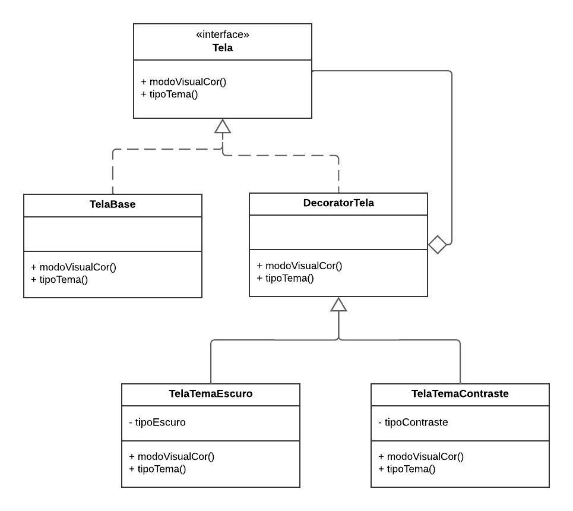

# Decorator

## Participantes

| Nome                                                        |
| ----------------------------------------------------------- |
| [Luis Henrique](https://github.com/luishenrrique)           |
| [Marina Márcia](https://github.com/The-Boss-Nina)           |
| [Laura Pinos](https://github.com/laurapinos)                |
| [Maria Eduarda Barbosa](https://github.com/Madu01)          |
| [Maria Eduarda Marques](https://github.com/EduardaSMarques) |
| [Pedro Augusto](https://github.com/PedroSiq)                |
| [Matheus Perillo](https://github.com/MatheusPerillo)        |
| [João Lucas](https://github.com/Jlmsousa)                   |
| [Júlia Souza](https://github.com/JuliaSSouza)               |
| [Carolina Barbosa](https://github.com/CarolinaBarb)         |
| [Felipe Direito](https://github.com/FelipeDireito)          |
| [Felipe Hansen](https://github.com/FHansen98)               |

## **Introdução**

&emsp;&emsp; O Decorator é um padrão de projeto estrutural focado em componentes concretos e componentes decoradores. É facilmente compreendido frontend onde temos uma página estática como componente concreto. Para adicionar funcionalidades ou elementos decorativos (como botões, etc.), podemos usar componentes decoradores que podem ser facilmente reutilizados.

## **Objetivo**

&emsp;&emsp; 

## **Metodologia**

&emsp;&emsp;

## **UML Decorator**

&emsp;&emsp;

## **Código do UML Decorator**

&emsp;&emsp;

## **Bibliografia**

> 

## **Histórico de Versão**

| Versão | Data       | Descrição            | Autor(es)                                           | Revisor(es) |
| ------ | ---------- | -------------------- | --------------------------------------------------- | ----------- |
| `1.0`  | 22/07/2024 | Criação do documento e da estrutura | [Maria Eduarda Barbosa](https://github.com/Madu01) |    [Marina Márcia](https://github.com/The-Boss-Nina)       |
| `1.1`| 24/07/2024 | Adiciona UML e introdução | [Felipe Direito](https://github.com/FelipeDireito)  |  [Felipe Hansen](https://github.com/FHansen98)  |